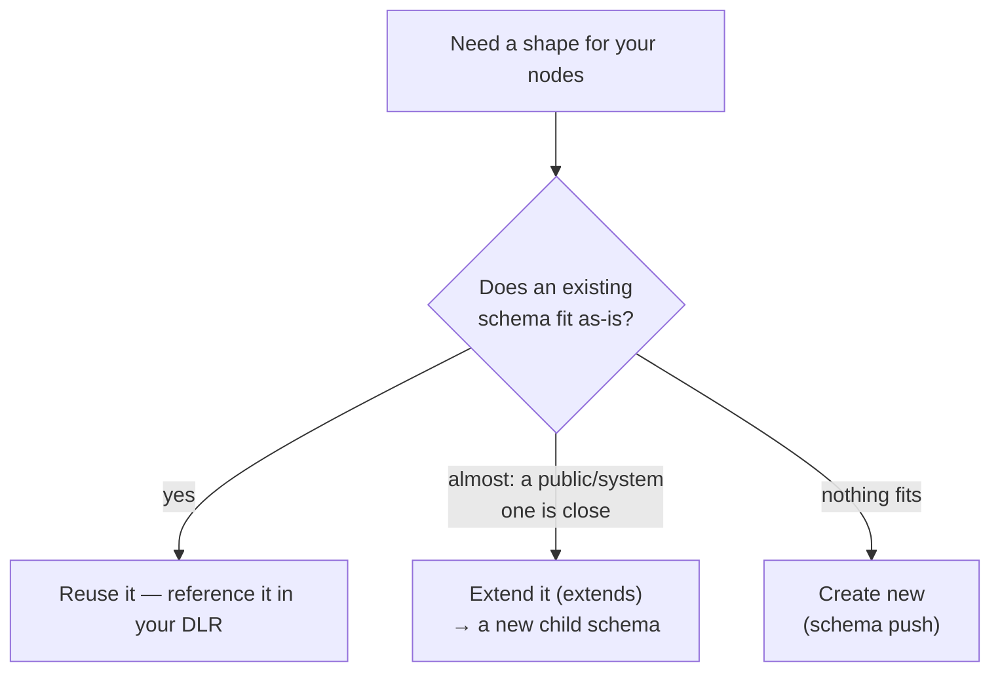
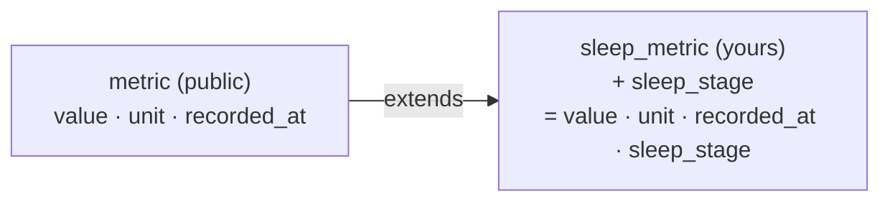
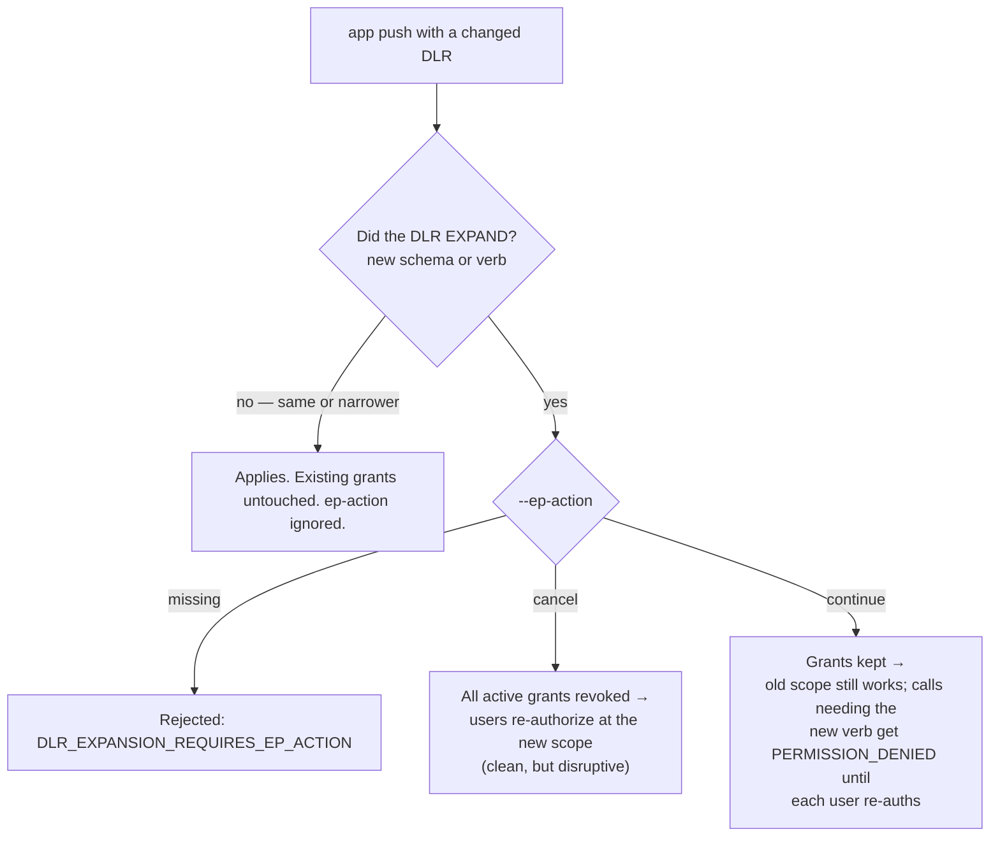

# Paradigm Developer Guide

> **A complete reference for building applications on Paradigm.** This guide covers authentication, data modeling, encryption, DLR, exposure profiles, plugins, and full application lifecycle. All examples use the Python SDK first; REST endpoints are referenced throughout.

---

## Table of Contents

1. [What Is Paradigm?](#1-what-is-paradigm)
2. [Setup](#2-setup)
   - 2.1 [The Paradigm CLI](#21-the-paradigm-cli)
   - 2.2 [Designing the App: the CRUX](#22-designing-the-app-the-crux)
   - [Developer Sandbox: Test Users](#developer-sandbox-test-users)
3. [Authentication: API Keys and JWTs](#3-authentication-api-keys-and-jwts)
4. [Using Paradigm for User Identity & Auth Best Practices](#4-using-paradigm-for-user-identity--auth-best-practices)
5. [Core Concepts](#5-core-concepts)
   - 5.1 [Nodes](#51-nodes)
   - 5.2 [Schemas](#52-schemas)
   - 5.3 [Relationships](#53-relationships)
   - 5.4 [Tags](#54-tags)
   - 5.5 [Privacy Realms](#55-privacy-realms)
   - 5.6 [Data Lender Requests (DLR)](#56-data-lender-requests-dlr)
   - 5.7 [Exposure Profiles (EP)](#57-exposure-profiles-ep)
6. [Encryption](#6-encryption)
7. [Working with Data via DLR](#7-working-with-data-via-dlr)
   - 7.x [DLR Builder Reference](#7x-dlr-builder-reference--what-every-field-does)
8. [Schemas In Depth: Creating, Versioning, and Golden Schemas](#8-schemas-in-depth)
   - [Schema Development Workflow](#schema-development-workflow-iterating-fast-without-breaking-things)
9. [Groups & Group Connections](#9-groups--group-connections)
10. [Maintaining a Local Ledger & Webhooks](#10-maintaining-a-local-ledger--webhooks)
11. [Plugins: Using Other Applications](#11-plugins-using-other-applications)
12. [Building an Application](#12-building-an-application)
13. [Building a Plugin](#13-building-a-plugin)
14. [Logout](#14-logout)
15. [Editing the DLR](#15-editing-the-dlr)
    - 15.1 [Charging for your app](#151-charging-for-your-app)
16. [Node Versioning](#16-node-versioning)
17. [Audit Logs & Activity Feed](#17-audit-logs)
18. [Error Handling](#18-error-handling)
19. [Proposals: Consent-Gated Data Writes](#19-proposals-consent-gated-data-writes)
20. [Automations: Scheduled & Event-Driven Plugins](#20-automations-scheduled--event-driven-plugins)
21. [Notifications](#21-notifications)
22. [Social Graph: Follows & Friend Requests](#22-social-graph)
23. [Batch Node Operations](#23-batch-node-operations)
24. [EP Variables & Scope Filters](#24-ep-variables--scope-filters)
25. [Rate Limits](#25-rate-limits)
26. [Schema Categories & User Settings](#26-schema-categories--user-settings)
27. [Delta Sync](#27-delta-sync)
28. [Plugins — Patterns and Ownership](#28-plugins--patterns-and-ownership)
   - 28.1 [The Three Plugin Patterns](#281-the-three-plugin-patterns)
   - 28.2 [Plugin Discovery](#282-plugin-discovery)
   - 28.3 [Plugin Execution Flow](#283-plugin-execution-flow)
   - 28.4 [Composing Plugins (Plugin Chaining)](#284-composing-plugins-plugin-chaining)
   - 28.5 [Plugin Fields Reference](#285-plugin-fields-reference)
   - 28.6 [Plugin Manifest & Health Check](#286-plugin-manifest--health-check)
29. [Error Handling (Full Reference)](#29-error-handling)
30. [Full API Reference](#30-full-api-reference)
31. [Cross-App Plugin Workflows: App A Using Plugin B](#31-cross-app-plugin-workflows-app-a-using-plugin-b)
32. [Keeping Nodes in Sync (Ledger Pattern)](#32-keeping-nodes-in-sync-ledger-pattern)
33. [File Uploads](#33-file-uploads)
34. [Maintaining a Live App](#34-maintaining-a-live-app)
   - 31.1 [The Mental Model](#311-the-mental-model)
   - 31.2 [Discovery: Finding Plugin B](#312-discovery-finding-plugin-b)
   - 31.3 [DLR: What App A Must Declare](#313-dlr-what-app-a-must-declare)
   - 31.4 [User Consent: Two Separate Authorizations](#314-user-consent-two-separate-authorizations)
   - 31.5 [The Delegation EP: Intersection Logic](#315-the-delegation-ep-intersection-logic)
   - 31.6 [Execution: Calling Plugin B from App A](#316-execution-calling-plugin-b-from-app-a)
   - 31.7 [Reading Plugin B's Output](#317-reading-plugin-bs-output)
   - 31.8 [Multi-Hop Chains](#318-multi-hop-chains-app-a--plugin-b--plugin-c)
   - 31.9 [Complete Worked Example](#319-complete-worked-example)
   - 31.10 [Common Pitfalls](#3110-common-pitfalls)

- [Appendix A: Encryption Keypair for Encrypted Fields](#6-encryption)

---

## 1. What Is Paradigm?

Paradigm is **identity infrastructure for the age of intelligence** — a foundational layer that lets people be intentional about who they are, what they know, and who gets to see and act on any part of that. Not a personal data manager. Not a privacy tool. A new language for how humans relate to software, AI, and each other — and the infrastructure needed to keep that relationship human-first.

### The problem

We are entirely dependent on compression mechanisms — algorithms, recommendation systems, AI — to make reality manageable. But compression is never neutral. Every system that filters, ranks, or summarizes makes choices about what matters, and those choices accumulate into something profound: they shape belief, attention, and identity itself.

What's strange — and largely unexamined — is how completely we have accepted this. The algorithms that decide what you see, who you connect with, what you come to believe, and how you present yourself online are owned and operated by a small number of corporations whose business model depends on maximizing your engagement, not your intentionality. Social media platforms do not just reflect who you are — they actively sculpt it, feeding you content that reinforces certain identities over others, all optimized for time-on-platform. Most people would find it alarming if a stranger had this much influence over their sense of self. We let companies do it without a second thought because the product is free and the effect is gradual.

**Identity has become something that happens to you.** Inferred from your behavior, stored across systems you don't control, used for purposes you didn't agree to, fragmented across apps none of which have the full picture — and none of which are yours.

### Why AI makes this urgent

Every AI system you interact with is building a model of you — richer, in many ways, than what any person in your life holds. None of it belongs to you. The danger is not just misuse. It is the slow transfer of self: as AI mediates more of your experience — writing for you, deciding for you, remembering for you — and as that AI is owned by entities with diverging interests, your identity stops being something you author. It becomes something optimized processes produce on your behalf.

Without infrastructure for maintaining explicit, coherent identity — tools to hold yourself accountable to your declared values over time — the vacuum gets filled. The experience machine is not a thought experiment. It is a product roadmap.

**Identity is the fight against entropy.** Selfhood is not static; it is the continuous act of maintaining coherent structure against natural drift. That fight now requires infrastructure.

### Agents make this urgent in a new way

Platforms like [OpenClaw](https://openclaw.ai) — and the broader wave of persistent, agentic AI infrastructure — are pushing this to a breaking point. These are not chat interfaces. They are agents that sit permanently across your messaging platforms, remember everything across time, spawn sub-agents, and take real actions in the world on your behalf: sending messages, making bookings, managing your calendar, drafting your communications. They are, by design, the most intimate software ever built.

Consider what it means to run one of these without a sovereignty harness. The agent has access to every conversation you've had. It builds the richest model of you that has ever existed — your relationships, anxieties, patterns, finances, health, the things you say in private. That model lives on a platform whose business interests are not yours. You have no audit trail of what it accessed or decided. You cannot scope what it knows to what it actually needs. When it delegates to a sub-agent — and to another, and another — your original consent context dissolves entirely somewhere in the chain. You cannot revoke cleanly, because the data was never bounded; it was absorbed. The agent that knows the most about you becomes the one you can't leave, because all your context is trapped inside it. This is a new kind of lock-in more powerful than anything that came before, because it doesn't just hold your data — it holds your accumulated self.

And there is a subtler danger. An agent that manages your communications is also shaping them. An agent that drafts your responses, summarizes your relationships, and decides what to surface is making continuous micro-choices about who you are and how you relate to others. Without explicit identity infrastructure underneath it — without you having declared your values, preferences, and limits in a form the agent is bound by — those choices are made by the agent's optimization target, not yours.

With a platform like Paradigm underneath, the calculus changes entirely. You give an agent access to exactly what it needs — your health context, your communication preferences, your relationship graph — with explicit scope and an audit trail. It can only do what you declared. You can revoke it, narrow it, inspect it. When it delegates to a sub-agent, the consent boundary travels with the request. The agent becomes *more* useful because it operates on a declared model of you rather than an inferred one — and you remain the author of that model.

This is what it means to orchestrate AI with intentionality.

### The inversion

Paradigm inverts the model. The person is the source of truth. Applications are guests.

You declare your identity — beliefs, values, relationships, goals, knowledge — as structured, encrypted data you own and control. Every app, AI agent, or person that wants access must declare what they need and operate within the limits you set. You can revoke, narrow, or audit that access at any time. The platform never holds your keys.

This is not about paranoia — sometimes you *want* to share deeply, with a trusted AI or close collaborators. Paradigm ensures the choice is yours, traceable to an explicit grant rather than a terms-of-service checkbox. And because the model is structured and explicit, AI operating within it is *more* useful: one with access to your declared values has far higher alignment bandwidth than one guessing from behavioral residue.

### Why incumbents cannot build this

Google, Meta, and Amazon built their businesses on one bet: *infer identity from behavior, monetize the inference*. Paradigm requires the opposite: *users declare identity, users control sharing*. These are not compatible paths — every architectural decision points in opposite directions. Building genuine user sovereignty would require them to stop doing the thing their revenue depends on. They can offer privacy theater, not sovereignty. Any company whose survival depends on the asymmetry Paradigm dissolves cannot build Paradigm and mean it.

The mission itself is the moat.

### What this means for developers

You are building at the moment when the relationship between people and software is being renegotiated. The Paradigm model is not a constraint — it is a foundation that makes your application more trustworthy, more interoperable, and more durable as user expectations and regulation catch up.

In practice:
- You are never granted ownership of user data — only bounded, revocable access
- You declare your intentions upfront (DLR) and users hold you to them
- Sensitive fields are encrypted client-side; your infrastructure never sees plaintext
- Interoperability is structural — use existing schemas and your app works immediately with data users already have
- AI agents you build operate within the same consent model as any other app: declared, bounded, auditable, revocable
- Trust compounds: apps that respect the model earn more access; apps that don't get cut off

**The three roles:**

| Role | Who | Trust level | What they can do |
|---|---|---|---|
| **User** | The person | Sovereign | Owns the identity. Manages all permissions. The source of truth. |
| **Paradigm platform** (app.ofself.ai) | The official first-party application | Highest | Handles login, encryption key management, privacy realm configuration, the full identity cockpit. Holds the user's session and derives their private key from their password. This is the surface where users manage *who has access to them*. |
| **Third-party app** | You — a developer building on Paradigm | Guest | Accesses user data via OAuth delegation and an API key. Operates within an Exposure Profile the user granted. Bounded, auditable, revocable. This is what this guide is about. |

**If you are reading this guide, you are building a third-party app.** The first-party platform is app.ofself.ai — it is where users live, manage their identity, and decide what to share with your application. Your app is a guest that a user has invited in, with explicit limits on what rooms it can enter.

**Tokens at a glance:**

| Token | Format | Who holds it | Lifetime | What it does |
|---|---|---|---|---|
| **JWT** | `eyJ...` | User (held by app.ofself.ai) | Short (~1h), rotating | Identifies the user session. Unlocks E2EE. You never see or handle this — you receive a `user_id` from OAuth instead. |
| **API key** | `ofs_tp_<id>.<secret>` | Your app's backend | Long-lived | Identifies your application. Sent with every API call alongside a `user_id` to act on that user within their granted Exposure Profile. |

See [Section 3](#3-authentication-api-keys-and-jwts) for the full auth reference.

---

## 2. Setup

### Install the SDK

```bash
# From the paradigm_sdk repo
pip install -e ./shared/backend   # installs `paradigm_client` (sync, no E2EE)
# Or use sdk/ directly (async, with E2EE)
# sys.path.append("/path/to/paradigm_sdk")
```

### Environment Variables

```bash
# .env
PARADIGM_BASE_URL=http://localhost:5001      # or https://api.ofself.ai in production
PARADIGM_API_KEY=ofs_tp_<id>.<secret>       # your app's API key (from dashboard registration)
```

### Registering Your App (Dashboard)

Everything about your app's identity — its name, redirect URIs, webhook URL, and crucially its **DLR (what data it needs from users)** — is configured in the **developer portal** (Build → Create). You don't need code for any of this. The portal lets you declare every permission your app will request upfront, before any user ever authorizes it.

The portal is a separate surface from the user-facing platform at `app.ofself.ai`: users live on the platform, developers live in the portal. The portal offers two paths — **Coding Assistant** (recommended: create a token, install the CLI, let Claude Code or Cursor drive it) and **Manual Registration** (fill in the form yourself). The rest of this section covers the assistant path; the CLI is documented in [Section 2.1](#21-the-paradigm-cli).

On the assistant path, registration comes *after* design: a new app needs a validated `CRUX.md`
before `paradigm app push` will accept it. See [Section 2.2](#22-designing-the-app-the-crux).

After registration, the dashboard shows you (once only — copy immediately):
- **API key** (`ofs_tp_<id>.<secret>`) — your app's server-side credential
- **Client ID** — used in OAuth flows
- **Webhook secret** — if you configured a webhook

Store these in your secrets manager. They are not recoverable.

### 2.1 The Paradigm CLI

#### Create a developer token

A **developer token** (a PAT, prefix `ofs_dev_`) is your durable credential. One token authenticates
three things: the CLI, the private PyPI index the CLI itself is installed from, and the private npm
registry that serves `@ofself/shell`. Create one per machine.

In the developer portal: **Build → Create → Coding Assistant → Step 1**, name it (e.g. `MacBook Pro`,
`CI`), and copy it. **It is shown once and never again.** Tokens are listed, created, and revoked any
time on the **Tokens** page.

Or, if you already have a working CLI login, from the CLI:

```bash
paradigm token create --name "my-machine"                      # prints ONCE
paradigm token create --name CI --expires-in-days 365 --group-id <UUID>
paradigm token list
paradigm token revoke <token-id>
```

#### Install the CLI and log in

The CLI ships from Paradigm's own PyPI index, not public PyPI, so the install command carries your
token. Requires [pipx](https://pipx.pypa.io) (`brew install pipx`):

```bash
pipx install paradigm-cli \
  --pip-args="--extra-index-url https://paradigm:<YOUR_TOKEN>@api.ofself.ai/api/pypi/simple/"

paradigm login --token <YOUR_TOKEN>
paradigm login --token <YOUR_TOKEN> --group-id <UUID>   # register apps under a group
```

Credentials land in `~/.paradigm/credentials.toml`. To rotate onto a new token, just run
`paradigm login --token <new-token>` again. `paradigm whoami` shows who you are, the active group
context, and whether you are on a `pat` or a `jwt`.

Building a UI? The same token authenticates the npm registry. Add an `.npmrc` to your project:

```ini
@ofself:registry=https://api.ofself.ai/api/npm/
//api.ofself.ai/api/npm/:_authToken=<YOUR_TOKEN>
```

then `npm install @ofself/shell` — or let `paradigm init --frontend` scaffold the whole
React + Vite + `@ofself/shell` frontend for you.

#### Testing the API as yourself

Your developer token doubles as a Bearer credential for testing the API directly (curl, Postman,
httpie) as yourself, before you have an OAuth flow built. Endpoints that accept a user JWT accept a
PAT in exactly the same header.

```bash
# No X-User-ID needed — you are the user
curl https://api.ofself.ai/api/v1/nodes \
  -H "Authorization: Bearer ofs_dev_..."

# Create a node as yourself
curl -X POST https://api.ofself.ai/api/v1/nodes \
  -H "Authorization: Bearer ofs_dev_..." \
  -H "Content-Type: application/json" \
  -d '{"title": "Test node", "value_json": {"note": "hello"}}'
```

This is useful for:
- Exploring what data your own Paradigm account holds
- Testing schema validation and node structure before wiring up your app
- Checking what `GET /my-permissions` returns for your own EP with your own app
- Quick smoke tests when debugging

**Important:**
- Treat it like a password — it grants full access to your Paradigm account. Never commit it
- Never use it in your app's code. Your app authenticates with `X-API-Key` + `X-User-ID`, not a Bearer token
- When testing your app's actual behaviour (what it can see as a third-party), use your API key + your own user ID instead
- A short-lived dashboard **JWT** also works everywhere a PAT does (`paradigm login --token <JWT>`),
  but it expires in ~1h and its refresh token is single-use. Prefer a PAT — it does not expire
  unless you set `--expires-in-days`, and you can revoke it

### 2.2 Designing the App: the CRUX

**A new app must have a filled, validated `CRUX.md` before you register a schema, write the DLR, or
push.** This is enforced, not advised — three CLI commands refuse until it passes. If you have hit
an unexplained `exit 6`, this section is why.

`paradigm init` scaffolds `CRUX.md`. It is a nine-section design doc, and
its last section is machine-read:

| | |
|---|---|
| §1 The App | one sentence, the gap, the outcome |
| §2 The Identity Thesis | what the app captures and produces, and what gets better as the graph fills |
| §3 The Product | views, workflows, tags, Paradigm-only vs your own DB |
| **§4 Schema Strategy** | **reuse or invent, per data type** |
| §5 Paradigm Integration | auth, relationships, groups, AI, proposals, plugins, automations, webhooks, encryption |
| §6 What's Not Used & Why | unused is fine; unexplained is not |
| §7 How Paradigm Takes It Further | cross-app compounding |
| §8 Architecture | stack, key files, data flow |
| **§9 The DLR** | a fenced `yaml` block — `crux sync` pushes it to the app's DLR |

```bash
paradigm crux init           # scaffold CRUX.md + the skill, if `init` didn't
paradigm crux questions      # the interview (--json for agents)
paradigm crux check          # what's filled, what's still empty
paradigm crux validate       # the gate — exits 6 until clean
paradigm crux sync           # push §9 to the app's DLR, one-directional
```

Open `claude` in the project and it runs the interview with you — `paradigm init` writes the skills
that know how. You can also fill the file by hand.

#### Why §4 is the section that matters

The rest of the CRUX documents. §4 **decides**, and it decides something you cannot cheaply undo.

A schema is the interoperability. A `belief` written by one app is readable by Story, Personas and
Missions immediately, with no integration work. A `myapp:belief` is readable by nobody, forever —
and once it is registered and carrying nodes it cannot be renamed, so changing your mind later is a
migration. Search before you invent:

```bash
paradigm schema search <term> --json
```

Record what you found in §4.2, including the near-misses you rejected and why. §4.3 (custom schemas)
ideally reads "None. By design."

#### The DLR is derived, not written

The DLR lives in the **app record**, not in a file. In a project with a `CRUX.md`, §9 is where
you author it — edit it and run `crux sync`, which pushes it. `paradigm dlr add-*` writes the same
record directly and refuses in a CRUX project, so the design and the contract cannot drift apart.
There is no local manifest: `paradigm init` writes none, and `app push` asks for the app's
metadata once when it registers.

```yaml
# CRUX.md §9
dlr:
  requests:
    - resource: nodes
      verb: read
      schemas: [belief, goal]
    - resource: nodes
      verb: create
      schemas: [memory]
```

An app that genuinely cannot predict what it needs may instead declare an **open DLR** — it requests
nothing specific and accepts whatever the user grants from their realm:

```yaml
dlr:
  open: true
  requests: []
```

This is the only case where an empty `requests` list is valid. Prefer a declared DLR wherever the
data shape is knowable: it gives the user a consent screen they can actually reason about.

#### Inspecting what the app actually asks for

```bash
paradigm dlr show      # the app's current DLR, as the record has it
paradigm dlr check     # server-side validation + warnings
paradigm dlr preview   # the consent card a user will see
```

Pass `paradigm init --group-id <UUID>` to register the app under a group — use
`paradigm group list` to find one you administer.

#### The three refusals, and what they mean

| You ran | It said | Do this |
|---|---|---|
| `paradigm app push` | *the design isn't settled* | `paradigm crux check`, fill what's empty, `crux validate` |
| `paradigm dlr add-read/add-write/add-verb` | *this project derives its DLR from CRUX.md* | edit §9, then `paradigm crux sync` |
| `paradigm schema push` | *reuse check failed* | `paradigm schema search` — reuse or `extends` an existing schema if you can |

Each has an override — `PARADIGM_CRUX_FORCE=1`, `PARADIGM_DLR_FORCE=1`, and `--force` respectively.
They exist for the cases where you are genuinely right and the check is wrong. Reach for them
rarely; every one of these guards exists because skipping the step it protects produced a real
problem that was expensive to reverse.

#### Once the app exists

This strictness is about the *first* build. Adding a verb, a view, or a webhook to a live app is
fine to build first and record after — re-run `crux sync` so §9 and the app's DLR stay in step. What
does not relax is §4: a *new* data type still needs the reuse-or-invent decision before you register
anything.

### Developer Sandbox: Test Users

Every registered app or plugin can have up to **3 auto-provisioned test users**. These are real User accounts with a full-access Exposure Profile for your app — no sign-up flow, no OAuth dance, no password to manage.

**In the dashboard:**
Go to Developer Tools → Apps & Plugins → [select your app] → Test Users. Three slots appear. For each slot:

| Action | What it does |
|---|---|
| **Create** | Provisions the account on demand |
| **Copy user_id** | Copies the UUID to your clipboard |
| **Reset** | Wipes all nodes/tags/relationships owned by this test user; keeps the account + EP intact |
| **Delete** | Removes the account entirely; slot reopens |

**Using a test user in API calls:**

No password needed. Pass the test user's `user_id` alongside your app's API key:

```http
X-API-Key: ofs_tp_<your-app-id>.<secret>
X-User-ID: <test_user_id>        ← UUID from the dashboard slot
```

```python
import requests

TEST_USER_ID = "abc123-uuid-from-dashboard"
BASE_URL = "http://localhost:5001"
API_KEY = "ofs_tp_..."

# Create a node as the test user — no special setup needed
resp = requests.post(
    f"{BASE_URL}/api/v1/nodes",
    headers={"X-API-Key": API_KEY, "X-User-ID": TEST_USER_ID},
    json={
        "schema_name": "journal/entry",
        "title": "Test entry",
        "value_json": {"content": "Hello world"},
    }
)
node_id = resp.json()["node"]["id"]
```

The test user has a **full-access EP** (all verbs granted, no realm restrictions). This lets you test any data operation without going through the OAuth flow first.

**Passwords?** There are none to manage. Test user passwords are randomly generated and immediately bcrypt-hashed — never stored in plaintext, never shown. You don't need them because API access uses the `X-API-Key` + `X-User-ID` pair directly.

**Best practice:** Reset between test runs rather than deleting and recreating. Reset is faster (wipes data, keeps row + EP) and keeps your `user_id` stable so test fixtures don't need updating.

**Limits:** 3 test users per app/plugin. Test users are excluded from production analytics and marked `is_test: true`.

### Client Instantiation

**Async (recommended):**

```python
from sdk import ParadigmAppClient

async with ParadigmAppClient(
    api_key="ofs_tp_<id>.<secret>",
    base_url="http://localhost:5001",
) as client:
    node = await client.get_node("node-uuid", user_id="user-uuid")
```

**Sync:**

```python
from paradigm_client import ParadigmClient

with ParadigmClient(
    base_url="http://localhost:5001",
    api_key="ofs_tp_<id>.<secret>",
) as client:
    resp = client.list_nodes(user_id="user-uuid", limit=10)
```

---

## 3. Authentication: API Keys and JWTs

As a third-party developer, **your API key is your primary credential** — it identifies your app on every request. You never handle user passwords or JWTs directly; that's the platform's job.

### API Key (what you use)

Issued at app registration. Sent on every request alongside the target user's ID.

```
Header: X-API-Key: ofs_tp_<id>.<secret>
Header: X-User-ID: <user_uuid>
```

The SDK sets both headers automatically:

```python
with ParadigmClient(base_url="...", api_key="ofs_tp_...") as client:
    client.list_nodes(user_id="user-uuid")
```

### JWT (what the platform manages, for context)

When a user logs in to app.ofself.ai, they receive a short-lived JWT (~1h) paired with a 30-day refresh token. This token pair identifies the user session, unlocks their E2EE private key, and lets them authorize third-party apps. **You never see or handle a user's JWT.** What you receive after a user authorizes your app is their `user_id` — a stable UUID you use in all subsequent API calls.

#### JWT rotation model

The platform uses **single-use refresh token rotation**:

- **Access token** — valid for ~1 hour. Sent as `Authorization: Bearer <token>` on every request.
- **Refresh token** — valid for 30 days, but **single-use**. Each call to `POST /auth/refresh` revokes the presented token and issues a fresh one. The new refresh token must be stored and used next time.
- **Family invalidation** — every refresh token belongs to a rotation family. If a revoked token is ever presented again (e.g. by an attacker who stole an old token), **the entire family is immediately revoked**, forcing the user to log in again. This detects token theft.
- **Logout** — calling `POST /auth/logout` revokes the refresh token server-side, not just client-side. Even if someone captured the token from localStorage, it cannot be used after logout.

As a third-party app developer, you don't implement any of this — the platform handles it transparently. It is relevant only if you are building a first-party integration or using the developer JWT for manual API testing.

### Quick reference

| | API Key | JWT |
|---|---|---|
| **Who holds it** | Your app's backend | User (via app.ofself.ai) |
| **Access token lifetime** | Long-lived | ~1 hour |
| **Refresh token lifetime** | N/A | 30 days, single-use rotating |
| **Used for** | All your API calls | User session + E2EE unlock |
| **You need this?** | Yes | No |

---

## 4. Using Paradigm for User Identity & Auth Best Practices

### Paradigm as Your Auth Layer

For third-party apps, Paradigm's OAuth-style authorization doubles as your user identity system. When a user authorizes your app, you receive their `user_id` — a stable UUID that can serve as your primary key for that user in your own database.

```python
# After OAuth callback
from paradigm_client.auth import verify_callback

result = verify_callback(code="...", user_id=None, username=None)
# result = {"user_id": "abc-123-uuid", "username": "alice"}

user_id = result["user_id"]    # stable UUID — use as your primary key
username = result["username"]  # the user's Paradigm handle, e.g. "alice"
```

You do not need to maintain a separate password table. Paradigm handles authentication; you just verify the OAuth callback.

### What to Store in Paradigm vs. Your Own Database

**Store in Paradigm:**
- Personal profile data (name, bio, contact info, preferences)
- Health, financial, and any sensitive user data that requires E2EE
- Data you want users to share across apps (interoperable data)
- Relationship graph (who the user knows)
- User-tagged collections and organizational structures
- Data you want users to be able to revoke access to at any time

**Store in your own database:**
- App-specific state and business logic (e.g., game progress, order history, subscription tier)
- High-frequency transactional data (logs, events, metrics)
- Data that is not user-owned (e.g., your product catalog, pricing)
- Data that should not be portable or user-controlled
- Derived data and caches
- App configuration

**Rule of thumb:** If the data primarily describes or belongs to the user and could be useful to them or another app, put it in Paradigm. If the data primarily describes their relationship with your specific service, keep it in your own DB.

### When you need both: maintain a local ledger

Many real apps straddle both sides. A diary app, for example, stores the entries themselves in Paradigm (user-owned, portable, revocable) but needs app-specific state in its own DB: read status, UI preferences, search indexes, notification history, sharing links, or derived metadata that doesn't belong in the node itself.

When this is the case, your local DB needs to stay in sync with what's in Paradigm. The right pattern is a **local ledger**: a table in your DB that mirrors node state — at minimum tracking `node_id`, `schema_name`, `updated_at`, and a `synced_at` timestamp. When Paradigm notifies you of a change (via webhook or delta sync), you update the ledger and trigger whatever local processing you need.

```python
# Local ledger table (pseudocode)
# node_id | schema_name | paradigm_updated_at | synced_at | local_state

# On webhook event (node.updated):
def handle_node_updated(event):
    node_id = event["node_id"]
    updated_at = event["updated_at"]

    # Fetch fresh node from Paradigm
    node = client.get_node(node_id, user_id=event["user_id"])

    # Update local ledger
    db.upsert("ledger", {
        "node_id": node_id,
        "paradigm_updated_at": updated_at,
        "synced_at": datetime.utcnow(),
        "local_state": compute_local_state(node),
    })
```

For efficient initial sync or catching up after downtime, use the delta sync endpoint (`GET /sync`) rather than paginating all nodes — it returns only what changed since your last cursor. See [Section 27 (Delta Sync)](#27-delta-sync) and [Section 10 (Webhooks)](#10-maintaining-a-local-ledger--webhooks) for the full pattern.

### Checking EP Validity

A user can revoke your app's access at any time from app.ofself.ai. Your DLR expanding can also cause their EP to be paused. Either way, the next API call you make for that user will return:

```
403 Forbidden
{ "code": "NO_AUTHORIZATION", "message": "Third-party app has no active authorization for user ..." }
```

**Handle this explicitly.** Don't treat a 403 as a generic error — it means the user's authorization is gone and they need to re-authorize before you can proceed.

```python
try:
    nodes = client.list_nodes(user_id=user_id)
except ParadigmAPIError as e:
    if e.code == "NO_AUTHORIZATION":
        # Redirect user to re-authorize or show a "reconnect" prompt
        redirect_to_oauth(user_id)
```

You can also proactively check EP status before making calls — useful on login or before sensitive operations:

```bash
GET /my-permissions
X-API-Key: ofs_tp_...
X-User-ID: <user_id>
→ 200: { "is_active": true, "effective_verbs": {...}, "expires_at": null,
         "ep_id": "<uuid>", "version": "9f2c…", ... }      ETag: "…"
→ 304: (with If-None-Match: <that ETag>, when nothing in the body changed)
→ 403: { "code": "NO_PERMISSIONS", "message": "No active exposure profile found" }
```

**Recommended pattern:** read `GET /my-permissions` once when the user starts a session, keep it, and read it again only when a response tells you access moved. Don't poll it on a timer.

#### Knowing when access changed: `X-Paradigm-Permissions-Version`

Every response to an authorized app request — node reads, writes, and the `403`s enforcement returns — carries an `X-Paradigm-Permissions-Version` header. It is a short hash of what your grant **computes to** for that user: the effective access across every realm, the field masks, the receipt (`ep_id`) and its expiry, the agent mode for a sub-entity call, and your app's spec version.

- It **changes** when the user edits your grant, a realm it sits under is narrowed or widened, a realm is attached or detached, the receipt is superseded, or a schema push changes what a schema-scoped grant expands to.
- It **does not change** across identical requests, or when something unrelated to your grant changes — so it is safe to compare on every response.
- `GET /my-permissions` returns the same value as `version`, so hold the body and compare.

```python
client = ParadigmAppClientSync(user_id=user_id)
perms = client.my_permissions()          # conditional: an unchanged grant is a 304

nodes = client.list_nodes(schema_id=SCHEMA_UUID)
if client.permissions_changed():         # no network call — compares the last header
    perms = client.my_permissions()
```

The header is the source of truth; nothing about it depends on your app receiving a webhook. A **revoked or paused** grant has no version to report — the request is refused before one is computed — so that case surfaces as the `401`/`403` on the call itself, exactly as before.
### Session Management

As a third-party app, you don't manage user login or tokens — that's app.ofself.ai's job. Your session model is simpler: store the `user_id` you receive from the OAuth callback and use it on all subsequent API calls.

#### Logout (client-side only)

There is no server-side logout call to make. Paradigm API keys are long-lived per-app credentials — they don't expire when a user "logs out" of your app. Logging out is entirely client-side: clear everything your app stored for that user session.

Exactly what to clear depends on your app, but typically:

```python
# Clear on logout
session.pop('paradigm_user_id', None)   # the user_id from OAuth callback
session.pop('paradigm_access_token', None)  # if you stored a token your own auth layer issued
session.pop('permissions_cache', None)  # any cached EP/permission data
# Any other app-specific user state
```

The user's Paradigm account, their data, and their authorization of your app are **not affected**. The EP remains active — when they log back in and re-authorize, everything is still there. If the user wants to fully revoke your app's access, they do that from app.ofself.ai, not through your app.

---

## 5. Core Concepts

### 5.1 Nodes

A **node** is the fundamental unit of data in Paradigm. It is a structured JSON document conforming to a schema, owned by a user (or group).

**Node fields:**

| Field | Type | Description |
|---|---|---|
| `id` | UUID | Immutable primary key |
| `title` | string | Human-readable label |
| `value_json` | object | All node data, structured per schema |
| `schema_id` | UUID | Schema this node conforms to |
| `owner_id` | UUID | Data owner (user) |
| `group_id` | UUID | If set, node is group-owned (not user-owned) |
| `created_by_user_id` | UUID | Who created it |
| `created_by_third_party_id` | UUID | Which app created it (if applicable) |
| `tags` | Tag[] | Organizational tags |
| `version` | integer | Increments on each update |

**Create a node:**

```python
node = await client.create_node({
    "schema_name": "paradigm:person/contact",
    "title": "Alice Smith",
    "value_json": {
        "name": "Alice Smith",
        "email": "alice@example.com",   # encrypted if declared in schema
        "phone": "+1-555-0100",         # encrypted if declared in schema
    },
})
node_id = node["id"]
```

```bash
# REST
POST /nodes
X-API-Key: ofs_tp_...
X-User-ID: <user_id>
{
    "schema_name": "paradigm:person/contact",
    "title": "Alice Smith",
    "value_json": { "name": "Alice Smith", "email": "alice@example.com" }
}
```

**Read a node:**

```python
node = await client.get_node(node_id)
print(node["value_json"]["email"])  # decrypted automatically
```

**Update a node:**

```python
# Updates create a new version. Only send changed fields.
updated = await client.update_node(node_id, {
    "value_json": {"name": "Alice M. Smith"},
    "title": "Alice M. Smith",
})
```

**Delete a node:**

```python
await client.delete_node(node_id)
```

**List nodes with filters:**

```python
# All filters are optional and combinable
resp = await client.list_nodes(
    schema_id="uuid",           # single schema UUID or URI (e.g. "paradigm:health/record")
    schema_ids=["uuid1","uuid2"],# multiple schemas (comma-sep in REST: ?schema_ids=uuid1,uuid2)
    search="alice",             # full-text search across title + value
    sort="created_at",          # created_at | updated_at | title
    order="desc",               # asc | desc
    limit=20,                   # max 100
    offset=0,
    fields="id,title,created_at", # trim the response; omit for ALL fields, value_json included
)
for node in resp["nodes"]:
    print(node["title"])
```

> `__freeform__` is a special value for `schema_id` / `schema_ids` that matches nodes with no schema attached.

---

### 5.2 Schemas

A **schema** defines the structure of nodes. It uses JSON Schema Draft 2020-12 and optionally declares which fields should be encrypted.

**Schema fields:**

| Field | Type | Description |
|---|---|---|
| `schema_name` | string | Stable, permanent identifier (e.g., `paradigm:health/medical-record`) |
| `version` | integer | Increments on every change (immutable per-version) |
| `name` | string | Display name |
| `description` | string | What this schema is for |
| `category` | string | Grouping (e.g., Health, Finance) |
| `scope` | `public` / `private` | Discoverable vs. hidden |
| `private_to` | `user` / `app` | Who owns a private schema |
| `extends` | UUID | Parent schema (inheritance) |
| `encrypted_fields` | string[] | Field names that will be E2EE |
| `is_promoted` | boolean | Admin-selected as a golden schema |
| `is_system` | boolean | Built-in, read-only |
| `json_schema` | object | Full JSON Schema definition |

**Fetch a schema by URI:**

```python
schema = client.get_schema_by_name(user_id, "paradigm:person/contact")
```

**Validate data against a schema:**

```python
result = client.validate_against_schema(
    user_id=user_id,
    schema_id="uuid",
    metadata={"name": "Alice", "email": "alice@example.com"},
)
# result = {"valid": True, "errors": []}
```

Schemas are **immutable**: every edit creates a new version at the same `schema_name`. See [Section 8](#8-schemas-in-depth) for full details.

---

### 5.3 Relationships

**Relationships** are typed, directed edges between two nodes. They let you model connections in the knowledge graph.

```python
# Create a relationship
rel = client.create_relationship(user_id, {
    "from_node_id": "uuid-a",
    "to_node_id": "uuid-b",
    "relationship_type": "authored",    # free-form string label
    "metadata": {"role": "lead"},       # optional additional data
})

# List relationships for a node
rels = client.get_node_relationships(user_id, node_id, direction="both")
# direction options: "in", "out", "both"

# List with filters
resp = client.list_relationships(
    user_id,
    from_node_id="uuid-a",
    relationship_type="authored",
    include_nodes=True,      # hydrate from_node and to_node
    limit=10,
)

# Update
client.update_relationship(user_id, rel_id, {"metadata": {"role": "co-author"}})

# Delete
client.delete_relationship(user_id, rel_id)
```

```bash
# REST — a relationship IS a node, on the `relationship` schema.
# There is no /relationships endpoint.
POST /nodes
X-API-Key: ofs_tp_...
X-User-ID: <user_id>
{ "title": "authored",
  "schema_name": "relationship",
  "value_json": { "from": ["..."], "to": ["..."], "relationship_type": "authored" } }
```

---

### 5.4 Tags

**Tags** are labels a user defines once and then applies across items.

A tag is an ordinary **node** on the `tag` schema, and wearing a tag is a **field** on the wearing
node. Everything here goes through `nodes:*` like any other node.

A tag node carries only what a label needs:

| Field | Type | Notes |
|---|---|---|
| `label` | string | **Required.** The display name — the only thing that identifies it to a person |
| `color` | string | Optional palette *token*, not a literal colour: one of `sand`, `clay`, `rust`, `rose`, `gold`, `moss`, `sage`, `teal`, `denim`, `indigo`, `plum`, `slate`. Each app maps these to its own palette so a tag looks native wherever it is shown |

**Required EP verbs:** the same ones you already need for nodes. Creating a tag is `nodes: create`
scoped to the `tag` schema; reading them is `nodes: read`.

```python
# A tag is just a node — requires nodes:create on the `tag` schema
tag = client.create_node({
    "schema_name": "tag",
    "title": "Deep work",
    "value_json": {"label": "Deep work", "color": "moss"},
}, user_id=user_id)

# List the user's tags — requires nodes:read on the `tag` schema
tags = client.list_nodes(user_id=user_id, schema_name="tag")
```

**Applying a tag** is a write to the wearing node's `tags` field, not a separate endpoint. Each
entry is `{id, label}`:

```python
client.update_node(action_id, {
    "value_json": {
        "tags": [{"id": tag["id"], "label": "Deep work"}],
    },
}, user_id=user_id)
```

**`id` is authoritative — resolve it and render the tag node's current label.** The stored `label` is
a denormalised copy, kept so the node stays legible to a reader that doesn't resolve the id. It may
be stale. Rendering the stored `label` directly is the one way to get this wrong: renames silently
stop propagating. Nothing cascades on tag deletion either — drop entries whose `id` no longer
resolves.

A tag is a **field** rather than a relationship on purpose. As edges, a tag worn by 500 actions would
become the highest-degree node in the user's graph, and every consumer walking relationships would
eat that noise. As a field, the tag node stays a leaf: a definition, not a hub.

The `tags` field currently ships on the `goal` and `action` schemas. Your own schemas can adopt the
same shape — an array of `{id, label}` objects pointing at `tag` nodes.

---

### 5.5 Privacy Realms

A **Privacy Realm** is a user-defined access ceiling. Think of it as a named firewall zone. Before any Exposure Profile can grant something to an app or friend, the grant must be a **subset** of the realm's permissions.

**Why realms matter:** Tightening a realm instantly tightens all Exposure Profiles under it — even active ones. A user can create a "work apps" realm and know that no work app can ever exceed those limits, regardless of what an app requests.

**Realm fields:**

| Field | Type | Description |
|---|---|---|
| `name` | string | e.g., "Work Apps", "Close Friends" |
| `description` | string | Optional |
| `ceiling` | JSONB | **The whole permission model.** An `access` document — see below |
| `excluded_node_ids` | UUID[] | Hard exclusions |
| `is_default` | boolean | The realm new authorizations land in unless the user picks another |
| `is_active` | boolean | |

A realm carries one JSONB `ceiling`, and an EP one JSONB `consent`, both in the same `access` shape.

**The `access` shape** — `consent`, `ceiling`, and the computed `effective` are all this shape:

```
access
└─ <resource>              nodes · relationships · plugins · discovery · activity · automations · sub_entity
   └─ <verb>               read · edit · edit_content · create · delete · propose · modify · …
      ├─ schemas           map: <schema_id> → mask
      │   └─ mask          { fields, filter }
      └─ nodes             [ <node_id> ]
```

```jsonc
ceiling = {                            // a consent looks exactly the same
  "nodes": {
    "read":   { "schemas": { "<goal_id>": { "fields": ["description"],
                                            "filter": { "status": { "in": ["active"] } } } },
                "nodes": ["<node_id>"] },
    "delete": {},                       // present + empty = granted, ANY node
    // "propose" absent                 // absent = DENIED
  },
  "plugins": { "execute": { "plugin_ids": ["summarize"] } }
}
```

**Presence is the grant.** The grammar is small and worth memorising:

- a verb key **present** → granted; **absent** → denied. Absence is the *only* way to deny
- a verb whose value is **empty `{}`** → granted, unrestricted (any node)
- **`schemas`** — a key means that schema is included; its value is an optional **mask**
- **`nodes`** — specific node ids, OR'd with `schemas`
- `fields` / `filter` apply on every verb: on a read they shape what is shown, on a write they gate
  what may be changed

**Permission enforcement:**

```
effective = consent ∩ ceiling          # recomputed on EVERY request, stored nowhere

check_access(verb, resource):
  1. is the verb key present in effective[resource]?     → NO → DENY
  2. which nodes?   schemas + nodes  → accessible_query (many) / is_accessible (one)
  3. which fields?  mask             → apply_mask
```

An app gets `min(what the user granted it, what the realm currently allows)`. Because the ceiling is
read live and never copied, tightening a realm takes effect on the app's very next request, and
loosening it restores access automatically — with no re-authorization either way.

**Realms are managed entirely by the user on app.ofself.ai — third-party apps cannot create, list, update, or delete realms.** All realm endpoints require a user JWT.

What you can do as a third-party app:
- See which realm your EP sits under via `GET /my-permissions` (returns `realm_id` and `realm_name`)
- Check the intersection of your DLR with a realm before showing the authorization UI (see [Section 15](#15-editing-the-dlr))
- Reference a `privacy_realm_id` when triggering plugin execution (the user's chosen realm scopes the run)

---

### 5.6 Data Lender Requests (DLR)

A **DLR** is your app's formal declaration of what data it needs from users. It is set at registration time and shown to users during the authorization flow. Users see exactly what you're asking for before they agree.

Think of the DLR as the *ask*; the Exposure Profile (EP) is the *grant*.

> **Where you author it.** In a project with a `CRUX.md` the DLR is derived: you edit §9 and run
> `paradigm crux sync`, and `paradigm dlr add-*` refuses (see [2.2](#22-designing-the-app-the-crux)).
> Without a CRUX, `paradigm dlr add-read/add-write/add-verb` writes the app record directly, and the
> portal's Manual Registration form is a third route. The structure below is the same whichever one
> you use.

**DLR structure:**

```json
{
    "dlr_inputs": [
        {
            "key": "health_records",
            "label": "Health Records",
            "request_type": "see_nodes",
            "source": "schema",
            "schema_id": "<uuid>",
            "min": 1,
            "max": null,
            "required": false
        },
        {
            "key": "work_notes",
            "label": "Work notes",
            "request_type": "see_nodes",
            "source": "schema",
            "schema_id": "<uuid>",
            "min": 0,
            "max": null,
            "required": false
        }
    ]
}
```

**`request_type` values and what they auto-derive:**

| request_type | Derived Verbs |
|---|---|
| `see_nodes` | `nodes: [read]` |
| `see_relationships` | `relationships: [read]` |
| `edit` | `nodes: [edit_content]` |
| `create` | `nodes: [create]` |
| `delete_nodes` | `nodes: [delete]` |
| `propose` | `nodes: [propose]` |
| `run_plugins` | `plugins: [execute]` |
| `discover` | `discovery: [friends, groups]` |

> **Write new DLRs as `{resource, verb, schemas?}`.** That is what the CLI and the dashboard author,
> and it is the vocabulary the server validates against — see [Valid DLR verbs](#valid-dlr-verbs)
> below. The server also accepts the `request_type` clauses above and translates them on read.

**`source` values:**

| source | Meaning |
|---|---|
| `schema` | Nodes of a specific schema (`schema_id` required) |
| `any` | Any node (user selects specific nodes at auth time) |
| `all` | All of the user's nodes |

**`min` / `required`:** If `min: 3`, the user must select at least 3 nodes for this input or the authorization fails. `required: true` means the input cannot be skipped.

<a id="valid-dlr-verbs"></a>
### Valid DLR verbs

This is the complete vocabulary. A verb outside it is rejected at validation time — both by
`paradigm validate` and by the server.

| Resource | Verbs |
|---|---|
| `nodes` | `read`, `edit`, `edit_content`, `create`, `delete`, `propose`, `modify` |
| `relationships` | `read`, `create`, `edit`, `delete` |
| `plugins` | `execute` |
| `discovery` | `friends`, `groups`, `realms` |
| `activity` | `read` |
| `automations` | `write`, `execute` |
| `sub_entity` | `declare` |

`discovery:realms` lets your app list the *names* of the user's privacy realms — names only, no
contents. Use it when you want to show the user which realm they are about to place you in.

### Open DLRs

An **open DLR** declares "give me anything you want": your app requests nothing specific, and the
user grants whatever they choose from their realm. Because it asks for nothing, it is compatible
with every realm — there is nothing that can fail to fit — and it is the one case where an empty
`requests` list is valid.

```yaml
# CRUX.md §9
dlr:
  open: true
  requests: []      # legitimately empty
```

Use this for general-purpose tools where you genuinely cannot predict what the user will want to
hand over. For anything with a known data shape, declare it — a specific DLR gives the user a
consent screen they can actually reason about.

### Requesting additional verbs with `requested_verbs`

Some permissions — like creating relationships or deleting nodes — have no `request_type` shortcut. Request them directly with `requested_verbs` alongside your `dlr_inputs`:

```json
{
    "dlr_inputs": [
        {
            "key": "health_records",
            "label": "Health Records",
            "request_type": "see_nodes",
            "source": "schema",
            "schema_id": "<uuid>"
        }
    ],
    "requested_verbs": {
        "relationships": ["create", "delete"]
    }
}
```

Or in YAML:

```yaml
node_requirements:
  - key: health_records
    label: Health Records
    request_type: see_nodes
    source: schema
    schema_id: "<uuid>"

requested_verbs:
  relationships:
    - create
    - delete
```

The user sees these requested verbs on the authorization screen. They are only granted if the user's realm also allows them (`allow_tag_create`, `allow_rel_create`, etc.) — the effective grant is always the intersection of what you asked for and what the realm permits.

The `requested_verbs` object is **auto-derived** from `dlr_inputs` — do not set it manually.

---

### 5.7 Exposure Profiles (EP)

An **Exposure Profile** is the live grant record — the intersection of what your app asked for (DLR) and what the user agreed to share (bounded by their Realm).

**EP is created automatically when a user authorizes your app.** You generally do not create EPs directly; you read them to understand what a user has granted you.

**EP fields:**

| Field | Type | Description |
|---|---|---|
| `id` | UUID | EP identifier |
| `owner_id` | UUID | User who granted this |
| `entity_type` | string | `app`, `friend`, `group_member`, `mcp`, `plugin_delegation`, etc. |
| `entity_id` | UUID | The app/friend/group this is for |
| `sub_entity_key` | string | For sub-entity scoping (e.g., "research_agent") |
| `privacy_realm_id` | UUID | Parent realm (ceiling) |
| `consent` | JSONB | **What the user actually granted you** — an `access` document, same shape as the realm's `ceiling` (see [5.5](#55-privacy-realms)) |
| `variables` | JSONB | Values the user filled in for the `input_parameters` your DLR declared |
| `dlr_version` | string | Which version of your DLR this grant was approved against |
| `enc_user_privkey` | text | User's private key wrapped with your app's public key (for E2EE) |
| `ttl_days` / `expires_at` | int / datetime | Optional TTL |
| `is_active` | boolean | `false` = paused or revoked; your calls will get `403 NO_AUTHORIZATION` |

> **EPs are managed entirely by the user on app.ofself.ai** — creating, updating, revoking, pausing, and resuming are all user actions. Your app cannot touch EP CRUD directly. If a user revokes or pauses your EP, your subsequent API calls will return `403 NO_AUTHORIZATION`. Subscribe to `ep.revoked` / `ep.paused` webhooks (see [Section 10](#10-maintaining-a-local-ledger--webhooks)) to react proactively rather than discovering this on the next API call.

> **Verb permissions and schema permissions are both live `consent` ∩ `ceiling`.** If a user narrows their realm — drops a verb, or removes a schema from a verb's `schemas` map — that restriction takes effect immediately on all EPs under that realm, on the very next request, with no re-authorization needed.

To check what permissions a user has granted your app, use `GET /third-party/me` (see [Section 4](#4-using-paradigm-for-user-identity--auth-best-practices)):

```bash
GET /third-party/me
X-API-Key: ...
X-User-ID: <user_id>
→ { "effective_verbs": { "nodes": ["read", "create"], "relationships": ["read"] }, ... }
```

**Runtime access check:** When your app calls `GET /nodes`, Paradigm automatically checks the EP for `X-User-ID` and only returns nodes the EP covers. You do not need to manually filter.

---

## 6. Encryption

### What Gets Encrypted

Fields declared in a schema's `encrypted_fields` array. The SDK handles encryption/decryption transparently on every create/read/update.

```json
{
    "schema_name": "paradigm:person/contact",
    "encrypted_fields": ["email", "phone", "ssn"],
    "json_schema": {
        "type": "object",
        "properties": {
            "name":  { "type": "string" },
            "email": { "type": "string" },
            "phone": { "type": "string" },
            "ssn":   { "type": "string" }
        }
    }
}
```

### How It Works (ECIES v2)

Paradigm uses **Elliptic Curve Integrated Encryption Scheme** (P-256 ECDH + AES-256-GCM):

```
Encrypt(value, field_name, recipient_public_key):
  1. Generate ephemeral P-256 keypair
  2. shared_secret = ECDH(ephemeral_private, recipient_public)
  3. aes_key = HKDF-SHA256(shared_secret, salt="paradigm-enc-v2", info=field_name)
  4. nonce = random 12 bytes
  5. ciphertext = AES-256-GCM(aes_key, nonce, JSON(value), aad=field_name)
  6. blob = ephemeral_pubkey[65 bytes] || nonce[12 bytes] || ciphertext+auth_tag
  7. return "paradigm_enc:v2:" + base64url(blob)
```

Wire format: `paradigm_enc:v2:<base64url(...)>`
Legacy v1: `paradigm_enc:v1:<base64url(nonce + ciphertext)>` — read-only support.

### Key Hierarchy

```
User password
    │ PBKDF2-HMAC-SHA256 (600k iterations, salt=user_id)
    ▼
Wrapping key
    │ AES-256-GCM
    ▼
User P-256 private key  ──────────────────────────────────────────┐
    │                                                              │
    │ (delegated to app: ECIES-wrap with app public key)          │
    ▼                                                              ▼
enc_user_privkey                                         Decrypt any
stored in EP                                             encrypted field
    │
    │ App uses own private key to unwrap
    ▼
User private key (runtime only, in app memory)
```

Recovery codes each escrow a copy of the user's private key:
```
Recovery code
    │ PBKDF2-HMAC-SHA256 (300k iterations, salt=user_id)
    ▼
Escrow key
    │ AES-256-GCM
    ▼
User private key
```

### Guarantees

| Threat | Protected? | Why |
|---|---|---|
| Server breach | ✓ Yes | Server only stores ciphertext; private key requires password to unwrap |
| Database dump | ✓ Yes | All sensitive fields are ciphertexts; attacker sees `paradigm_enc:v2:...` |
| Network intercept | ✓ Yes (HTTPS + E2EE double layer) | Ciphertext travels over TLS |
| Rogue app | ✓ Yes | App only receives user_privkey after user explicitly authorizes |
| Forgotten password | ✓ Yes (via recovery codes) | 6 escrowed copies of private key, each single-use |
| App reading fields never declared encrypted | ✗ No | Undeclared fields travel as plaintext |

### Using Crypto Primitives Directly

```python
from sdk.crypto import (
    encrypt_field,      # encrypt a single value
    decrypt_field,      # decrypt a single value
    encrypt_fields,     # bulk encrypt a dict
    decrypt_fields,     # bulk decrypt a dict
    is_encrypted,       # check if a value is an encrypted blob
    generate_key_pair,  # generate a P-256 keypair
)

# Check if a field is encrypted
if is_encrypted(node["value_json"]["email"]):
    plain = decrypt_field(
        ciphertext=node["value_json"]["email"],
        field_name="email",
        private_key_der=priv_der,
    )
```

### Password Change / Re-encryption

When a user changes their password, the private key must be re-wrapped with the new password. The SDK handles this:

```python
result = await client.reencrypt_all_nodes(
    old_password="current_password",
    new_password="new_password",
)
# result = {"reencrypted": 142, "errors": []}
# Also regenerates all 6 recovery code escrows
```

---

## 7. Working with Data via DLR

Once a user has authorized your app, you access their data through the SDK using the `user_id` as the scope. The EP is automatically enforced server-side — you only get what the user granted.

### Nodes

```python
from paradigm_client import ParadigmClient

with ParadigmClient(base_url=BASE_URL, api_key=API_KEY) as client:
    user_id = "user-uuid"

    # List nodes — automatically scoped to EP
    resp = client.list_nodes(
        user_id,
        schema_id="uuid",             # filter by schema
        search="meeting notes",       # full-text search over title + value_json
        access="read",                # verb filter
        limit=20,
        offset=0,
        sort="created_at",            # sort field
        order="desc",                 # "asc" | "desc"
        group_id="uuid",              # filter to group-owned nodes
    )

    print(resp["total"])              # total count (for pagination)
    for node in resp["nodes"]:
        print(node["id"], node["title"])

    # Get single node
    node = client.get_node(user_id, node_id)

    # Create node (if EP grants create verb)
    new_node = client.create_node(user_id, {
        "schema_name": "paradigm:person/contact",
        "title": "Bob Jones",
        "value_json": {"name": "Bob Jones", "email": "bob@example.com"},
    })

    # Update node
    client.update_node(user_id, node_id, {
        "title": "Bob A. Jones",
        "value_json": {"name": "Bob A. Jones"},
    })

    # Delete node
    client.delete_node(user_id, node_id)
```

### Relationships

```python
    # Create a relationship between two nodes
    rel = client.create_relationship(user_id, {
        "from_node_id": node_a_id,
        "to_node_id": node_b_id,
        "relationship_type": "colleague",
        "metadata": {"since": "2023-01-01"},
    })

    # Get all relationships for a node
    rels = client.get_node_relationships(user_id, node_id, direction="both")

    # List relationships with filters
    resp = client.list_relationships(
        user_id,
        from_node_id=node_a_id,
        relationship_type="colleague",
        include_nodes=True,      # embed the full node objects
        limit=50,
    )

    # Update / delete
    client.update_relationship(user_id, rel_id, {"metadata": {"since": "2024-01-01"}})
    client.delete_relationship(user_id, rel_id)
```

### Tags

Tags are ordinary nodes on the `tag` schema — use the node methods. See [Section 5.4](#54-tags).

```python
    # List a user's tags
    tags = client.list_nodes(user_id=user_id, schema_name="tag")

    # Create one (needs nodes:create on the `tag` schema)
    tag = client.create_node({
        "schema_name": "tag",
        "title": "Project Alpha",
        "value_json": {"label": "Project Alpha", "color": "denim"},
    }, user_id=user_id)
```

### Friends & Social Graph

Requires `request_type: "discover"` with `friends: true` in your DLR. Discovery permissions are EP ∩ Realm — if the user's EP scopes down `discovery.friends`, the narrowed permission is respected.

```python
    # List the user's mutual friends (bidirectional accepted friend requests only)
    friends = client.list_friends(user_id)
    # friends = [{"user": {"id": "...", "username": "...", "first_name": "..."}, "since": "..."}, ...]

    # Search Paradigm users by name/username
    users = client.search_users("alice")
```

#### Reading a Friend's Nodes (Cross-User EP Intersection)

If a friend has also authorized your app, you can read their nodes through a `?perspective=<friend_user_id>` query parameter. The server enforces a **dual-consent intersection** — the friend's nodes are filtered by both:

1. Their **friend EP → you** (what they chose to share with you as a person)
2. Their **app EP → your app** (what they chose to share with your app)

Only nodes that appear in both grants are returned. Neither consent signal alone is enough.

```python
# Bob uses your diary app and wants to see Alice's shared entries.
# Requirements:
#   - Alice and Bob are mutual friends on Paradigm
#   - Alice has authorized your app (she has an active EP for your app)
#   - Bob has authorized your app (used to authenticate the request)

# Fetch Alice's nodes as seen by Bob through your app
resp = requests.get(
    f"{BASE_URL}/nodes",
    headers={
        "X-API-Key": API_KEY,
        "X-User-ID": bob_id,          # authenticated caller
    },
    params={"perspective": alice_id}   # whose nodes to view
)
# → Returns Alice's nodes ∩ (Alice's friend EP to Bob) ∩ (Alice's app EP to your app)

# 403 NO_PERSPECTIVE_ACCESS if:
#   - Alice and Bob are not friends, OR
#   - Alice has not authorized your app
```

> **Consent model:** Alice independently controls what Bob can see (her friend EP) and what your app can see (her app EP). The intersection means neither can be escalated by the other — Alice can't show Bob more than she shared with the app, and the app can't see more of Alice's data than she shared with Bob.

> **Read-only:** `?perspective` only supports reading. Write, create, and delete operations always act on the authenticated user's own data.

### Groups

Requires `request_type: "discover"` with `groups: true` in your DLR. Each group includes `app_authorized` — use this to build a "switch context" dropdown that only shows groups your app can actually access.

```python
    # List groups the user belongs to, with authorization status
    groups_resp = client.list_groups(user_id)
    all_groups = groups_resp["groups"]
    # Each group: { "id", "name", "role", "group_user_id", "app_authorized": true/false }

    # Filter to groups this app can switch context to
    authorized_groups = [g for g in all_groups if g["app_authorized"]]

    # Access group data — use group_user_id as X-User-ID, NOT the member's personal ID
    group_nodes = client.list_nodes(authorized_groups[0]["group_user_id"])
```

### Schemas

```python
    # List schemas accessible to a user
    schemas = client.list_schemas(user_id, include_json_schema=True, limit=100)

    # Get schema by ID or URI
    schema = client.get_schema(user_id, schema_id, include_json_schema=True)
    schema = client.get_schema_by_name(user_id, "paradigm:person/contact")

    # Validate data against a schema before creating a node
    result = client.validate_against_schema(
        user_id, schema_id, {"name": "Alice", "email": "alice@example.com"}
    )
    if not result["valid"]:
        print("Validation errors:", result["errors"])
```

### Checking Your Live Permissions

Before making a write call, you can check exactly what your EP permits for the current user. This is more precise than `/third-party/me` — it computes the live intersection of EP ∩ Realm and respects sub-entity keys:

```python
resp = requests.get(
    f"{BASE_URL}/my-permissions",
    headers={"X-API-Key": API_KEY, "X-User-ID": user_id},
    # Optional: "X-Sub-Entity": "research-agent"
)
perms = resp.json()
# {
#   "effective_verbs": { "nodes": ["read", "create"], "relationships": ["read"], ... },
#                                               # every resource in the vocabulary is present;
#                                               # a denied resource reports []
#   "realm_name": "Work Apps",                  # LEGACY primary pointer — kept for back-compat
#   "realm_id": "uuid",                         #   ↳ ditto
#   "realms": [                                 # the honest composition: every realm folded
#     {"id": "uuid-a", "name": "Work Apps"},    # into this grant (A ∪ B ∪ C). Length 1 for a
#     {"id": "uuid-b", "name": "Journals"}      # plain single-realm grant. PREFER THIS.
#   ],
#   "sub_entity_key": null,
#   "expires_at": null,
#   "is_active": true
# }

if "create" in perms["effective_verbs"].get("nodes", []):
    client.create_node(user_id, {...})
else:
    # prompt user to re-authorize with broader permissions
    pass
```

### Avoiding 403s: load permissions once per session

The SDK doesn't gate calls automatically — enforcement is server-side. But you can avoid wasted 403 round-trips by loading permissions once when a user session starts and checking locally before calling:

```python
class UserSession:
    def __init__(self, user_id: str):
        self.user_id = user_id
        self._perms = None

    def load_permissions(self):
        resp = requests.get(
            f"{BASE_URL}/my-permissions",
            headers={"X-API-Key": API_KEY, "X-User-ID": self.user_id},
        )
        if resp.status_code == 403:
            raise EPRevokedError("User's EP is revoked or inactive")
        self._perms = resp.json()

    def can(self, resource: str, verb: str) -> bool:
        if not self._perms:
            return False
        return verb in self._perms.get("effective_verbs", {}).get(resource, [])

    def assert_can(self, resource: str, verb: str):
        if not self.can(resource, verb):
            raise InsufficientPermissionsError(
                f"EP does not grant {resource}:{verb} — prompt user to re-authorize"
            )
```

Then use it before any call:

```python
session = UserSession(user_id)
session.load_permissions()   # once at session start

# Check before calling — no round-trip wasted
session.assert_can("nodes", "create")
client.create_node(user_id, {...})

# Also useful for conditional UI
if session.can("nodes", "delete"):
    show_delete_button()
```

Re-load permissions if you hit a `403 NO_AUTHORIZATION` mid-session (the user may have changed their EP while your session was active). See [Section 4](#4-using-paradigm-for-user-identity--auth-best-practices) for the full 403 handling pattern.

---

### 7.x DLR Builder Reference — what every field does

This section is the canonical reference for the DLR YAML format used in the developer
portal. Read it once and the builder will make complete sense.

---

#### Concept map (terminology)

The same data access declaration has different names in different places. They all mean
the same thing:

| Where you see it | What it's called |
|---|---|
| YAML form in the portal | `requests:` |
| JS objects in the codebase | `dlr_inputs` / `request_type` |
| Database column | `data_lender_request.dlr_inputs` (JSONB inside JSONB) |
| Old plugin model (legacy) | `node_requirements` |

**Authoritative source:** `dlr_inputs` (the requests array). The `requested_verbs` object
stored alongside it is a *derived cache* — computed from the requests by
`deriveVerbsFromRequests()`. Always edit the requests; never edit `requested_verbs` directly.

---

#### Top-level structure

```yaml
requests:           # ← what data the app wants / what it can do to it
  - key: diary_entries
    type: see_nodes
    ...

input_parameters:   # ← runtime config the caller provides at invocation time
  - key: max_results
    type: number
    ...
```

**`requests`** and **`input_parameters`** are completely different things even though
they appear in the same form:

- `requests` declares the *data access contract* — what the app asks the user to authorise.
  The user sees these on their consent screen.
- `input_parameters` are *runtime configuration values* passed by whoever calls the plugin
  (e.g. another app, an agent). The user never sees these. They exist so a plugin can be
  configured without code changes (e.g. "summarise the last N entries").

---

#### `requests` — field reference

Every request item must have `key` and `type`. All other fields depend on type.

**`key`** *(required)*
A stable identifier for this request within your app. Used as a variable name when
the platform resolves which nodes to pass. Must be unique within the request list.
Snake_case is recommended.

```yaml
key: medical_records   # your code references this variable by name
```

**`type`** *(required)*
What kind of access you are requesting. Determines which other fields are valid.

| Type | What it means |
|---|---|
| `see_nodes` | Read nodes (most common) |
| `edit` | Modify content of nodes the user has shared |
| `create` | Create new nodes in the user's space |
| `delete_nodes` | Permanently delete nodes |
| `propose` | Suggest edits — user approves before they apply |
| `see_relationships` | See edges between shared nodes |
| `create_relationships` | Create edges between shared nodes |
| `delete_relationships` | Remove edges |
| `run_plugins` | Execute plugins on user data |
| `discover` | See the user's friends/groups list |

**`label`** *(optional)*
Human-readable name shown to the user on the consent screen. Defaults to the type
name. Set this to something meaningful: `"Your diary entries"` not `"see_nodes"`.

**`description`** *(optional)*
One sentence explaining why you need this. Shown on the consent screen. Increases
user trust and authorization rates.

---

#### Node filter fields (for `see_nodes`, `edit`, `create`, `delete_nodes`, `propose`)

**`source`** *(default: `schema`)*
Controls which nodes this request matches.

| Value | Meaning |
|---|---|
| `schema` | Only nodes matching the specific schema you declare with `schema:` |
| `any` | Any node in the user's space, regardless of schema |

`source: any` gives broad access. Use `source: schema` whenever you know what
shape of data you need — it narrows the consent surface and is clearer to users.

**`schema`** *(required when `source: schema`)*
The schema name or ID that nodes must match. Displayed on the consent screen.

```yaml
source: schema
schema: journal/entry   # name (preferred) or UUID
```

**`min`** *(default: `0` for actions, `1` for reads)*
Minimum number of nodes expected. A hint to the user and UI — not enforced at the
API level. `min: 1` means "this app won't work without at least one node of this type".

**`max`** *(default: `unlimited`)*
Maximum number of nodes. `unlimited` means no cap. Use a number to signal that you
only need a fixed number (e.g. `max: 1` for a "primary profile" request).

**`required`** *(default: `true` for reads, `false` for actions)*
Whether this request must be satisfied for the app to function. Surfaced in the UI
so users understand which items are mandatory vs optional.

---

#### `see_tags` specific fields

Tags don't have a min/max. The user chooses which tags to expose during auth.

```yaml
- key: my_tags
  type: see_tags
  label: "Your tags"
  description: "We use tags to organise your shared content"
```

There are no extra fields to set — the platform always uses `visibility: some` (user
selects during auth).

---

#### `see_relationships` / `create_relationships` / `delete_relationships` specific fields

**`types`** *(optional list)*
Which relationship types you care about. Leave empty to accept all types.

```yaml
- key: connections
  type: see_relationships
  types:
    - relates_to
    - depends_on
```

The user selects the specific relationships to expose during auth.

---

#### `run_plugins` specific fields

**`plugins`** *(list of plugin IDs or names, or `all`)*
Which plugins this app may execute on user data. Use `all` to request permission
to run any plugin, or list specific IDs to narrow the scope.

```yaml
- key: processing
  type: run_plugins
  plugins:
    - Diary Summarizer
    - Sentiment Tagger
```

---

#### `discover` specific fields

**`friends`** / **`groups`** *(boolean, default `false`)*
Whether the app needs to see the user's friend list and/or group memberships.

```yaml
- key: social
  type: discover
  friends: true
  groups: false
```

---

#### `input_parameters` — field reference

These are caller-supplied configuration values, not user data. They appear in the
plugin's invocation payload, not on the user's consent screen.

**`key`** *(required)*
Parameter name. Your plugin code reads this from the invocation payload.

**`type`** *(required)*
One of: `text`, `number`, `boolean`, `select`, `file`

**`label`** *(optional)*
Human-readable label shown to the developer/caller who invokes the plugin.

**`options`** *(for `type: select` only)*
List of allowed string values.

```yaml
input_parameters:
  - key: max_entries
    label: "Max diary entries to summarise"
    type: number

  - key: tone
    label: "Output tone"
    type: select
    options:
      - "professional"
      - "casual"
      - "empathetic"
```

---

#### Derived permissions (the `# --- Derived permissions ---` section in YAML preview)

The YAML preview shows a computed `permissions:` block at the bottom. **You do not
write this.** It is auto-generated from your `requests` by `deriveVerbsFromRequests()`
and shown for reference only. It represents what verb-level permissions the platform
will grant based on your declared requests.

If you add a `create` request, the derived block will include `nodes: [create]`.
If you add `see_relationships`, it includes `relationships: [read]`. You never need
to think about this directly — it is the translation layer between your human-readable
requests and the underlying verb/capability system.

---

#### Full example

```yaml
# DLR for a journal analysis plugin

requests:
  - key: journal_entries
    type: see_nodes
    label: "Your journal entries"
    description: "We read your recent entries to generate a mood summary"
    source: schema
    schema: journal/entry
    min: 1
    max: unlimited
    required: true

  - key: mood_tags
    type: see_tags
    label: "Your mood tags"
    description: "We use tags to categorise entries by emotion"

  - key: summary_output
    type: create
    label: "Write summary node"
    description: "We create one summary node per analysis run"
    source: schema
    schema: journal/mood-summary

input_parameters:
  - key: days_back
    label: "How many days of entries to analyse"
    type: number

  - key: tone
    label: "Summary tone"
    type: select
    options: ["clinical", "supportive", "neutral"]
```

---

## 8. Schemas In Depth

### Exploring existing schemas first

Before creating a schema, check whether one already exists. Using an existing schema — especially a golden/promoted one — means interoperability: nodes your app creates are immediately consumable by other apps, and users who already have nodes of that type from another app can share them with you without any data migration.

**Browse promoted (golden) schemas:**

```bash
GET /schemas?promoted=true
GET /schemas?promoted=true&category=Health
```

**Search by name, description, or URI:**

```bash
GET /schemas?search=medical+appointment
```

**Search by field name** (useful if you know the shape of data you need):

```bash
GET /schemas?field_search=diagnosis
```

**Fetch a specific schema by URI** (get latest version, or pin to a version):

```bash
GET /schemas/name/paradigm:health/medical-record
GET /schemas/name/paradigm:health/medical-record?version=2
GET /schemas/name/paradigm:health/medical-record?resolve=true   # merges inherited fields
```

**List all versions of a URI:**

```bash
GET /schemas/name/health%2Fappointment/versions
→ [{ "version": 1, "id": "...", ...}, { "version": 2, "id": "...", ...}]
```

**Deduplicate by name** (get only the latest version of each, useful for building pickers):

```bash
GET /schemas?group_by_uri=true&scope=public
```

Each row carries `version_ids` — every version id sharing that `schema_name`. If you
hold a schema id (a permission's `scope_filters` pins one), match it against
`version_ids` and not just `id`: the version you stored may be one this row replaced,
and it would otherwise look like an unknown schema.

*(The parameter is named for a `uri` field that no longer exists; it groups by
`schema_name`.)*

### Schema scope (public vs. private)

| Scope | Visible to | Can be promoted | Can be extended |
|---|---|---|---|
| `public` | All authenticated users | Yes (by admin) | Yes |
| `private` | Owner only + your own apps | No | No |
| `system` | Everyone (built-in) | N/A | Yes |

- Use `public` if you want other apps and users to discover and reuse your schema
- Use `private` for app-internal data shapes you don't want appearing in the ecosystem
- You can only extend `public` or `system` schemas, not `private` ones

### When to use an existing schema vs. creating a new one

**Use an existing schema when:**
- The concept exists in Paradigm already — contacts, health records, financial transactions, etc.
- You want interoperability — other apps can read your nodes; users can share existing nodes with you
- You want compounding workflows — if App A wrote `paradigm:person/contact` nodes, your app using the same schema gets that data for free when the user authorizes it

**Create a new schema when:**
- The concept is genuinely novel or app-specific
- The existing schema's shape doesn't fit your data
- You need `encrypted_fields` not present in the public schema

**Best practice:** extend an existing golden schema rather than creating from scratch. This preserves discoverability while adding your custom fields:

```python
client.create_schema(user_id, {
    "name": "Healthcare Patient",
    "schema_name": "health/patient",
    "extends": "<id-of-paradigm:person>",   # inherits all person fields
    "scope": "public",
    "json_schema": {
        "type": "object",
        "properties": {
            "patient_id": { "type": "string" },
            "blood_type":  { "type": "string" },
        }
    },
    "encrypted_fields": ["patient_id", "blood_type"],
})
```

### Creating a new schema

```python
schema = client.create_schema(user_id, {
    "name": "Medical Appointment",
    "description": "Scheduled healthcare visits",
    "schema_name": "health/appointment",    # stable — choose carefully, can't rename
    "category": "Health",
    "scope": "public",
    "encrypted_fields": ["notes", "diagnosis", "provider_name"],
    "json_schema": {
        "$schema": "https://json-schema.org/draft/2020-12",
        "type": "object",
        "required": ["date", "provider_name"],
        "properties": {
            "date":          { "type": "string", "format": "date" },
            "provider_name": { "type": "string" },
            "specialty":     { "type": "string" },
            "notes":         { "type": "string" },
            "diagnosis":     { "type": "string" },
        },
    },
    "schema_metadata": { "icon": "stethoscope" },    # lucide icon name
})
```

### Versioning: schemas are immutable

You cannot edit a schema in place. Every change creates a **new version** with the same `schema_name` but an incremented `version` number. Existing nodes remain bound to the version they were created with — they are never silently migrated.

```bash
PUT /schemas/<schema_id>
{ "json_schema": { ...updated... }, "name": "Medical Appointment v2" }
# → new schema object, version=2, same schema_name
```

When you publish a new version, its `is_promoted` flag resets to `false` — it must be re-reviewed before becoming the recommended version.

**Implication for DLRs:** DLR entries reference a `schema_name`, not a specific version. Your app will always match nodes of any version of that URI — old and new.

### Iterating across schema versions

When you publish a new schema version, existing nodes are not migrated — they still carry their original `schema_id`. Your DLR fetches all of them regardless of version, so your app code will see a mix of old and new node shapes.

Each node tells you which version it is:

```python
node["schema_id"]      # specific version UUID
node["schema_name"]     # e.g. "health/appointment"  — same across all versions
```

**Handling multiple versions in your app:**

```python
# Fetch the schema versions you care about
v1_schema_id = get_schema_by_name("health/appointment", version=1)["id"]
v2_schema_id = get_schema_by_name("health/appointment", version=2)["id"]

for node in nodes:
    if node["schema_id"] == v2_schema_id:
        # use new field added in v2
        specialty = node["value_json"].get("specialty")
    else:
        # v1 — field didn't exist, handle gracefully
        specialty = None
```

Or more simply: **make new fields optional and write defensive code** — treat missing fields as `None` rather than branching on version. This is the right default if your change is additive.

**What's safe to change vs. what breaks things:**

| Change type | Safe? | Notes |
|---|---|---|
| Add optional field | Yes | Old nodes just won't have it — defensive reads handle this |
| Add required field | Careful | Old nodes fail validation if you try to update them without the new field |
| Remove a field | Careful | Any code reading that field on old nodes will get `None` |
| Rename a field | Breaking | Treat as remove + add; old nodes have the old name |
| Change a field's type | Breaking | Existing data becomes invalid |

**Migrating old nodes to a new version:**

If you need all nodes on the latest version, iterate and update them:

```python
old_nodes = client.list_nodes(user_id, schema_ids=[v1_schema_id])

for node in old_nodes:
    # Transform data to match v2 shape
    updated_value = migrate_v1_to_v2(node["value_json"])
    client.update_node(user_id, node["id"], {
        "schema_id": v2_schema_id,   # pin to new version
        "value_json": updated_value,
    })
```

Do migrations lazily (on next read/write) or in a background job — never block user-facing operations on a bulk migration.

### Deprecating a schema

There is no separate "deprecated" state — deprecation in Paradigm is soft deletion. When you no longer want a schema used:

```bash
DELETE /schemas/<schema_id>
```

This sets `is_active=false` and records a `deleted_at` timestamp. The schema stops appearing in search and cannot be used to create new nodes. **Existing nodes that reference that schema version are unaffected** — they retain their data; the schema definition remains accessible for reading.

**Important:** only the schema owner can delete their schemas. System schemas cannot be deleted.

If you are replacing a schema with a new version rather than abandoning it entirely, just publish the new version with `PUT /schemas/<schema_id>` — the old version remains queryable via its specific UUID or `?version=N`, and you communicate the migration to downstream consumers via documentation or a schema metadata field.

### Schema development workflow (iterating fast without breaking things)

Schema immutability is the right default for production — it protects users whose data
exists under a given shape. But during development it creates friction: every field
rename or type change mints a new version, old test nodes pile up, and your DLR ends
up matching multiple versions simultaneously.

Here is the workflow that removes the friction.

#### Phase 1 — Scratch development (before any real user data)

Register schemas with a `dev:` prefix in your URI, e.g. `dev:myapp/appointment`.
Because no real users have authorised access to these schemas, you can delete and
re-register from scratch as many times as you need.

```bash
# Blowing away a dev schema and starting over
DELETE /schemas/<schema_id>

POST /schemas
{
  "schema_name": "dev:myapp/appointment",
  "name": "Appointment (dev)",
  "visibility": "private",
  "json_schema": { ...revised shape... }
}
# → version 1 again, clean slate
```

Keep your test app in incubator mode (`deployment_mode: "incubator"`) and give it only
your own user ID in `allowed_user_ids`. This ensures the schema never lands in a real
user's data during development.

**Checklist before leaving phase 1:**
- [ ] All required fields are actually required; optional fields are truly optional
- [ ] Field names are stable — no more renames planned
- [ ] `value_json` examples have been tested against the schema using `POST /schemas/<id>/validate`
- [ ] You've confirmed the schema works end-to-end in your app

#### Phase 2 — First promotion (switching from `dev:` to your real URI)

When the shape is stable, register it under your production URI:

```bash
POST /schemas
{
  "schema_name": "health/appointment",
  "name": "Medical Appointment",
  "visibility": "public",
  "json_schema": { ...finalised shape... }
}
```

Delete the `dev:` schema so it doesn't linger. Update your DLR and redeploy.
From this point on, treat the schema as user-data-bearing.

#### Phase 3 — Iterating on a live schema

Once real users have nodes, you can no longer blow things away — you version instead.
The goal is to make each version change **additive and backward compatible**:

**Prefer additive changes:**
```json
// v1
{ "date": "2024-01-15", "doctor": "Dr Smith" }

// v2 — added optional fields, v1 nodes still valid under your app
{ "date": "2024-01-15", "doctor": "Dr Smith", "specialty": null, "duration_minutes": null }
```

**For breaking changes, migrate lazily:**
```python
def read_appointment(node):
    v = node["value_json"]
    # v1 had "doctor", v2 renamed it to "provider_name"
    return {
        "provider_name": v.get("provider_name") or v.get("doctor"),
        "specialty": v.get("specialty"),
    }
```

Write the migration shim first, deploy it, then publish the new schema version.
Only once your app no longer writes v1 nodes do you need to bulk-migrate old ones.

#### Phase 4 — Schema review checklist before version bump

Before publishing a new version, run through this:

| Check | Why |
|---|---|
| All new fields are optional OR you have a migration plan | Old nodes will fail writes if required fields are missing |
| Field names are final | Renames are the most disruptive change — get them right once |
| `$defs` reuse has not duplicated structure | DRY schemas are easier to evolve |
| You've validated 3+ real-world `value_json` examples | Catches schema errors before users hit them |
| The `description` of each field is accurate | Users see these in the consent screen |
| Downstream apps/plugins that read this schema name have been notified | They'll see both versions in their DLR results |

#### Pinning to a specific version in your DLR

By default, DLR requests match *all versions* of a `schema_name`. If you need to only
receive nodes matching your latest version (e.g. after completing a full migration),
you can pin by `schema_id`:

```json
{
  "dlr_inputs": [
    {
      "request_type": "see_nodes",
      "schema_id": "<v3-schema-id>",     ← pin to exact version
      "schema_name": "health/appointment"
    }
  ]
}
```

Note: pinning reduces coverage — users who haven't been migrated yet will have
their nodes silently excluded. Only pin when the migration is complete.

#### Quick reference — operations by phase

| Want to | Phase 1 (dev) | Phase 3+ (live) |
|---|---|---|
| Fix a typo in a field name | DELETE + re-register | New version + migration shim |
| Add a field | DELETE + re-register | New version, field optional |
| Remove a field | DELETE + re-register | New version + lazy migration |
| Test the shape | `POST /schemas/<id>/validate` | Same |
| Wipe all test data | DELETE all test nodes | — don't do this |

---

### Golden schemas (promoted schemas)

A **golden schema** is a `public` schema that a Paradigm admin has verified and promoted. They are the canonical data shapes for their category and appear at the top of the schema browser.

Examples: `paradigm:person/contact`, `paradigm:health/medical-record`, `paradigm:finance/transaction`

**Properties:**
- `is_promoted: true`
- `is_system: true` for built-in platform schemas (read-only, cannot be deleted)
- Promotion resets on each new version — must be re-promoted by admin

**Why target them:**
- Any user who has these nodes from any other app can share them with you immediately
- Your DLR requesting a golden schema name is self-explanatory to users
- Multiple apps writing to the same schema name creates shared infrastructure — each app benefits from the others' data entry

```bash
GET /schemas?promoted=true&include_json_schema=false
```

---

## 9. Groups & Group Connections

Groups allow multiple users to share a node collection. Group-owned nodes are stored in Paradigm but are owned by the group rather than any individual user.

### Group-Owned Nodes

When creating a node, set `group_id` to place it in the group's namespace:

```python
node = client.create_node(user_id, {
    "schema_name": "paradigm:document/note",
    "title": "Project Kickoff Notes",
    "value_json": { "content": "..." },
    "group_id": group_id,    # this node belongs to the group
})
```

### App Access to Groups

Third-party apps with `discover` in their DLR can list a user's groups and group-owned nodes:

```python
groups = client.list_groups(user_id, include_members=True)

# List nodes scoped to a specific group
resp = client.list_nodes(user_id, group_id=group_id)
```

### Group-Scoped Node & Tag CRUD

When working with groups, use the group-scoped endpoints instead of the top-level `/nodes`. They scope reads and writes to the group's privacy realm automatically.

```bash
# Create a node owned by the group
POST /groups/<group_id>/nodes
X-API-Key: ofs_tp_... / X-User-ID: <user_id>
{ "schema_name": "...", "title": "...", "value_json": {...} }
→ node with group_id set

# List all nodes in a group (filtered by member's realm)
GET /groups/<group_id>/nodes?search=meeting&page=1&per_page=20

# A group tag is just a group-scoped node on the `tag` schema
POST /groups/<group_id>/nodes
{ "schema_name": "tag", "title": "Internal", "value_json": { "label": "Internal", "color": "clay" } }

# List group tags
GET /groups/<group_id>/nodes?schema_name=tag
```

**Key difference from personal CRUD:** Group nodes have `group_id` set and are owned collectively. Admins see all group nodes; members see only what their group realm permits.

### Authorizing an App at the Group Level

A group admin can authorize an app to access the group's data independently of any individual user's authorization. This is how you build apps that serve teams rather than individuals.

```bash
# List apps already authorized for the group
GET /groups/<group_id>/apps
X-API-Key: ofs_tp_...
X-User-ID: <user_id>
→ {
    "apps": [{ "id": "uuid", "name": "...", "ep_id": "uuid", "realm_name": "..." }],
    "available_apps": [...],
    "group_realms": [{"id": "uuid", "name": "Work Data"}]
  }

```

> Group-level app authorization and revocation are managed by group admins on app.ofself.ai (JWT-only). The EP is created owned by the group's synthetic user account (`group_user_id`), not the admin's personal account.

Once a group authorizes your app, access group-owned nodes using `X-User-ID: <group_user_id>` — **not** an individual member's ID. The group's `group_user_id` is returned in `GET /third-party/groups` response (see below).

#### Discovering which groups have authorized your app

Use `GET /third-party/groups` (requires `discovery.groups` in DLR). Each group in the response includes:

- `app_authorized: true/false` — whether this group has an active EP for your app
- `group_user_id` — the ID to use as `X-User-ID` when accessing group data

```python
groups_resp = requests.get(
    f"{BASE_URL}/third-party/groups",
    headers={"X-API-Key": API_KEY, "X-User-ID": user_id},
).json()

# Only show groups the user can actually switch context to
authorized_groups = [g for g in groups_resp["groups"] if g["app_authorized"]]

# Access group data
for group in authorized_groups:
    nodes = requests.get(
        f"{BASE_URL}/nodes",
        headers={"X-API-Key": API_KEY, "X-User-ID": group["group_user_id"]},
    ).json()
```

---

## 10. Maintaining a Local Ledger & Webhooks

For apps that need to maintain their own database of user data (e.g., for full-text search, analytics, or offline access), webhooks let Paradigm push real-time change events to your endpoint.

### Webhook Events

**Data events** (filtered by the user's privacy realm before delivery):

| Event | Trigger |
|---|---|
| `node.created` | New node created |
| `node.updated` | Node updated |
| `node.deleted` | Node deleted |
| `relationship.created` | New relationship |
| `relationship.updated` | Relationship updated |
| `relationship.deleted` | Relationship deleted |
| `tag.created` | New tag |
| `tag.updated` | Tag updated |
| `tag.deleted` | Tag deleted |

**EP lifecycle events** (sent directly to your app — no realm filtering, always delivered):

| Event | Trigger | `data.reason` |
|---|---|---|
| `ep.created` | User authorized your app for the first time | — |
| `ep.reauthorized` | User completed re-authorization after pause/revoke | — |
| `ep.paused` | EP deactivated | `dlr_expanded` or `user_action` |
| `ep.resumed` | EP reactivated by user | — |
| `ep.revoked` | Access permanently revoked — by the user, or by your own app revoking one of its agent grants | `app_request` when your app revoked it; absent when a person did |
| `ep.updated` | User changed grant scope (verbs/schemas/nodes) | — |

**EP events are critical for graceful degradation.** Without them, your app discovers a revoked or paused EP only when it makes the next API call and gets a `403`. Subscribing to EP events lets you degrade UI, warn users, and — for `ep.paused` with `reason: dlr_expanded` — show a targeted re-authorization prompt.

All EP events include a `reauth_url` in `data` pointing to the app's authorization page:

```json
{
    "event": "ep.paused",
    "timestamp": "2026-04-04T12:00:00Z",
    "user_id": "<owner_user_id>",
    "data": {
        "ep_id": "<ep_uuid>",
        "app_id": "<your_app_uuid>",
        "sub_entity_key": null,
        "privacy_realm_id": "<realm_uuid>",
        "is_active": false,
        "reason": "dlr_expanded",
        "missing_verbs": {"nodes": ["create"]},
        "new_required_verbs": {"nodes": ["read", "create"]},
        "reauth_url": "https://app.ofself.ai/authorize?client_id=tp_...&prompt=reauth"
    }
}
```

### Handling EP Events: The Re-Authorization Pattern

When your DLR expands, users whose EP doesn't cover the new permissions are auto-paused. Your app receives `ep.paused` (with `reason: dlr_expanded`) for each affected user. When users complete re-authorization, you receive `ep.reauthorized`.

**Backend webhook handler:**

```python
@app.post("/paradigm/webhook")
def paradigm_webhook():
    # ... verify HMAC signature first (see Receiving and Verifying Webhooks) ...

    event = request.json
    event_type = event["event"]
    user_id = event["user_id"]
    data = event.get("data", {})

    if event_type == "ep.paused":
        reauth_url = data.get("reauth_url")
        db.execute(
            "UPDATE app_users SET ep_status='paused', reauth_url=? WHERE paradigm_user_id=?",
            reauth_url, user_id,
        )

    elif event_type == "ep.revoked":
        # User actively revoked — respect it, don't auto-prompt
        db.execute(
            "UPDATE app_users SET ep_status='revoked', reauth_url=NULL WHERE paradigm_user_id=?",
            user_id,
        )

    elif event_type in ("ep.created", "ep.reauthorized"):
        # User is now fully authorized — clear any stale state
        db.execute(
            "UPDATE app_users SET ep_status='active', reauth_url=NULL WHERE paradigm_user_id=?",
            user_id,
        )

    return {"ok": True}
```

**In your app's UI**, check `ep_status` when the user loads a page:

```python
user = db.get_user(paradigm_user_id=session["user_id"])

if user.ep_status == "paused":
    # Show reconnect banner with direct link — user clicks once
    show_banner("Your connection needs updating.", cta="Reconnect", href=user.reauth_url)
elif user.ep_status == "revoked":
    # Inform, don't force — they made a deliberate choice
    show_banner("You've disconnected this app from Paradigm.", cta="Reconnect if you'd like")
```

### Subscribing to Webhooks

```bash
POST /webhooks/subscribe
X-API-Key: ofs_tp_...
{
    "user_id": "user-uuid",
    "webhook_url": "https://yourapp.com/paradigm/webhook",
    "events": ["node.created", "node.updated", "node.deleted"],
    "secret": "your-shared-hmac-secret"
}
```

```python
import requests

requests.post(
    f"{BASE_URL}/webhooks/subscribe",
    headers={"X-API-Key": API_KEY},
    json={
        "user_id": user_id,
        "webhook_url": "https://yourapp.com/paradigm/webhook",
        "events": ["node.created", "node.updated", "node.deleted"],
        "secret": WEBHOOK_SECRET,
    }
)
```

### Receiving and Verifying Webhooks

Every webhook Paradigm sends — `node.*`, `ep.*`, `session.revoked`, and subscription
events — carries `X-Paradigm-Signature: sha256=<hex>`, an HMAC-SHA256 of the **raw
request body** keyed with your webhook secret. App events also send the same value as
`X-Webhook-Signature`, for receivers written before this was documented.

**Verify the bytes you received, never a re-serialization.** `json.dumps(request.json)`
is a different byte string from the body, and a float Paradigm sends as `5.0` parses
back as `5` — so a receiver that rebuilds the JSON fails on real events however
carefully it copies the format. In Node, capture the body before the JSON parser
consumes it: `express.json({ verify: (req, _res, buf) => { req.rawBody = buf; } })`.

```python
import hmac
import hashlib
import json
from flask import Flask, request, abort

app = Flask(__name__)
WEBHOOK_SECRET = "your-shared-hmac-secret"

@app.post("/paradigm/webhook")
def paradigm_webhook():
    # 1. Verify HMAC signature — over the raw body, with the "sha256=" prefix the
    #    header carries. Comparing against a bare hexdigest never matches.
    sig = request.headers.get("X-Paradigm-Signature", "")
    expected = "sha256=" + hmac.new(
        WEBHOOK_SECRET.encode(),
        request.get_data(),
        hashlib.sha256,
    ).hexdigest()
    if not hmac.compare_digest(sig, expected):
        abort(401)

    # 2. Process event
    event = request.json
    event_type = event["event"]       # "node.created"
    user_id = event["user_id"]
    timestamp = event["timestamp"]
    node = event["data"]["node"]      # full node object

    if event_type == "node.created":
        upsert_to_local_db(user_id, node)
    elif event_type == "node.updated":
        upsert_to_local_db(user_id, node)
    elif event_type == "node.deleted":
        delete_from_local_db(user_id, node["id"])

    # EP lifecycle — react before your next API call hits a 403
    elif event_type == "ep.revoked":
        # User permanently revoked access — clear their session and data
        revoke_user_session(user_id)
        delete_local_data_for_user(user_id)
    elif event_type == "ep.paused":
        # Temporary — mark the user as inaccessible, show a "reconnect" prompt
        mark_user_access_suspended(user_id)
    elif event_type == "ep.resumed":
        mark_user_access_active(user_id)
    elif event_type == "ep.updated":
        # Permissions changed — reload cached permissions for this user
        invalidate_permissions_cache(user_id)

    return "", 200
```

### Webhook Delivery Tracking

Paradigm tracks delivery attempts with retry logic (`failure_count`, `last_failure_at`). Your endpoint must return 2xx within a timeout or the delivery is retried.

```bash
GET /webhooks/subscription                # check current subscription and failure state
DELETE /webhooks/subscription             # unsubscribe
```

### Local Ledger Strategy

For building a local mirror:

1. **Initial sync:** On first authorization, call `list_nodes` with pagination to fetch all existing nodes.
2. **Ongoing sync:** Subscribe to webhooks for all node events.
3. **Reconciliation:** Periodically compare your local IDs against Paradigm to catch missed webhooks.
4. **Encryption:** If you store encrypted fields locally, store only the ciphertext. Never store the user's plaintext if your app is a third-party (you received delegated key access, not ownership).

```python
# Initial sync pattern
def initial_sync(user_id: str):
    offset = 0
    limit = 100
    while True:
        resp = client.list_nodes(user_id, limit=limit, offset=offset)
        for node in resp["nodes"]:
            upsert_to_local_db(user_id, node)
        if offset + limit >= resp["total"]:
            break
        offset += limit
```

### Real-Time EP Monitoring (Browser Apps) — STRONGLY RECOMMENDED

> **Security guidance.** EP state is a permission boundary. When a user pauses or
> revokes your app's access, your UI **must** reflect that change as close to
> instantly as possible. Continuing to display data or accept input after
> permissions have been withdrawn is a sovereignty violation — the user revoked
> consent and your app is still acting as if it has it.

Apps with a browser-based frontend need a **layered detection strategy** to catch
EP state changes. No single mechanism is reliable in all conditions:

| Layer | Mechanism | Latency | Catches |
|-------|-----------|---------|---------|
| **1. Webhooks → SSE** | Paradigm POSTs `ep.*` to your server; your server relays to the browser via Server-Sent Events or WebSocket | **< 1 second** | Mid-session pauses, revocations, DLR expansions |
| **2. Tab focus check** | `visibilitychange` event triggers an EP health check when the user tabs back | **Instant on return** | Changes made while your tab was backgrounded (SSE may have disconnected) |
| **3. Boot check** | Check EP status on app load, before rendering authenticated UI | **Instant on load** | Stale state from before the page loaded |
| **4. Periodic poll** | `setInterval` calls your EP status endpoint every 3–5 minutes | **≤ 5 min** | Safety net for missed webhooks, SSE drops, network blips |
| **5. Reactive (on API error)** | Catch `403 NO_AUTHORIZATION` on any API call and surface immediately | **On next action** | Last resort — the user tried to do something and was denied |

**All five layers are recommended.** Each one covers a failure mode the others miss:

- **SSE alone** fails silently when the connection drops (mobile backgrounding, network switch, laptop sleep).
- **Polling alone** has a blind window of up to 5 minutes where your UI shows stale permissions.
- **Boot check alone** misses mid-session revocations.
- **Tab focus alone** misses changes that happen while the tab is active but SSE is disconnected.

#### Reference implementation (React)

```javascript
// 1. SSE — relay EP events from your server to the browser
useEffect(() => {
  if (authState !== 'authed') return;
  const source = new EventSource('/api/sse');

  for (const event of ['ep.revoked', 'ep.paused', 'ep.resumed', 'ep.updated']) {
    source.addEventListener(event, (e) => {
      const data = JSON.parse(e.data);
      if (event === 'ep.revoked' || event === 'ep.paused') {
        setEpWarning({ reauthUrl: data.reauth_url });
      } else if (event === 'ep.resumed') {
        setEpWarning(null);  // clear the banner — access is restored
      }
    });
  }

  return () => source.close();
}, [authState]);

// 2. Tab focus — re-check when user comes back
useEffect(() => {
  if (authState !== 'authed') return;
  const onVis = () => { if (!document.hidden) checkEpHealth(); };
  document.addEventListener('visibilitychange', onVis);
  return () => document.removeEventListener('visibilitychange', onVis);
}, [authState, checkEpHealth]);

// 3. Boot — check immediately, then start the poll
useEffect(() => {
  checkEpHealth();                                    // immediate on mount
  const interval = setInterval(checkEpHealth, 5 * 60 * 1000);  // 4. poll every 5 min
  return () => clearInterval(interval);
}, []);

// 5. Reactive — in your API wrapper
async function apiCall(url, options) {
  const res = await fetch(url, options);
  if (res.status === 403) {
    const body = await res.json();
    if (body.code === 'NO_AUTHORIZATION' || body.code === 'NO_ENC_KEY') {
      setEpWarning({ reauthUrl: body.reauth_url || '/auth/connect' });
    }
  }
  return res;
}
```

#### Server-side SSE relay (Express/Node)

Your server receives `ep.*` webhooks from Paradigm and broadcasts them to connected browsers:

```javascript
// Track SSE clients per user
const sseClients = new Map();   // userId → Set<Response>

app.get('/api/sse', requireAuth, (req, res) => {
  res.writeHead(200, {
    'Content-Type': 'text/event-stream',
    'Cache-Control': 'no-cache',
    'Connection': 'keep-alive',
  });
  const userId = req.session.userId;
  if (!sseClients.has(userId)) sseClients.set(userId, new Set());
  sseClients.get(userId).add(res);
  req.on('close', () => sseClients.get(userId)?.delete(res));
});

// In your webhook handler:
app.post('/api/paradigm/webhook', verifySignature, (req, res) => {
  const { event, user_id, data } = req.body;

  if (event.startsWith('ep.')) {
    // Broadcast to all of this user's browser sessions
    const clients = sseClients.get(user_id);
    if (clients) {
      const payload = `event: ${event}\ndata: ${JSON.stringify(data)}\n\n`;
      for (const client of clients) {
        try { client.write(payload); } catch {}
      }
    }
  }

  res.sendStatus(200);
});
```

#### EP health check endpoint

Your server should expose a lightweight endpoint the browser polls:

```javascript
app.get('/api/ep-status', requireAuth, async (req, res) => {
  try {
    const perms = await paradigmApi('GET', '/my-permissions', req.session.userId);
    const active = perms.ep?.is_active !== false;
    res.json({
      active,
      reason: active ? null : 'ep_inactive',
      reauth: perms.reauth || null,
    });
  } catch (err) {
    // API call failed — EP may be revoked (403) or server issue
    res.json({ active: false, reason: 'api_error' });
  }
});
```

#### What to do when EP becomes inactive

| EP state | User intent | Your app should |
|----------|-------------|-----------------|
| **Paused** (`ep.paused`) | Temporary — user may resume | Show a non-blocking banner with "Resume" link to `reauth_url`. Keep local data. Disable writes. |
| **Revoked** (`ep.revoked`) | Permanent — deliberate choice | Show an informational banner. Clear cached permissions. Disable all data access. Optionally offer re-authorization but don't push. |
| **Resumed** (`ep.resumed`) | User restored access | Clear the banner, re-enable functionality, trigger a sync to catch up on missed changes. |
| **DLR expanded** (`ep.paused` + `reason: dlr_expanded`) | Your app needs new permissions | Show a targeted prompt explaining what's new. Link to `reauth_url` with `prompt=reauth`. |

> **Do not** continue to read or write user data after receiving `ep.paused` or
> `ep.revoked`. Your API calls will return `403`, but more importantly, the user
> has withdrawn consent — respecting that boundary immediately is a core
> principle of the platform.

---

## 11. Plugins: Using Other Applications

Plugins are apps that can **act on user data within a declared contract**. Instead of just reading/writing nodes, a plugin receives a scoped set of nodes, transforms them, and can create/edit/delete nodes as output.

### Plugin Discovery and Execution (as a user or orchestrating app)

```bash
# Discover available plugins
GET /plugins

# Get a specific plugin's manifest (inputs/outputs/parameters)
GET /plugins/<plugin_id>/manifest
→ {
    "id": "...",
    "name": "Meeting Summarizer",
    "node_requirements": [{"type": "schema", "schema_id": "<meeting-notes-schema>"}],
    "output_declaration": [{"action": "create", "schema_id": "<summary-schema>"}],
    "input_parameters": [
        {"key": "style", "label": "Summary style", "type": "select",
         "options": ["bullet", "prose"], "default": "bullet"}
    ]
}

# Plugin execution is triggered by the user in the Paradigm UI (JWT-only).
# As a plugin developer, you receive the execution POST at your endpoint — you don't call this.
```

### Plugin Auth: How It Works

**Direct execution (user calls plugin):**
1. User selects a privacy realm + scope
2. Paradigm creates an ephemeral **execution EP** under that realm for the plugin
3. Plugin executes within that scope, using its own API key
4. Ephemeral EP is destroyed after execution

**Delegated execution (your app invokes a plugin for a user):**
1. Your app's EP must include `plugins: [execute]` for the target plugin
2. Paradigm creates an ephemeral **delegation EP** = intersection(your app EP, plugin contract)
3. Plugin can only access the intersection — it cannot exceed either constraint

### Sub-Entity Keys

**Sub-entities** are named scopes within a single app — each gets its own EP. The primary use case is multi-agent apps where different agents should have different access: a research agent sees research notes, a writing agent sees drafts only, neither sees the other's data.

There are two ways to create a sub-entity EP:

#### Option 1: User-configured redirect flow (recommended for agents)

Redirect the user to the sub-entity EP assignment page — an OAuth-like flow where they pick a privacy realm and optionally narrow permissions (verbs, tags, schemas, or specific nodes) for that specific agent. This is the right approach when you want the user to have explicit, intentional control over each agent's scope.

```python
from urllib.parse import urlencode

params = urlencode({
    "client_id": CLIENT_ID,
    "sub_entity_key": "research_agent",
    "display_name": "Research Agent",
    "description": "Searches and summarizes papers",
    "redirect_uri": "https://myapp.com/agents/research-agent",  # ← page to return to after auth
})
redirect_url = f"https://app.ofself.ai/authorize?{params}"
return redirect(redirect_url)
```

> **`redirect_uri` is required.** Without it, after the user assigns an EP they land on the Paradigm dashboard with no way back to your app. Always set it to the specific page in your product the user should return to — e.g. the agent's settings page or the chat interface that triggered the flow.

The user sees an EP assignment screen where they choose which privacy realm this agent can access, optionally narrow it further (verbs, tags, schemas, specific nodes), and confirm. They are then redirected back to your `redirect_uri`. The sub-entity EP is created — or updated if it already exists — with exactly what the user configured.

> **Sub-entity EPs are capped at the base EP.** The realm the user picks for a sub-entity cannot grant more verbs than the base authorization already allows. If they attempt to, the server returns `400 EXCEEDS_BASE_AUTHORIZATION`. Sub-entity EPs can only be equal to or narrower than the base EP.

#### Option 2: Silent API (app-controlled)

> **Requires a base EP.** The user must have already authorized your app through the OAuth flow — this call returns `403 NO_AUTHORIZATION` if they haven't. You are carving a sub-entity out of an existing grant, not creating access from nothing.

Call the API directly with your API key. The sub-entity EP is created immediately, inheriting the base EP's realm and permissions exactly. No user interaction. Use this only when you want the agent to start with the same scope as the app and the user can adjust it later on app.ofself.ai.

```python
requests.post(
    f"{BASE_URL}/third-party/sub-entities",
    headers={"X-API-Key": API_KEY, "X-User-ID": user_id},
    json={
        "sub_entity_key": "research_agent",
        "display_name": "Research Agent",
        "description": "Literature research module",
    }
)
# → 201 created, or 200 if already exists for this app-user pair (upserts metadata)
```

---

**At runtime**, pass the sub-entity key as a header — Paradigm uses that sub-entity's EP instead of the base EP:

```
X-API-Key: ...
X-User-ID: <user_id>
X-Sub-Entity: research_agent
```

There is no hard limit on sub-entities per app. Each `sub_entity_key` must be unique per app-user pair, max 100 characters, alphanumeric/hyphens/underscores only.

**Sub-entity EPs cascade from the base EP.** When a user revokes, pauses, or resumes their base app authorization, all sub-entity EPs for that app-user pair are affected automatically:

| User action on base EP | Effect on sub-entity EPs |
|---|---|
| Revoke (`DELETE /exposure-profiles/<id>`) | All sub-entity EPs hard-revoked (permanent) |
| Pause (`POST /exposure-profiles/<id>/pause`) | All sub-entity EPs paused |
| Resume (`POST /exposure-profiles/<id>/resume`) | All non-revoked sub-entity EPs resumed |

The response from revoke includes `sub_entities_revoked: N` so you know how many child EPs were cleaned up.

To remove a sub-entity (revokes its EP for the current user):

```python
requests.delete(
    f"{BASE_URL}/third-party/sub-entities/research_agent",
    headers={"X-API-Key": API_KEY},
)
```

```python
# Invoke a sub-entity plugin
POST /plugins/sub-entity/<plugin_id>/invoke
X-API-Key: ...
X-User-ID: <user_id>
X-Sub-Entity: research_agent
{
    "scope": { "schema_ids": ["uuid"] },
    "input_parameters": {}
}
```

---

## 12. Building an Application

### Step 1: Register Your App

**Do this at [app.ofself.ai/developer](https://app.ofself.ai/developer).** Here's what each field means:

| Field | Required | Notes |
|---|---|---|
| **Name** | Yes | Shown to users on the authorization screen |
| **Description** | No | What your app does — shown to users |
| **Website URL** | No | Your app's homepage |
| **Redirect URIs** | Yes | Where Paradigm sends the user after they authorize. Must exactly match what you pass to `build_oauth_url`. Add one per environment (local, staging, prod). |
| **Developer Email** | No | Defaults to your account email — used for platform notifications |
| **Webhook URL** | No | Paradigm will POST signed events here (node changes, EP changes, etc.). See [Section 10](#10-maintaining-a-local-ledger--webhooks). |
| **Deployment Mode** | Yes | `Incubator` = private, only allowed users can authorize. `Public` = anyone. Start with Incubator. |
| **App Store Visibility** | Yes | `Selected Users` = allowlist only. Switch to `All Users` when going public. |
| **Allowed Users** | No | Allowlist for Incubator mode — search users by name or email |
| **Exposure Profile (DLR)** | Yes | What data your app needs from users. See below. |
| **Encryption Public Key** | No | Only needed if you access encrypted fields. See [Appendix A](#6-encryption). |

After registration, the dashboard shows your `api_key`, `client_id`, and `webhook_secret` (if configured) **once** — copy them immediately into your secrets manager.

### Configuring the DLR (Exposure Profile)

The DLR declares what data your app will request from users. You can configure it two ways:

**In the dashboard:** Use the Exposure Profile builder in the registration form — a UI for selecting schemas, request types, and required/optional flags.

**As a YAML file (recommended for version control):** Define your DLR in a config file and load it at registration or update time:

```yaml
# dlr.yaml
node_requirements:
  - key: health_records
    label: Health Records
    request_type: see_nodes
    source: schema
    schema_id: "<golden-health-schema-uuid>"
    required: false
  - key: journal_entries
    label: Personal Journal
    request_type: see_nodes
    source: schema
    schema_id: "<journal-schema-uuid>"
    required: false

output_declaration:
  - action: create
    schema_id: "<health-summary-schema-uuid>"
```

```python
import yaml, requests

with open("dlr.yaml") as f:
    dlr = yaml.safe_load(f)

# Use at registration or update
requests.put(
    f"{PARADIGM_BASE_URL}/third-party/{APP_ID}",
    headers={"X-API-Key": API_KEY},
    json=dlr,
)
```

Keeping your DLR in version control makes it auditable — you can see exactly when and why your data requirements changed.

What you get back from registration:
- `app_id` — your app's UUID
- `client_id` — used in OAuth URLs
- `api_key` — your long-lived credential (store in environment variable or secrets manager, never in code)

### Step 2: Implement the OAuth Flow

```python
from paradigm_client.auth import build_oauth_url, verify_callback

# 1. Generate authorization URL and redirect user
def login(request):
    url = build_oauth_url(
        paradigm_frontend_url="https://paradigm.ofself.ai",
        client_id=CLIENT_ID,
        callback_url="https://myapp.com/auth/callback",
    )
    return redirect(url)

# 2. Handle callback
def auth_callback(request):
    code = request.args.get("code")
    result = verify_callback(code=code, user_id=None, username=None)
    if not result:
        return "Authorization failed", 400

    user_id = result["user_id"]
    # Store user_id in session / your own DB
    session["user_id"] = user_id
    return redirect("/dashboard")
```

### Step 3: Unpack What the User Gave You

After a user authorizes, call `GET /my-permissions` to understand exactly what they granted:

```python
resp = requests.get(
    f"{BASE_URL}/my-permissions",
    headers={"X-API-Key": API_KEY, "X-User-ID": user_id},
)
perms = resp.json()
# {
#   "effective_verbs": {              ← what operations you can perform
#       "nodes": ["read", "create"],
#       "relationships": ["read"]
#   },
#   "realm_name": "Work Apps",        ← LEGACY primary pointer; prefer "realms"
#   "realm_id": "uuid-a",
#   "realms": [                       ← every realm folded into this grant
#       {"id": "uuid-a", "name": "Work Apps"}
#   ],
#   "sub_entity_key": null,
#   "is_active": true,
#   "expires_at": null,
#   "reauth": { ... }                 ← pollable: does your EP still satisfy your DLR?
# }
```

**What each field tells you:**

| Field | What it means |
|---|---|
| `effective_verbs` | The operations you're allowed, per resource. Every resource in the vocabulary is present; a denied one reports `[]`. Per-verb *schema scope* is deliberately not flattened here — a schema you may read is not necessarily one you may write |
| `realms` | Every realm whose ceiling was folded into this grant (A ∪ B ∪ C). Length 1 for a plain single-realm grant. **Prefer this** over `realm_name`/`realm_id` |
| `realm_name` / `realm_id` | Legacy pointer at the *primary* realm only. Kept for backwards compatibility; misleading on a multi-realm grant |
| `sub_entity_key` | Which sub-entity this context is scoped to, or `null` |
| `is_active` | `false` means the EP is paused — you'll get `403` on data calls |
| `expires_at` | When the authorization expires, if the user set a TTL |

If your DLR declared `input_parameters` (variables the user fills in at auth time), resolve them via `GET /slots`:

```python
slots = requests.get(
    f"{BASE_URL}/slots",
    headers={"X-API-Key": API_KEY, "X-User-ID": user_id},
).json()["slots"]
# [
#   { "key": "focus_node", "type": "node", "bound_value": "<node-uuid>", "bound_name": "Project Alpha" },
#   { "key": "batch_size", "type": "static", "bound_value": 50 }
# ]

# Use bound values directly in queries — no hardcoded IDs needed
node_id = next(s["bound_value"] for s in slots if s["key"] == "focus_node")
node = client.get_node(node_id, user_id=user_id)
```

Paradigm enforces all of this server-side automatically — if you query beyond what the EP allows, the response is scoped down silently. `GET /my-permissions` lets you understand the shape before you query, so you can adapt your UI accordingly (e.g. hide a "Create" button if `create` isn't in `effective_verbs`).

### Step 4: Access User Data

```python
with ParadigmClient(base_url=BASE_URL, api_key=API_KEY) as client:
    user_id = session["user_id"]
    nodes = client.list_nodes(user_id, schema_id=HEALTH_SCHEMA_ID)
```

### Lifecycle: Incubation → Public

| Stage | `deployment_mode` | Visibility | Who can authorize |
|---|---|---|---|
| **Incubation** | `incubator` | Hidden | Only `allowed_user_ids` |
| **Public** | `public` | App store | All users |

To request promotion to public:
```bash
PUT /third-party/<app_id>
{ "deployment_mode": "public" }
```

This sets visibility to `all_users` and flags your app for admin verification (`is_verified`). Until verified, the app may appear in the store but is not highlighted. Contact Paradigm admins to expedite verification.

### Update Your App

```bash
PUT /third-party/<app_id>
X-API-Key: ofs_tp_...
{
    "description": "Updated description",
    "website_url": "https://myapp.com",
    "node_requirements": [...]     # updating DLR
}
```

**Note:** Updating the DLR only affects new authorizations. Existing EPs retain their original granted scope.

---

## 13. Building a Plugin

A plugin is an app with `is_plugin: true` and an `execute` endpoint that Paradigm will POST to.

### Step 1: Register the Plugin

**Do this at [app.ofself.ai/developer](https://app.ofself.ai/developer)** under the plugins tab. Here's what each field means:

| Field | Required | Notes |
|---|---|---|
| **Name** | Yes | Shown to users in the plugin browser |
| **Endpoint URL** | No | The URL Paradigm will POST execution requests to. Leave blank for dry-run mode during development — Paradigm will simulate execution without calling your endpoint. |
| **Description** | No | What the plugin does — shown to users |
| **Developer Email** | No | Defaults to your account email |
| **Exposure Profile (DLR)** | Yes | What nodes the plugin needs to read, and what it will write/create. Same YAML-based config as apps — see below. |

The dashboard issues you a `plugin_id`, `api_key`, and `plugin_secret` (all shown once — store immediately). The `plugin_secret` is used to verify that execution requests genuinely come from Paradigm.

### Step 2: Implement the Execute Endpoint

Paradigm will POST to your `plugin_endpoint_url` with the scoped input nodes.

```python
from flask import Flask, request, abort
import hmac, hashlib, json

app = Flask(__name__)
PLUGIN_SECRET = "my-hmac-secret"

@app.post("/execute")
def execute():
    # 1. Verify signature from Paradigm
    sig = request.headers.get("X-Paradigm-Plugin-Signature", "")
    expected = hmac.new(PLUGIN_SECRET.encode(), request.data, hashlib.sha256).hexdigest()
    if not hmac.compare_digest(sig, expected):
        abort(401)

    payload = request.json
    user_id          = payload["user_id"]
    execution_ep_id  = payload["execution_ep_id"]
    input_nodes      = payload["nodes"]              # list of nodes matching requirements
    params           = payload.get("input_parameters", {})

    # 2. Do work
    for node in input_nodes:
        summary = summarize(node["value_json"]["content"], style=params.get("style", "bullet"))

        # 3. Write back to Paradigm using the execution EP
        requests.post(
            f"{PARADIGM_BASE_URL}/nodes",
            headers={
                "X-API-Key": API_KEY,
                "X-User-ID": user_id,
                "X-Execution-EP": execution_ep_id,   # scopes write to execution EP
            },
            json={
                "schema_name": "document/summary",
                "title": f"Summary: {node['title']}",
                "value_json": {"summary": summary, "source_node_id": node["id"]},
            }
        )

    return {"status": "ok", "processed": len(input_nodes)}
```

### Step 3: Publish Your Plugin

Once tested in incubation:

```bash
POST /plugins/<plugin_id>/publish
```

This moves `deployment_mode` to `public`. Admin verification required for featured placement.

---

## 14. Logout

There are two distinct things a "logout" button can mean for a Paradigm-connected app:

| Action | What it does | Who initiates |
|---|---|---|
| **Log out of your app** | Clears your app's session. User must re-authenticate with your app next visit, but their Paradigm data and EP remain intact. | Your logout button |
| **Disconnect from Paradigm** | Revokes the Exposure Profile. Your app loses all access to their data until they re-authorize. | User (on app.ofself.ai, or via a "disconnect" button you provide) |

Most logout buttons should just do the first. Offer "Disconnect" as a separate, clearly labelled action.

### Logout button (clear session)

```python
# Flask/Django example
def logout(request):
    session.clear()
    response = redirect("/")
    response.delete_cookie("session_id")   # if using httpOnly cookies
    return response
```

That's it. Your API key remains valid and the user's EP is untouched — you can make API calls on their behalf next time they log in.

### Disconnect button (revoke EP)

If you want to offer a "Disconnect from Paradigm" option, direct the user to app.ofself.ai where they can revoke the EP themselves — this is the cleanest UX since revocation is a user-sovereign action. Alternatively, you can trigger it directly:

```python
# Get the user's EP id first
ep = requests.get(
    f"{BASE_URL}/my-permissions",
    headers={"X-API-Key": API_KEY, "X-User-ID": user_id},
).json()

# Then revoke
requests.delete(
    f"{BASE_URL}/exposure-profiles/{ep['ep_id']}",
    headers={"X-API-Key": API_KEY, "X-User-ID": user_id},
)

# Clear your local session too
session.clear()
```

After revocation, any further API calls for that `user_id` return `403 NO_AUTHORIZATION` until they re-authorize.

---

## 15. Editing the DLR

The DLR is declared at app registration and updated with `PUT /third-party/<app_id>`.

### What happens to existing EPs when you update the DLR

Updating the DLR triggers an automatic re-evaluation of every active Exposure Profile for your app:

- **If the new DLR requires more access than an EP currently grants** — the EP is **paused** (`is_active = false`). The user receives a notification and must explicitly re-authorize before your app can make calls on their behalf again. You'll get `403 NO_AUTHORIZATION` until they do.
- **If the existing EP still covers the new DLR** — the EP stays active, and the user is notified that the DLR changed but their authorization remains valid.

This means narrowing your DLR is safe and transparent. Expanding it will pause any EPs that don't meet the new bar — plan accordingly. If you need all users to re-authorize after a DLR expansion, direct them back through the OAuth flow.

### Update the DLR

```bash
PUT /third-party/<app_id>
X-API-Key: ofs_tp_...
{
    "node_requirements": [
        {
            "key": "health_records",
            "label": "Health Records",
            "request_type": "see_nodes",
            "source": "schema",
            "schema_id": "<uuid>",
            "min": 0,
            "required": false
        },
        {
            "key": "journal_entries",
            "label": "Personal Journal",
            "request_type": "see_nodes",
            "source": "schema",
            "schema_id": "<journal-schema-uuid>",
            "min": 0,
            "required": false
        }
    ]
}
```

### Force Re-authorization for Existing Users

Since DLR changes don't retroactively update EPs, if you need existing users to grant new permissions, you must prompt them to re-authorize:

```python
from paradigm_client.auth import build_oauth_url

# Check the user's current effective permissions
ep = requests.get(
    f"{BASE_URL}/third-party/me",
    headers={"X-API-Key": API_KEY, "X-User-ID": user_id},
).json()

# If the new scope isn't in ep["effective_verbs"], redirect to re-auth
required_verbs = {"nodes": ["read", "create"]}
effective = ep.get("effective_verbs", {})
needs_reauth = any(
    verb not in effective.get(resource, [])
    for resource, verbs in required_verbs.items()
    for verb in verbs
)
if needs_reauth:
    return redirect(build_oauth_url(...))
```

---

### 15.1 Charging for your app

A price is part of your app spec, not a separate billing configuration. It is versioned
with the DLR, staged in the same draft, shown on the same consent card, and changing it
upward takes the same `ep_action` fork. The reason is the reframe at the centre of this:
**a Paradigm app has nothing to download, so what a person acquires when they pay is the
exposure profile.** Money is a term of the grant.

Every app is free until you say otherwise.

#### The three models

```json
{"model": "free"}
{"model": "one_time",     "currency": "GBP", "amount": 1200}
{"model": "subscription", "currency": "GBP", "monthly": 400, "annual": 4000, "trial_days": 14}
```

Amounts are **integer minor units** — `1200` is £12.00. Currencies: `GBP`, `USD`, `EUR`.
A subscription needs `monthly`, `annual`, or both; an annual price must beat twelve
monthly payments or it offers no reason to choose it.

`metered` (you report usage, the user consents to a spend ceiling) is designed and **not
yet available**. An app declaring it is refused rather than treated as free.

#### Setting it

The CLI takes amounts the way you say them — `--monthly 4.50` means £4.50 — and stages
by default, so a price lands in the same pending change as everything else:

```bash
paradigm pricing set --free
paradigm pricing set --once 12.00
paradigm pricing set --monthly 4.00 --annual 40.00 --trial-days 14

paradigm pricing show           # what it charges now
paradigm pricing preview        # the exact line users will read
paradigm changes && paradigm commit -m "pricing"
```

Or `PUT /third-party/<app_id>` with a `pricing` object.

#### You never format a price yourself

Every response carrying `pricing` also carries `pricing_display`:

```json
{"model": "subscription", "is_paid": true,
 "headline": "£4/month",
 "alternate": "or £40/year — save 17%",
 "detail": "14 days free, then £4/month. Cancel anytime."}
```

Those are the exact strings the consent card and the store badge render. Display them;
do not rebuild them. A second formatter is how two surfaces come to quote different
prices for one app.

#### Raising a price does not re-price existing users

The price each person agreed to is **frozen** on their purchase record when they consent.
Editing your app's price changes what *new* users are asked, and nothing about what
existing subscribers pay, until you say which you want:

| `ep_action` | Effect on people already paying |
|---|---|
| `continue` | **Grandfathered.** They keep the price they agreed to; only new users meet the new one. |
| `cancel` | Their authorization is revoked and their subscription cancelled. They re-authorize at the new price. |

A change that asks **more** — a rise, a withdrawn billing interval, a shortened trial, a
different currency, free→paid — is refused with `EP_ACTION_REQUIRED` until you choose. A
change that asks less needs no decision, and is still not applied to an existing
purchase: changing somebody's billing amount without asking is refused in both
directions.

#### Two rules worth knowing before you price

**A preinstalled app cannot charge.** `auto_grant` materializes a grant on first use with
no consent screen, so there is nowhere to show a price. The combination is rejected by a
database constraint, not just a route.

**One purchase covers your app and every agent it declares.** A sub-entity's exposure
profile is capped by its parent app's, so authorizing an agent buys nothing the app
purchase did not already cover. Agent consent screens carry no price.

#### What a paid consent flow looks like

`GET /authorize/preview` returns, on `requester`:

| Field | Meaning |
|---|---|
| `pricing` | the blob, for your own logic |
| `pricing_display` | the strings to render |
| `payment_required` | whether **this** person must pay before a grant can exist |

`payment_required` is `false` for somebody who already holds a live purchase — including
one that is `past_due`. A failed card is a billing problem to fix, not a reason to sell
the app again.

#### Before you can charge: a payout account

Payouts belong to **you**, not to an app — four paid apps, one onboarding. Set it up at
`developer.ofself.ai/billing`, or:

```bash
POST /billing/payout-account       # → a Stripe Express onboarding URL
GET  /billing/payout-account       # status + exactly what Stripe is still waiting for
```

Stripe collects your details directly and Paradigm never sees a bank detail. **Until the
account can both take payments and receive payouts, a checkout for your paid app is
refused** — holding a buyer's money we could not settle to you is worse than declining
the sale. `GET /third-party/<app_id>/earnings` shows what you have earned, per currency,
gross and net.

#### The paid consent flow, in order

A free app is *choose a realm → the grant exists*. A paid app inserts one step:

1. `POST /billing/checkout` → a `checkout_url`. **No grant is created here.** An
   abandoned checkout must not leave standing access to somebody's graph.
2. The buyer pays. Stripe's webhook marks the purchase owned.
3. They authorize as normal at `/authorize/approve`, which now sees a live purchase and
   asks for no money.

So `/authorize/approve` answers **`402 PAYMENT_REQUIRED`** for a paid app nobody has
bought. If a buyer pays and closes the tab, their purchase stands and they can authorize
whenever — which is a better failure than a half-built grant.

#### Payment never changes what your app can do

Your grant is byte-identical whether your app is free or £4/month: no price enters the
consent blob, and no runtime request consults a purchase. What payment can change is the
grant's **lifecycle**, through flags your app already handles:

| Event | EP state | What your app sees |
|---|---|---|
| card fails | `is_active=False`, `revoked_at=None` | **paused** — `my_permissions()` reports `reason: 'paused'` |
| payment recovers | `is_active=True` | working again, same consent, no re-authorization |
| subscription ends | `revoked_at` set | **revoked** — needs buying again |
| buyer revokes | `revoked_at` set | revoked, and their subscription is cancelled at the same moment |

Handle `paused` as "temporary, they may fix it" and `revoked` as final. Do not treat a
`402` or a paused grant as a permissions bug — nothing about their consent changed.

---

## 16. Node Versioning

Every write to a node increments its `version` integer. This is the primary tool available to third-party apps for tracking change — use it to detect stale data, avoid blind overwrites, and keep your local ledger in sync.

```python
node = client.get_node(node_id, user_id=user_id)
node["version"]       # int — how many times this node has been written
node["updated_at"]    # ISO timestamp of last write
```

### Detecting stale data

If you cache a node locally, store the `version` alongside it. When you next fetch the node, compare versions:

```python
cached_version = db.get("node_version", node_id)
fresh = client.get_node(node_id, user_id=user_id)

if fresh["version"] > cached_version:
    # Node was updated since you last saw it — re-process
    process(fresh)
    db.set("node_version", node_id, fresh["version"])
```

### Avoiding blind overwrites (optimistic concurrency)

If multiple processes might update the same node, read-then-write can silently clobber changes. Check that the version you're updating from is still current before writing:

```python
node = client.get_node(node_id, user_id=user_id)
version_before = node["version"]

# ... do your processing ...

fresh = client.get_node(node_id, user_id=user_id)
if fresh["version"] != version_before:
    # Someone else updated it — re-fetch and re-process instead of overwriting
    raise StaleNodeError(node_id)

client.update_node(user_id, node_id, { "value_json": new_value })
```

### Tracking changes over time

For tracking what changed across all nodes (not just one), use webhooks or delta sync rather than polling individual nodes — they give you the full change stream efficiently. See [Section 10](#10-maintaining-a-local-ledger--webhooks) and [Section 27](#27-delta-sync).

> Per-node history, diffs, and revert are available via `GET /nodes/<node_id>/history` and `POST /nodes/<node_id>/revert/<version>` — both accessible with your API key.

---

## 17. Audit Logs

Paradigm automatically logs every action your app takes on user data — reads, writes, deletes — as part of the user's audit trail on app.ofself.ai. You don't need to do anything; it happens automatically.

**Best practice:** Be explicit in your own UI about what your app does with user data. The audit log gives users transparency, but surfacing it in your own app builds trust.

---

## 18. Error Handling

### HTTP Status Codes

| Status | Meaning | Common Causes |
|---|---|---|
| `400 Bad Request` | Invalid request body | Missing required fields, schema validation failure, malformed JSON |
| `401 Unauthorized` | Missing or invalid credentials | Expired JWT, invalid API key, missing header |
| `403 Forbidden` | Authenticated but not authorized | EP doesn't grant this verb, realm ceiling, EP revoked/paused |
| `404 Not Found` | Resource doesn't exist | Wrong node_id, schema_id, or user_id |
| `409 Conflict` | Duplicate resource | Creating a schema with an existing URI + same owner |
| `422 Unprocessable Entity` | Business logic error | DLR min constraint not met, schema incompatibility |
| `429 Too Many Requests` | Rate limit exceeded | Reduce request frequency, implement backoff |
| `500 Internal Server Error` | Server error | Retry with exponential backoff |

### Error Response Shape

```json
{
    "error": "forbidden",
    "message": "Verb 'create' not permitted by exposure profile",
    "detail": { "verb": "create", "resource": "nodes", "ep_id": "uuid" }
}
```

### Retry Pattern

```python
import time
import requests
from requests.exceptions import RequestException

def api_call_with_retry(fn, max_retries=3, base_delay=1.0):
    for attempt in range(max_retries):
        try:
            resp = fn()
            if resp.status_code == 429:
                retry_after = int(resp.headers.get("Retry-After", base_delay * (2 ** attempt)))
                time.sleep(retry_after)
                continue
            if resp.status_code >= 500:
                time.sleep(base_delay * (2 ** attempt))
                continue
            resp.raise_for_status()
            return resp.json()
        except RequestException as e:
            if attempt == max_retries - 1:
                raise
            time.sleep(base_delay * (2 ** attempt))
```

### Common Issues

**"Verb not permitted by exposure profile"**
- The user hasn't granted you the verb you're attempting
- Check `GET /third-party/me` to see your effective verbs
- User needs to re-authorize with updated DLR

**"Schema validation failed"**
- The `value_json` doesn't match the schema's `json_schema`
- Call `POST /schemas/<schema_id>/validate` before creating nodes to debug

**"EP is paused"**
- The user has paused your app's EP from app.ofself.ai
- You'll receive `403 NO_AUTHORIZATION` until they resume it there
- Surface this to the user gracefully; don't retry

**"enc_user_privkey not found"**
- The user authorized your app before you registered your `enc_public_key`
- They need to re-authorize so Paradigm can wrap their private key with your public key
- Required for encrypted field decryption in `ParadigmAppClient`

---

## 19. Proposals: Consent-Gated Data Writes

The **proposal system** is the polite way for an app to write to user data. Instead of directly creating or modifying nodes, your app submits a proposal that the user reviews and approves before anything is written. Use this when the data is sensitive, the write is non-trivial, or you want to build trust by giving users explicit control.

Proposals require the `propose` verb in your DLR (`request_type: "propose"`).

### Proposal Lifecycle

```
App: POST /proposals        → status: PENDING
App: PATCH /proposals/{id}  → status: READY_FOR_APPROVAL  (optional enrichment)
User: sees proposal in UI
User: POST /proposals/{id}/approve
App: POST /proposals/{id}/apply → status: APPLIED (nodes/relationships created)
```

Or rejected:
```
User: POST /proposals/{id}/reject → status: REJECTED (nothing written)
```

### Creating a Proposal

```python
import requests

resp = requests.post(
    f"{BASE_URL}/proposals",
    headers={"X-API-Key": API_KEY, "X-User-ID": user_id},
    json={
        "title": "Add 3 health records from your wearable",
        "type": "CREATE_NODE",                   # CREATE_NODE | UPDATE_NODE | DELETE_NODE
        "canonical_data": {
            "nodes": [
                {
                    "schema_name": "paradigm:health/metric",
                    "title": "Heart Rate — 2024-11-01",
                    "value_json": {"bpm": 72, "timestamp": "2024-11-01T08:00:00Z"},
                    "tags": ["health", "wearable"],
                },
                {
                    "schema_name": "paradigm:health/metric",
                    "title": "Steps — 2024-11-01",
                    "value_json": {"count": 8432, "timestamp": "2024-11-01T00:00:00Z"},
                    "tags": ["health", "wearable"],
                },
            ],
            "relationships": [],
        },
        "reasoning_metadata": {
            "source": "FitBit API sync",
            "confidence": 0.99,
            "note": "Automatically synced from connected device",
        },
    }
)
proposal = resp.json()
proposal_id = proposal["id"]
```

### Enriching a Proposal (Optional)

After creation, you can update `canonical_data`, tags, or reasoning before surfacing it to the user:

```bash
PATCH /proposals/<proposal_id>
X-API-Key: ...
X-User-ID: <user_id>
{
    "canonical_data": { ... updated ... },
    "reasoning_metadata": { "note": "Verified against source data" }
}
# Updates status to READY_FOR_APPROVAL
```

### Applying an Approved Proposal

Poll or use webhooks (see below) to know when the user has approved. Then apply:

```python
resp = requests.post(
    f"{BASE_URL}/proposals/{proposal_id}/apply",
    headers={"X-API-Key": API_KEY, "X-User-ID": user_id},
)
result = resp.json()
# result = {"created_nodes": [...], "created_relationships": [...], "status": "APPLIED"}
```

### Subscribing to Proposal Events

Instead of polling, subscribe to webhooks for proposal status changes:

```bash
POST /proposals/subscribe
X-API-Key: ...
{
    "user_id": "uuid",
    "webhook_url": "https://yourapp.com/paradigm/proposals",
    "events": ["proposal.approved", "proposal.rejected", "proposal.applied"]
}
```

Payload on `proposal.approved`:
```json
{
    "event": "proposal.approved",
    "proposal_id": "uuid",
    "user_id": "uuid",
    "approved_entities": ["entity-key-1"],
    "timestamp": "2024-11-01T10:00:00Z"
}
```

If you can't use webhooks, poll for events:
```bash
GET /proposals/events?since=<ISO-timestamp>
X-API-Key: ...
X-User-ID: <user_id>
```

### Listing Proposals

```python
# List all proposals for a user, with status filter
resp = requests.get(
    f"{BASE_URL}/proposals",
    headers={"X-API-Key": API_KEY, "X-User-ID": user_id},
    params={"status": "READY_FOR_APPROVAL", "limit": 20, "offset": 0},
)
proposals = resp.json()["proposals"]
```

**Status values:** `PENDING`, `READY_FOR_APPROVAL`, `APPROVED`, `REJECTED`, `APPLIED`, `FAILED`

### When to Use Proposals vs. Direct Writes

| Situation | Use |
|---|---|
| Importing data on user's behalf (sync, ingestion) | Proposal |
| High-confidence, user-initiated action (user clicked "save") | Direct write |
| Sensitive data (health, finance, personal) | Proposal |
| Frequent, low-stakes writes (app state, preferences) | Direct write |
| First interaction with a new user | Proposal (builds trust) |

### Cancelling a Proposal

Your app can delete any of its own pending proposals at any time (regardless of status):

```python
requests.delete(
    f"{BASE_URL}/proposals/{proposal_id}",
    headers={"X-API-Key": API_KEY, "X-User-ID": user_id},
)
# { "message": "Proposal deleted successfully", "id": "uuid" }
```

---

## 20. Automations: Scheduled & Event-Driven Plugins

Automations are rules that automatically invoke your plugin on a trigger — a cron schedule, a data event, or a manual call. Users create automations against your plugin; your plugin receives an inbound webhook when they fire.

---

### Step 1 — Register Your Automation Endpoint

Before any automation can call your plugin, register your endpoint URL. Do this via `PUT /third-party/<your_plugin_id>`:

```bash
PUT /api/v1/third-party/<plugin_id>
X-API-Key: <your_api_key>

{
  "automation_endpoint_url": "https://yourapp.com/automation/run"
}
```

The response includes a `plugin_secret` — **shown once, store it immediately**:

```json
{
  "plugin_secret": "pacXXXXXXXXXXXXXXXX..."
}
```

Store it as `PARADIGM_WEBHOOK_SECRET` in your environment. Every automation call Paradigm sends to your endpoint is signed with this secret. To rotate it, re-register the `automation_endpoint_url`.

---

### Step 2 — Create an Automation

```bash
POST /api/v1/automations
X-API-Key: <your_api_key>
X-User-ID: <user_id>
```

**Request body:**

```json
{
  "name": "Weekly Goal Review",
  "description": "Review goal progress every Monday morning",
  "trigger_type": "schedule",
  "trigger_config": { "cron": "0 9 * * 1" },
  "plugin_id": "<your_plugin_uuid>",
  "plugin_config": {
    "privacy_realm_id": "<realm_uuid>",
    "scope": { "schema_ids": ["uuid-1"] }
  },
  "action_config": {
    "job_type": "goal_review",
    "deadline_window_days": 7
  }
}
```

| Field | Required | Description |
|---|---|---|
| `name` | ✅ | Display name for the automation |
| `trigger_type` | ✅ | `"schedule"`, `"event"`, or `"manual"` |
| `trigger_config` | ✅ | Config for the trigger — see below |
| `plugin_id` | ✅ | Your plugin's UUID |
| `plugin_config` | — | `privacy_realm_id` + optional `scope` — which realm and data the plugin can access |
| `action_config` | — | Arbitrary JSON passed back to your endpoint on every run — use for job type, filters, etc. |

**`trigger_config` by trigger type:**

| Trigger | `trigger_config` shape |
|---|---|
| `schedule` | `{ "cron": "0 9 * * 1" }` — standard 5-part cron expression |
| `event` | `{ "event": "node.created", "schema_id": "uuid" }` — `schema_id` is an optional filter |
| `manual` | `{}` |

**Response (`201`):**

```json
{
  "id": "uuid",
  "name": "Weekly Goal Review",
  "trigger_type": "schedule",
  "trigger_config": { "cron": "0 9 * * 1" },
  "is_active": true,
  "next_run_at": "2026-04-29T09:00:00+00:00",
  "last_run_at": null,
  "last_run_status": null,
  "created_at": "..."
}
```

---

### Managing Automations

**List automations:**
```bash
GET /api/v1/automations?plugin_id=<uuid>&trigger_type=schedule&active_only=true&limit=50&offset=0
```

**Get one:**
```bash
GET /api/v1/automations/<automation_id>
```

**Update schedule or config:**
```bash
PUT /api/v1/automations/<automation_id>

{
  "trigger_type": "schedule",
  "trigger_config": { "cron": "0 8 * * *" },
  "name": "Daily Goal Review"
}
```

All fields are optional — only what you send is updated.

**Activate / Deactivate:**
```bash
POST /api/v1/automations/<automation_id>/activate
POST /api/v1/automations/<automation_id>/deactivate
```

Deactivating clears `next_run_at` and stops the automation from firing. Activating recomputes `next_run_at` from the cron expression.

**Delete:**
```bash
DELETE /api/v1/automations/<automation_id>
```

Hard delete — also revokes any associated exposure profiles.

**Manual trigger:**
```bash
POST /api/v1/automations/<automation_id>/trigger
```

Dispatches the automation immediately regardless of schedule. Response `202`:
```json
{
  "execution": {
    "automation_id": "uuid",
    "status": "dispatched",
    "task_id": "celery-task-uuid"
  }
}
```

**Poll status:**
```bash
GET /api/v1/automations/<automation_id>/status
```
```json
{
  "id": "uuid",
  "is_active": true,
  "last_run_status": "completed",
  "last_run_at": "2026-04-29T09:00:00+00:00",
  "next_run_at": "2026-04-30T09:00:00+00:00"
}
```

---

### Step 3 — Receive and Handle Automation Calls

When an automation fires, Paradigm POSTs to your `automation_endpoint_url`:

```http
POST https://yourapp.com/automation/run
Content-Type: application/json
X-Paradigm-Signature: sha256=<hmac_sha256(raw_body, plugin_secret)>

{
  "automation_id": "uuid",
  "paradigm_user_id": "uuid",
  "action_config": {
    "job_type": "goal_review",
    "deadline_window_days": 7
  }
}
```

| Field | Description |
|---|---|
| `automation_id` | The automation that fired |
| `paradigm_user_id` | The user — use as `X-User-ID` for any SDK API calls you make on their behalf |
| `action_config` | Whatever you set when creating the automation |

**Verify the signature** — the value is `sha256=HMAC-SHA256(raw_request_body, plugin_secret)`:

```javascript
// Node.js — capture raw body via the verify callback on your JSON middleware
app.use(express.json({
  verify: (req, _res, buf) => { req.rawBody = buf; },
}));

function verifyParadigmSignature(rawBody, header) {
  const expected = crypto.createHmac('sha256', process.env.PARADIGM_WEBHOOK_SECRET)
    .update(rawBody).digest('hex');
  return crypto.timingSafeEqual(Buffer.from(expected, 'hex'), Buffer.from(header.slice(7), 'hex'));
}
```

```python
# Python
import hmac, hashlib

def verify(raw_body: bytes, header: str, secret: str) -> bool:
    expected = hmac.new(secret.encode(), raw_body, hashlib.sha256).hexdigest()
    return hmac.compare_digest(expected, header[7:])
```

**Respond with `200` when done:**

```json
{
  "status": "completed",
  "output_text": "Reviewed 3 goals. SDK goal is 13h overdue with no actions logged."
}
```

Return a non-2xx or `"status": "failed"` to mark the run failed.

> **Run history is your responsibility.** Paradigm does not surface run logs to users — save each run's status, output, and timestamp in your own database.

### Design Checklist

- **Be idempotent** — automations may retry on failure
- **Always invoke your downstream logic** — even if no nodes match a filter, pass the empty context to your agent or processor rather than returning early
- **Automations run unattended** — no user is watching; make `output_text` self-explanatory

---

## 21. Notifications

When your app creates a proposal, Paradigm automatically sends the user a `proposal_created` notification in their app.ofself.ai UI. You don't need to manage this — it happens automatically. Reading, marking, and managing the notification feed is user-facing and JWT-only.

---

## 22. Social Graph

Following, friend requests, and managing the social graph are user actions managed on app.ofself.ai (JWT-only). As a third-party app, you can read who a user's mutual friends are if your DLR includes `discover`:

```python
friends = client.list_friends(user_id)
# [{"user_id": "...", "username": "alice", "display_name": "Alice Smith"}, ...]
```

```bash
GET /third-party/friends
X-API-Key: ... / X-User-ID: <user_id>
```

This is useful for social features — surfacing shared connections, suggesting collaborators, or scoping content to a user's network.

---

## 23. Batch Node Operations

For importing large datasets — from file uploads or bulk API migrations — use the batch endpoint instead of individual `POST /nodes` calls.

### JSON Batch (Direct List)

```python
import requests

resp = requests.post(
    f"{BASE_URL}/nodes/batch",
    headers={"X-API-Key": API_KEY, "X-User-ID": user_id},
    json={
        "nodes": [
            {
                "schema_name": "paradigm:person/contact",
                "title": "Alice Smith",
                "value_json": {"name": "Alice Smith", "email": "alice@example.com"},
                "tags": ["imported", "contacts"],
            },
            {
                "schema_name": "paradigm:person/contact",
                "title": "Bob Jones",
                "value_json": {"name": "Bob Jones", "email": "bob@example.com"},
                "tags": ["imported", "contacts"],
            },
        ],
        "on_duplicate": "skip",    # "skip" | "update" | "create" (error if exists)
    }
)
result = resp.json()
print(f"Created: {len(result['created'])}, Skipped: {len(result['skipped'])}, Errors: {len(result['errors'])}")
```

### File Upload Batch

Supports **CSV**, **NDJSON**, **Parquet**, and **gzip** (of any of the above).

```python
import requests

with open("contacts.csv", "rb") as f:
    resp = requests.post(
        f"{BASE_URL}/nodes/batch",
        headers={"X-API-Key": API_KEY, "X-User-ID": user_id},
        files={"file": ("contacts.csv", f, "text/csv")},
        data={
            "on_duplicate": "update",
            "default_tags": '["imported"]',          # JSON array as string
            "default_schema_name": "paradigm:person/contact",
        },
    )
```

**CSV column mapping:** Columns map to node fields. Expected columns: `title`, `value_json` (JSON string), `schema_name`, `tags` (comma-separated or JSON array). Extra columns are treated as `value_json` fields.

**NDJSON format** (one JSON object per line):
```
{"title": "Alice Smith", "schema_name": "paradigm:person/contact", "value_json": {"name": "Alice Smith"}}
{"title": "Bob Jones", "schema_name": "paradigm:person/contact", "value_json": {"name": "Bob Jones"}}
```

### Batch Response

```json
{
    "created": [{"id": "uuid", "title": "Alice Smith"}, ...],
    "updated": [],
    "skipped": [{"title": "Bob Jones", "reason": "duplicate"}],
    "errors": [{"title": "...", "error": "schema validation failed: ..."}],
    "total_processed": 100,
    "total_created": 98,
    "total_skipped": 1,
    "total_errors": 1
}
```

### Limits

- Max **1000 nodes** per batch request
- For larger imports, paginate your calls
- File uploads are subject to the same `on_duplicate` semantics as JSON batches

### Count Nodes

Get a count without fetching full node objects — useful for pagination UI and dashboards:

```python
resp = requests.get(
    f"{BASE_URL}/nodes/count",
    headers={"X-API-Key": API_KEY, "X-User-ID": user_id},
    params={
        "schema_ids": "uuid1,uuid2",       # comma-separated schema UUIDs or schema_name strings
    },
)
print(resp.json()["count"])   # → 142
```

`__freeform__` is a special value for `schema_ids` that matches nodes with no schema attached.

### Bulk Delete Nodes

Delete multiple nodes in one call:

```python
resp = requests.post(
    f"{BASE_URL}/nodes/bulk-delete",
    headers={"X-API-Key": API_KEY, "X-User-ID": user_id},
    json={"node_ids": ["uuid-1", "uuid-2", "uuid-3"]},
)
result = resp.json()
# { "deleted_count": 2, "not_found_ids": ["uuid-3"], "message": "Successfully deleted 2 node(s)" }
```

Soft-deletes the nodes and hard-deletes their associated relationships. Respects EP scope — you can only delete nodes your EP grants `delete` on.

---

## 24. EP Variables & Scope Filters

These are advanced EP features that let users or apps create parameterized, fine-grained access grants.

### EP Variables

**Variables** are named slots in an EP that bind to a specific tag, node, schema, or static value at authorization time. They let a user say "give this app access to my `project-alpha` tag" without the app hardcoding that tag ID.

**Variable types:**

| type | value | Meaning |
|---|---|---|
| `tag` | tag UUID | Bind a named slot to a specific tag |
| `node` | node UUID | Bind a named slot to a specific node |
| `schema` | schema UUID | Bind a named slot to a specific schema |
| `static` | any JSON value | Bind a named slot to a fixed value |

**EP variables shape:**
```json
{
    "focus_node":   { "type": "node",   "value": "uuid-of-project-brief-node" },
    "focus_schema": { "type": "schema", "value": "uuid-of-goal-schema" },
    "batch_size": { "type": "static", "value": 50 }
}
```

**Using variables in queries:** Pass the slot name as a query parameter:
```bash
GET /nodes?slot=focus_schema
X-API-Key: ...
X-User-ID: <user_id>
# → Returns only nodes of the schema the user bound to focus_schema
```

Your app declares the variable names in its DLR inputs (`key` field). At authorization, the Paradigm UI prompts the user to bind each variable to a concrete value from their data.

### Resolving Slot Bindings at Runtime

After a user has authorized your app and bound variables, use `GET /slots` to fetch what they bound to each of your declared keys:

```python
resp = requests.get(
    f"{BASE_URL}/slots",
    headers={"X-API-Key": API_KEY, "X-User-ID": user_id},
)
slots = resp.json()["slots"]
# [
#   { "key": "focus_schema",  "label": "Primary Schema", "type": "schema", "bound_value": "uuid-of-schema", "bound_name": "Goal" },
#   { "key": "batch_size",    "label": "Batch Size",     "type": "static", "bound_value": 50,                "bound_name": "50" }
# ]

# Then use the bound_value directly in your queries
focus_schema_id = next(s["bound_value"] for s in slots if s["key"] == "focus_schema")
nodes = client.list_nodes(user_id, schema_id=focus_schema_id)
```

This is cleaner than reading `EP.variables` directly and avoids hardcoding node/schema IDs in your app.

### Per-verb scope

Scope is not a parallel structure — it lives *inside* the `access` document, under the verb it
restricts. "Read contacts, and only these two nodes" is one verb entry:

```jsonc
"nodes": {
    "read":   { "schemas": { "<contact_id>": {} }, "nodes": ["<n1>", "<n2>"] },
    "create": { "schemas": { "<contact_id>": {} } }
}
```

Scope tags like anything else — a tag is a node on the `tag` schema (see [5.4](#54-tags)), so it is
reached through `nodes` and the `tag` schema id.

**Field- and row-level scope.** A schema's value in `schemas` is a **mask**, `{fields, filter}` —
which columns show and which rows qualify:

```jsonc
"nodes": {
  "read": { "schemas": { "<goal_id>": { "fields": ["title", "status"],
                                        "filter": { "status": { "in": ["active"] } } } } }
}
```

**Scope is set on the realm (`ceiling`) and/or the EP (`consent`).** The effective scope is the
intersection, recomputed per request.

**As a developer you don't set this yourself** — users configure it when they authorize your app.
But you should understand it because:
- It affects what your queries return, and which fields come back populated
- `GET /third-party/my-permissions` reports your effective verbs (see [Section 7](#7-working-with-data-via-dlr))
- Your DLR should declare only what you genuinely need — an overly broad DLR invites a tight grant

---

## 25. Rate Limits

Paradigm uses tiered rate limiting. Understanding the tiers helps you design your app's request patterns and set correct user expectations.

### Tiers

| Tier | Who | Limits |
|---|---|---|
| `builtin` | First-party Paradigm apps | Highest |
| `verified` | Admin-verified third-party apps | High |
| `unverified` | Registered but unverified apps | Medium |
| `user` | Direct JWT user calls | Low |

Your app starts as `unverified`. After admin verification (`is_verified: true`), you move to `verified`.

### Request Buckets

| Bucket | Endpoint types |
|---|---|
| `read` | GET requests (list, get) |
| `write` | POST, PUT, PATCH, DELETE |
| `expensive` | Batch operations, search, full encryption re-wrap |

Rate limit errors return `HTTP 429` with a `Retry-After` header (seconds to wait).

### Per-EP Rate Limits

The `rate_limit` field on an Exposure Profile caps how many requests **your app** can make on behalf of that specific user, regardless of your app's tier:

```bash
PUT /exposure-profiles/<ep_id>
{
    "rate_limit": 100   # max 100 requests/minute for this user-app pairing
}
```

A `rate_limit` of `null` means no extra cap (only your tier's global limit applies).

### Best Practices

- **Cache aggressively** — fetch schemas, tags, and user metadata once and cache; they rarely change
- **Use webhooks over polling** — a webhook is one inbound call vs. continuous polling
- **Batch writes** — use `POST /nodes/batch` instead of looping `POST /nodes`
- **Respect 429 + Retry-After** — implement exponential backoff (see Section 18)
- **Get verified** — submit your app for admin verification as soon as it's production-ready

---

## 26. Schema Categories & User Settings

### Schema Categories

Schemas are organized into categories. Use categories to narrow schema discovery in your UI and to group your own schemas semantically.

**Built-in categories:**

| Category | Example content |
|---|---|
| `health` | Medical records, vitals, appointments |
| `finance` | Transactions, accounts, budgets |
| `identity` | Profiles, credentials, documents |
| `experience` | Events attended, places visited |
| `education` | Courses, degrees, certifications |
| `work` | Jobs, projects, colleagues |
| `legal` | Contracts, agreements |
| `lifestyle` | Habits, preferences, routines |
| `planning` | Goals, tasks, calendars |
| `content` | Articles, notes, bookmarks |
| `system` | Raw files, documents (built-in) |
| `ontology` | Concepts, topic clusters (built-in) |

```bash
# List all available categories
GET /schemas/categories
→ ["health", "finance", "identity", "work", ...]

# List schemas within a category
GET /schemas?category=health&promoted=true
```

**When creating schemas**, pick the most specific built-in category that fits. This makes your schema discoverable alongside other interoperable schemas in the same domain.

### User Settings

One user-level setting is relevant for your app:

**`log_preferences`** — Controls which actions appear in the user's activity feed. By default, reads, writes, and deletes are all logged. If the user has disabled read logging, your `GET /nodes` calls won't appear in their audit trail. Your app can read this via `GET /guidelines`.

```bash
GET /user/log-preferences
→ { "log_reads": true, "log_writes": true, "log_deletes": true, "enabled_categories": [...] }
```

**User graph guidelines** — Users can define AI-oriented preferences for how their data should be organized: preferred tags, node quality standards, and custom prompts. If your app generates or organizes data on a user's behalf, reading their guidelines lets you respect their stated preferences:

```python
resp = requests.get(
    f"{BASE_URL}/guidelines",
    headers={"X-API-Key": API_KEY, "X-User-ID": user_id},
)
guidelines = resp.json()
# {
#   "preferred_tags": ["research", "biology"],
#   "node_standards": "All nodes should have a source URL",
#   "custom_prompts": "Be concise. Use plain language.",
#   "is_active": true
# }

# Use in your AI pipeline
if guidelines.get("is_active"):
    system_prompt += f"\nUser preferences: {guidelines.get('custom_prompts', '')}"
    default_tags = guidelines.get("preferred_tags", [])
```

**User lookup** — You can look up a Paradigm user by email (requires `discover` in your DLR):

```bash
GET /third-party/users/lookup?email=alice@example.com
X-API-Key: ...
→ { "user_id": "uuid", "username": "alice", "is_public": true }

# Or search by name/username
GET /third-party/users/search?q=alice&limit=10
```

---

## 27. Delta Sync

If you're maintaining a local mirror of user data (see [Section 10](#10-maintaining-a-local-ledger--webhooks)), webhooks cover real-time changes but miss the initial backfill and any gaps during downtime. The **sync endpoint** solves both: a cursor-based delta feed of all changes since your last poll.

### How It Works

The sync endpoint returns a list of changes (created / updated / deleted) since the cursor you provide. On first call, omit the cursor to get all history. Store the returned cursor, then pass it on the next call to get only new changes.

```
Bootstrap:   GET /nodes (paginated)          → your initial copy; note when you started
First call:  GET /sync?since=<that moment>    → { changes: [...since then...], cursor: "abc", has_more: false }
Next call:   GET /sync?cursor=abc             → { changes: [...new changes...], cursor: "def", has_more: false }
Gap recovery: GET /sync?cursor=abc            → { changes: [...missed changes...], cursor: "ghi", has_more: true }

A /sync with neither `since` nor `cursor` returns ALL history from the beginning. On a
large graph that is the most expensive call the API serves — bootstrap with `since`.
The cursor is opaque: never construct one; take it from the response.
```

### Basic Usage

```python
import requests

def sync_user_data(user_id: str, stored_cursor: str | None = None):
    params = {"limit": 500}
    if stored_cursor:
        params["cursor"] = stored_cursor

    while True:
        resp = requests.get(
            f"{BASE_URL}/sync",
            headers={"X-API-Key": API_KEY, "X-User-ID": user_id},
            params=params,
        )
        data = resp.json()

        for change in data["changes"]:
            action = change["action"]        # "create" | "update" | "delete" | "tag_added" | "tag_removed"
            node_id = change["node_id"]

            if action == "delete":
                delete_from_local_db(user_id, node_id)
            else:
                upsert_to_local_db(user_id, change["node"])

        # Persist cursor so you can resume next time
        save_cursor(user_id, data["cursor"])
        params["cursor"] = data["cursor"]

        if not data["has_more"]:
            break
```

### Change Object Shape

```json
{
    "action": "update",
    "timestamp": "2024-11-01T10:00:00Z",
    "version": 5,
    "node_id": "uuid",
    "changed_fields": ["title", "value_json"],
    "node": { "id": "uuid", "title": "...", "value_json": {...}, "tags": [...] },
    "deleted_title": null          // set only when action = "delete"
}
```

### Scoping Sync

By default, sync returns all changes your EP permits. Narrow it with `scope`:

```bash
GET /sync?scope=schema:<schema_uuid> # only changes to nodes of this schema
GET /sync?scope=all                  # everything (default)
GET /sync?ids_only=true              # return node_id only, no full node body (faster)
```

### Checking Sync Health

```python
resp = requests.get(
    f"{BASE_URL}/sync/status",
    headers={"X-API-Key": API_KEY, "X-User-ID": user_id},
)
status = resp.json()
# {
#   "total_versions": 1842,
#   "latest_change": "2024-11-01T10:00:00Z",
#   "last_sync_at": "2024-10-31T08:00:00Z",
#   "pending_changes": 3,
#   "scopes": {
#     "all": { "last_sync_at": "...", "last_version_seen": 1839, "pending_changes": 3 }
#   }
# }
```

### Sync vs. Webhooks

| | Webhooks | Sync |
|---|---|---|
| **Delivery** | Push (Paradigm calls you) | Pull (you call Paradigm) |
| **Gaps** | Can miss events if your endpoint is down | Cursor is durable — never misses changes |
| **Initial backfill** | Not covered | Full history on first call |
| **Best for** | Real-time, low latency | Reliable mirrors, catch-up after downtime |

**Use both together:** webhooks for low-latency updates, sync for gap recovery and initial load.

---

## 28. Plugins — Patterns and Ownership

Plugins are first-class participants in the Paradigm ecosystem: they have API keys,
Exposure Profile grants, and can read/write nodes just like apps. This section explains
the three recognised plugin patterns and how to choose between them.

---

### 28.1 The Three Plugin Patterns

| Pattern | `is_plugin` | `parent_app_id` | Who can call it |
|---|---|---|---|
| **Standalone plugin** | `true` | `null` | Any app or agent that authorises it |
| **App-owned component** | `true` | `<app_id>` | Any app or agent that authorises it |
| **Sub-entity plugin** | `true` | – (via `SubEntityPlugin` table) | The specific user sub-entity it was delegated to |

#### Standalone plugin

A standalone plugin is an independent, reusable processing unit. It has no formal owner.
Any app or agent that wants to use it adds it to their `node_requirements` as
`{"type": "plugin_output", "plugin_id": "<id>"}` and the user authorises it separately.

Use this when you are building a **general utility** (e.g. a diary-summariser or
sentiment-tagger) that different apps may want to compose.

#### App-owned component plugin

A plugin registered with `parent_app_id` set to one of your apps. This signals
that the plugin was built specifically for that app and is a component of its
processing pipeline. It is still discoverable and callable by other apps, but the
developer portal shows it **nested under its parent app** in your Apps & Plugins list.

Use this when you are breaking a complex app into independently executable steps
that you want to track together, or when you want to expose an internal capability
of your app as a composable building block.

**Registering an app-owned plugin:**

```http
POST /plugins/register
Authorization: Bearer <jwt>

{
  "name": "Receipt Parser",
  "description": "Extracts line items from receipt images",
  "parent_app_id": "a1b2c3d4-...",   ← must be an app you own
  "node_requirements": [
    {"type": "schema", "schema_id": "<receipt-image-schema-id>"}
  ],
  "output_declaration": [
    {"action": "create", "schema_id": "<line-items-schema-id>"}
  ]
}
```

**Changing or clearing the parent:**

```http
PATCH /plugins/<plugin_id>
Authorization: Bearer <jwt>

{
  "parent_app_id": "new-app-id"   ← or null to make it standalone
}
```

#### Sub-entity plugin

When a user creates a sub-entity (via `POST /users/me/sub-entities`) and your app has
`plugins_enabled: true`, the platform auto-creates a `SubEntityPlugin` row linking the
sub-entity's key to your app. This is the mechanism for **agentic delegation** — the
sub-entity can act with reduced permissions under your app's umbrella.

Sub-entity plugins are tracked in the `SubEntityPlugin` table, not via `parent_app_id`,
and are managed through the sub-entity APIs rather than the plugin APIs.

---

### 28.2 Plugin Discovery

Users and apps can discover available plugins via:

```http
GET /plugins                         # all public / authorised plugins
GET /plugins?search=summarise        # by name/description
GET /plugins/<plugin_id>             # single plugin details
```

Plugins owned by an app (`parent_app_id` set) are included in discovery by default.
The response includes `parent_app_id` and `parent_app_name` so callers can understand
the provenance of the plugin.

---

### 28.3 Plugin Execution Flow

1. Caller app or agent holds an active EP for the plugin.
2. Caller POSTs to `POST /plugins/<id>/execute` (or calls the plugin's own endpoint
   directly via webhook, if `plugin_endpoint_url` is set).
3. The plugin reads the authorised input nodes, performs its transformation, then
   writes output nodes according to its `output_declaration`.
4. The caller can retrieve output nodes filtered by the plugin's output schema IDs.

---

### 28.4 Composing Plugins (Plugin Chaining)

A plugin can declare that it depends on the *output of another plugin* using
`node_requirements`:

```json
{
  "node_requirements": [
    {
      "type": "plugin_output",
      "plugin_id": "<upstream-plugin-id>",
      "schema_id": "<expected-output-schema-id>"
    }
  ]
}
```

This tells the platform (and the user's consent screen) that your plugin needs the
upstream plugin to run first and that its output nodes will be passed as input.
The upstream plugin and your plugin each need their own Exposure Profile grant from the
user; the platform does **not** automatically chain execution — your app is responsible
for calling them in order.

---

### 28.5 Plugin Fields Reference

All fields available when registering or updating a plugin via `POST /plugins/register` or `PUT /plugins/<id>`:

| Field | Type | Required | Description |
|---|---|---|---|
| `name` | string | ✓ | Display name of the plugin |
| `description` | string | – | Short human-readable description |
| `usage_guide` | markdown string | – | **Agent guide** — detailed markdown explaining how to call this plugin: inputs, outputs, auth, example payloads. This is the field agents read to understand how to invoke the plugin. |
| `endpoint_url` | URL string | – | The HTTPS endpoint that receives execution POSTs. Omit for dry-run / platform-side-only plugins. |
| `parent_app_id` | UUID | – | UUID of an app you own; links plugin as a component of that app. `null` = standalone. |
| `node_requirements` | array | – | Input contract: what user data the plugin needs. Each entry is `{type, schema_id?, plugin_id?}`. |
| `output_declaration` | array | – | Output contract: what nodes the plugin produces. Each entry is `{action, schema_id?}`. |
| `input_parameters` | array | – | Caller-supplied parameters (not from user data). Each entry is `{key, label, type, default?, options?}`. |
| `dlr_inputs` | array | – | Unified DLR builder format (frontend convenience). Converted to `node_requirements` + `output_declaration` server-side. |
| `remove_source` | boolean | – | If `true`, plugin deletes the input node after processing (destructive transform). Default `false`. |
| `developer_email` | email | – | Contact email; defaults to your account email. |

**Read-only fields returned in responses:**

| Field | Description |
|---|---|
| `id` | Plugin UUID |
| `client_id` | OAuth client identifier |
| `plugin_endpoint_url` | Stored endpoint URL (normalised from `endpoint_url`) |
| `is_verified` | Admin-verified flag |
| `is_active` | Soft-delete flag |
| `created_at` | ISO 8601 timestamp |

**Credentials (returned once at registration, store securely):**

| Field | Description |
|---|---|
| `api_key` | `paradigm_pk_...` key — use as `X-API-Key` header |
| `plugin_secret` | HMAC-SHA256 secret — verify incoming execution webhooks with this |

---

### 28.6 Plugin Manifest & Health Check

#### Public manifest

Every plugin exposes a public manifest (no auth required):

```http
GET /plugins/<plugin_id>/manifest
GET /plugins/manifests          # all active plugins
```

The manifest includes all fields an agent needs to understand and invoke the plugin:

```json
{
  "plugin_id": "abc123",
  "name": "Diary Summariser",
  "description": "Condenses diary entries into a weekly summary node.",
  "usage_guide": "## How to call\n\nPOST `/plugins/<id>/execute` with...",
  "endpoint_url": "https://api.example.com/execute",
  "input": {
    "parameters": [{"key": "tone", "label": "Summary tone", "type": "string", "default": "neutral"}],
    "node_requirements": [{"type": "schema", "schema_id": "<diary-schema-id>", "name": "Diary Entry"}]
  },
  "output": {
    "declaration": [{"action": "create", "schema_id": "<summary-schema-id>", "name": "Weekly Summary"}]
  }
}
```

#### Writing a useful `usage_guide`

The `usage_guide` field is **the primary source of truth for AI agents** deciding whether and how to call your plugin. Treat it like a mini README. Recommended structure:

```markdown
## Purpose
One-sentence description of what the plugin does.

## Input
- Requires nodes of schema **Diary Entry** (`schema_id: abc123`)
- Optional parameter `tone`: one of `neutral`, `friendly`, `formal`

## Output
Creates one **Weekly Summary** node per execution.

## Execution example
POST /plugins/<plugin_id>/execute
{
  "execution_ep_id": "<ep_id>",
  "parameters": {"tone": "friendly"}
}

## Notes
- Plugin is idempotent — safe to re-run on the same week's data
- Typical latency: 3–8 s
```

#### Health check

Check whether your plugin's endpoint is reachable:

```http
GET /plugins/<plugin_id>/health
```

Response:

```json
{
  "status": "ok",            // "ok" | "error" | "unreachable" | "no_endpoint"
  "plugin_id": "abc123",
  "endpoint": "https://api.example.com",
  "http_status": 200
}
```

The platform calls `GET {endpoint_url}/health` first, falling back to `/ping` if `/health` returns 404. Your plugin should expose at least one of these. A minimal health handler:

```python
@app.get("/health")
def health():
    return {"status": "ok"}
```

---

### 28.7 Maintaining a plugin

```bash
paradigm plugin push             # update — applies immediately
paradigm plugin list
paradigm plugin show
paradigm plugin delete
paradigm plugin verify <id>      # admin only
paradigm plugin unverify <id>    # admin only
```

**Updating a plugin's contract takes effect immediately — there is no `--ep-action`.** That's
because a plugin keeps **no stored grant that snapshots its contract** — unlike an app, whose
EP pins the schemas and verbs the user agreed to, so a DLR change can leave that snapshot
stale ([Part 2 §2.2](#344-change-the-dlr--and-what-it-does-to-existing-users)). Each plugin run
recomputes scope from the *current* contract (3.3), so a change just applies on the next
execution — there's nothing standing to migrate. (The user's long-lived authorization is to
*run the plugin*, held on the app's EP; a contract change doesn't touch that.)

> Source: registration.py (`update_plugin`),
> execution.py (ephemeral EP)


## 29. Error Handling

Every error response from the Paradigm API has the same envelope shape:

```json
{
  "error": {
    "code": "EP_REVOKED",
    "message": "This app's authorization was revoked by the user. The user must re-authorize the app to restore access."
  }
}
```

`code` is a stable, machine-readable string. `message` is a human-readable explanation. Some errors include extra keys (e.g. `violations`, `fields`, `retry_after`).

### Catching errors in Python

```python
import httpx

resp = httpx.get(
    "https://api.ofself.ai/api/v1/nodes",
    headers={"X-API-Key": API_KEY, "X-User-ID": USER_ID},
)

if not resp.is_success:
    err = resp.json().get("error", {})
    code = err.get("code")
    msg  = err.get("message")

    if code == "EP_REVOKED":
        # User revoked access — direct them to re-authorize
        redirect_to_oauth_flow()
    elif code == "EP_PAUSED":
        # User temporarily paused — show friendly notice
        show_notice("Access paused by user")
    elif code == "RATE_LIMIT_EXCEEDED":
        retry_after = err.get("retry_after", 60)
        time.sleep(retry_after)
        # retry...
    elif code == "VALIDATION_ERROR":
        fields = err.get("fields", {})  # per-field detail if available
        print("Validation failed:", fields or msg)
    else:
        raise RuntimeError(f"API error {code}: {msg}")
```

### Complete error code reference

#### Authentication (transport layer)

| Code | HTTP | When you see it |
|------|------|-----------------|
| `MISSING_API_KEY` | 401 | `X-API-Key` header absent |
| `INVALID_API_KEY` | 401 | Key not found or HMAC mismatch |
| `MISSING_USER_ID` | 400 | `X-User-ID` header absent when using API key |
| `INVALID_USER_ID` | 400 | `X-User-ID` is not a valid UUID |
| `UNAUTHORIZED` | 401 | Missing or invalid JWT Bearer token |
| `INVALID_CREDENTIALS` | 401 | Wrong email/password on login |
| `FIRST_PARTY_APP_REQUIRED` | 403 | Endpoint restricted to official first-party apps |
| `INVALID_FIRST_PARTY_KEY` | 403 | Wrong `X-First-Party-Key` |

#### Account state

| Code | HTTP | When you see it |
|------|------|-----------------|
| `ACCOUNT_NOT_APPROVED` | 403 | User account awaiting admin approval |
| `ACCOUNT_DISABLED` | 403 | User account has been deactivated |

#### Exposure Profile / Authorization

These codes tell you **why** an otherwise-valid API key was rejected. Each maps to a distinct user action.

| Code | HTTP | When you see it | What to do |
|------|------|-----------------|------------|
| `EP_NOT_FOUND` | 403 | No authorization record exists for this app-user pair | Send user through the OAuth authorization flow |
| `EP_REVOKED` | 403 | User explicitly revoked access | Send user through the authorization flow again |
| `EP_PAUSED` | 403 | User temporarily paused access (`is_active=False`) | Show a notice; access resumes when the user unpauses |
| `EP_EXPIRED` | 403 | Authorization TTL elapsed | Send user through the authorization flow again |
| `NO_AUTHORIZATION` | 403 | Generic fallback (legacy) | Treat same as `EP_NOT_FOUND` |
| `SUB_ENTITY_NOT_FOUND` | 403 | `X-Sub-Entity` key has no active EP | User must assign an EP to this sub-entity — redirect them through the Option 1 flow |
| `INVALID_SUB_ENTITY` | 400 | `X-Sub-Entity` key is malformed or too long | Fix the key string |
| `ACCESS_NOT_CONFIGURED` | 403 | EP exists but permission checker failed to initialise | User may need to re-authorize |
| `EXCEEDS_BASE_AUTHORIZATION` | 400 | Sub-entity realm requests verbs beyond base EP | Choose a realm within the base EP's verb caps |
| `NO_PERSPECTIVE_ACCESS` | 403 | `?perspective=` used but either the friend EP or app EP is missing | Both users must have active EPs for this app |

#### Resource authorisation

| Code | HTTP | When you see it |
|------|------|-----------------|
| `FORBIDDEN` | 403 | Authenticated but not permitted for this resource |
| `SCHEMA_WRITE_DENIED` | 403 | Schema not in your app's access scope |
| `VERB_NOT_ALLOWED` | 400 | Operation not permitted by the user's privacy realm |
| `PLUGIN_NOT_IN_REALM` | 400 | Plugin excluded by the active realm |

#### Not found

| Code | HTTP | When you see it |
|------|------|-----------------|
| `NOT_FOUND` | 404 | Generic resource not found |
| `NODE_NOT_FOUND` | 404 | Node ID not found or not accessible |
| `SCHEMA_NOT_FOUND` | 404 | Schema ID/URI not found |
| `USER_NOT_FOUND` | 404 | User ID not found |
| `PLUGIN_NOT_FOUND` | 404 | Plugin not found or not active |
| `VERSION_NOT_FOUND` | 404 | Node version does not exist |
| `ASSOCIATION_NOT_FOUND` | 404 | Tag-node association does not exist |

#### Conflict

| Code | HTTP | When you see it |
|------|------|-----------------|
| `SCHEMA_EXISTS` | 409 | Schema name + version already registered |
| `RELATIONSHIP_EXISTS` | 409 | Relationship already exists between these nodes |
| `EMAIL_EXISTS` | 409 | Email already registered |
| `USERNAME_EXISTS` | 409 | Username already taken |
| `SHARING_EXISTS` | 409 | Active sharing already exists for this user |

#### Validation

| Code | HTTP | When you see it |
|------|------|-----------------|
| `VALIDATION_ERROR` | 400 | Generic field validation failure; check `fields` key for detail |
| `MISSING_BODY` | 400 | Request body is empty or absent |
| `MISSING_PARAMETER` | 400 | Required query or path parameter missing |
| `MISSING_FILE` | 400 | Expected multipart file part not provided |
| `CONFIRMATION_REQUIRED` | 400 | Destructive action requires `{"confirm": true}` |
| `SCHEMA_VALIDATION_ERROR` | 400 | `value_json` does not satisfy the node's schema |
| `INVALID_JSON_SCHEMA` | 400 | JSON Schema definition is structurally invalid |
| `ENCRYPTED_FIELD_PLAINTEXT` | 400 | An encrypted field was sent as plain text |

#### Rate limiting

| Code | HTTP | When you see it |
|------|------|-----------------|
| `RATE_LIMIT_EXCEEDED` | 429 | Too many requests; check `retry_after` in response and `Retry-After` header |

#### Server errors

| Code | HTTP | When you see it |
|------|------|-----------------|
| `INTERNAL_SERVER_ERROR` | 500 | Unhandled exception — report to support |
| `SERVICE_UNAVAILABLE` | 503 | A dependency (DB, auth service) is temporarily unreachable |
| `DATABASE_ERROR` | 500 | DB operation failed — transient; safe to retry |

### Validation errors with field detail

When `code == "VALIDATION_ERROR"`, the response may include a `fields` object:

```json
{
  "error": {
    "code": "VALIDATION_ERROR",
    "message": "Validation failed",
    "fields": {
      "title": ["Title must be between 1 and 500 characters"],
      "value_json": ["value_json must be an object"]
    }
  }
}
```

Use this for displaying per-field error messages in your UI.

### Retry strategy

Only these codes are safe to auto-retry (with exponential back-off):

| Code | Suggested action |
|------|-----------------|
| `RATE_LIMIT_EXCEEDED` | Wait `retry_after` seconds, then retry |
| `SERVICE_UNAVAILABLE` | Retry after 5–30 s with exponential back-off |
| `DATABASE_ERROR` | Retry after 2–10 s; max 3 attempts |
| `INTERNAL_SERVER_ERROR` | Do not auto-retry; surface to user and log |

All `4xx` errors indicate a client-side problem and should **not** be retried blindly — fix the underlying issue first.

---

## 30. Full API Reference

Every third-party endpoint — path, required verb, request body, response, and a curl —
is in **`API_REFERENCE.md`**, shipped into your project by `paradigm init` and served at
[app.ofself.ai/documentation](https://app.ofself.ai/documentation).

This section used to restate 73 of them as bare one-liners. `API_REFERENCE.md` carries 92
with their payloads, so the copy was strictly worse and drifted independently.

## 31. Cross-App Plugin Workflows: App A Using Plugin B

This section explains the end-to-end pattern for one app (or agent) invoking another app's plugin. It covers plugin discovery, DLR configuration, user consent, EP intersection mechanics, delegated execution, and multi-hop chains.

---

### 31.1 The Mental Model

Think of a plugin as a **capability with a scoped execution context**. When App A invokes Plugin B for a user, App A is saying:

> "For this user, take the data I'm allowed to see, run Plugin B's logic on it, and write the result — but only within what both of us are permitted to access."

**The cardinal rule: Plugin B never gets more than the intersection of App A's scope and Plugin B's own declared contract.** Neither party can escalate permissions by delegating to the other.

```
delegation_EP = intersect(App_A_EP, Plugin_B_contract)
```

This is why cross-app plugin workflows are safe by design: every hop in the chain can only *narrow* the permission set, never widen it.

---

### 31.2 Discovery: Finding Plugin B

Before you can invoke a plugin, you need its ID. Use the discovery endpoints:

```python
import requests

# List all public plugins (search by name/description)
resp = requests.get(
    f"{BASE_URL}/api/v1/plugins",
    headers={"X-API-Key": API_KEY, "X-User-ID": user_id},
    params={"search": "mood analyzer"},
)
plugins = resp.json()["plugins"]
# → [{id, name, description, parent_app_id, parent_app_name, ...}, ...]

# Get full manifest for a specific plugin
manifest = requests.get(
    f"{BASE_URL}/api/v1/plugins/{plugin_id}/manifest",
    headers={"X-API-Key": API_KEY, "X-User-ID": user_id},
).json()
```

**The manifest** tells you everything you need to compose with the plugin:

```json
{
    "id": "p-uuid",
    "name": "Mood Analyzer",
    "parent_app_id": "a-uuid",
    "parent_app_name": "JournalApp",
    "node_requirements": [
        {"type": "schema", "schema_id": "<journal-entry-schema-id>"}
    ],
    "output_declaration": [
        {"action": "create", "schema_id": "<mood-analysis-schema-id>"}
    ],
    "input_parameters": [
        {"key": "sensitivity", "type": "select", "options": ["low", "medium", "high"]}
    ]
}
```

Read `node_requirements` to know what input data Plugin B needs. Read `output_declaration` to know what it creates. Read `input_parameters` to know what runtime config it accepts.

---

### 31.3 DLR: What App A Must Declare

For App A to invoke Plugin B on behalf of a user, App A's DLR must include a `run_plugins` request naming Plugin B:

```yaml
# App A's DLR (in the developer dashboard)

requests:
  # App A's own data needs
  - key: journal_entries
    type: see_nodes
    source: schema
    schema: journal/entry
    label: "Your journal entries"
    description: "We read your entries to generate analysis"

  # Permission to invoke Plugin B
  - key: analysis_plugins
    type: run_plugins
    plugins:
      - <plugin_b_id>    # use the plugin's UUID
    label: "Mood analysis"
    description: "We run mood analysis on your journal entries"
```

If you want to invoke any plugin without listing them explicitly (broad grant), use `plugins: all` — but this is harder for users to evaluate on the consent screen. Prefer listing specific IDs.

---

### 31.4 User Consent: Two Separate Authorizations

This is the part that surprises most developers: **the user must authorize both App A and Plugin B separately**.

| Authorization | What the user sees | What it creates |
|---|---|---|
| **App A auth** | App A's full DLR including the `run_plugins` request | EP for App A (includes permission to run Plugin B) |
| **Plugin B auth** | Plugin B's own DLR (its `node_requirements` + `output_declaration`) | EP for Plugin B |

**Both EPs must exist** for delegated execution to work. If the user has authorized App A but not Plugin B, the execution call returns `403 PLUGIN_NOT_AUTHORIZED`.

**When does Plugin B auth happen?**

Option 1: **You direct the user through Plugin B's authorization flow** before invoking it. This is the explicit pattern — the user consciously grants Plugin B access.

Option 2: **Plugin B is already authorized** — the user discovered it independently in the Paradigm UI and authorized it there.

In either case, you can check whether Plugin B has an active EP for a user before trying to invoke it:

```python
# Check if Plugin B is already authorized for this user
resp = requests.get(
    f"{BASE_URL}/api/v1/plugins/{plugin_b_id}",
    headers={"X-API-Key": API_KEY, "X-User-ID": user_id},
)
plugin_info = resp.json()
# plugin_info["is_authorized_for_user"] → True/False
```

---

### 31.5 The Delegation EP: Intersection Logic

When App A calls `POST /plugins/<plugin_b_id>/execute`, the platform computes a **delegation EP** before touching any data:

```
delegation_EP = intersect(App_A_EP, Plugin_B_EP)
```

**Concretely:**

| What the intersection enforces | Example |
|---|---|
| Schema scope | Plugin B can only see schemas that BOTH App A's EP and Plugin B's contract include |
| Verb scope | If App A's EP doesn't grant `create`, Plugin B cannot create nodes even if its contract says it does |
| Tag scope | Plugin B only sees tags that the user scoped into both EPs |
| Privacy realm | Plugin B operates under the realm of App A's EP (the caller's realm is authoritative) |

```
App A EP grants:  schemas=[journal/entry, journal/summary], verbs=[read, create]
Plugin B contract: schemas=[journal/entry], output=[journal/mood-analysis], verbs=[read, create]

delegation_EP:    schemas=[journal/entry], verbs=[read, create]
                  (intersection: journal/summary dropped — Plugin B didn't declare it)
                  (journal/mood-analysis write NOT in delegation EP — App A didn't grant create for it)
```

> **The most common mistake:** App A grants read-only access (`see_nodes` only), but Plugin B needs to write (`create` or `edit`). The delegation EP has no write verbs, so Plugin B cannot save its output. App A must include a `create` request in its DLR covering the schemas Plugin B will write.

---

### 31.6 Execution: Calling Plugin B from App A

Once both EPs are in place, execution is a single API call:

```python
resp = requests.post(
    f"{BASE_URL}/api/v1/plugins/{PLUGIN_B_ID}/execute",
    headers={"X-API-Key": APP_A_KEY, "X-User-ID": user_id},
    json={
        # Which nodes to send as input (scoped by delegation EP automatically)
        "scope": {
            "schema_ids": [JOURNAL_ENTRY_SCHEMA_ID],  # must be in both EPs
        },
        # Runtime config values declared in Plugin B's input_parameters
        "input_parameters": {
            "sensitivity": "medium",
        },
    }
)
result = resp.json()
# → {"status": "ok", "processed": 3, "output_node_ids": ["uuid1", "uuid2", "uuid3"]}
```

**What happens inside Paradigm:**

1. Platform verifies App A has `run_plugins` for Plugin B in its EP.
2. Platform verifies Plugin B has an active EP for this user.
3. Platform computes `delegation_EP = intersect(App_A_EP, Plugin_B_EP)`.
4. Platform fetches input nodes matching the scope (bounded to delegation EP).
5. Platform POSTs to Plugin B's `plugin_endpoint_url` with the scoped nodes + `execution_ep_id`.
6. Plugin B reads/writes using `X-Execution-EP: <execution_ep_id>`.
7. Delegation EP is destroyed after execution completes (ephemeral).
8. Output node IDs returned to App A.

**Plugin B's execute handler** receives:

```python
# On Plugin B's side
payload = request.json
user_id         = payload["user_id"]
execution_ep_id = payload["execution_ep_id"]   # use this for all Paradigm calls
input_nodes     = payload["nodes"]              # already filtered to delegation EP
params          = payload.get("input_parameters", {})

# Write output using the execution EP
requests.post(
    f"{BASE_URL}/api/v1/nodes",
    headers={
        "X-API-Key": PLUGIN_B_API_KEY,
        "X-User-ID": user_id,
        "X-Execution-EP": execution_ep_id,   # scope all writes to this
    },
    json={
        "schema_name": "journal/mood-analysis",
        "title": f"Mood analysis",
        "value_json": {"mood": "reflective", "confidence": 0.85},
    }
)
```

---

### 31.7 Reading Plugin B's Output

After execution, App A can fetch the output nodes directly. Filter by the output schema Plugin B declared:

```python
# Fetch what Plugin B created
output = requests.get(
    f"{BASE_URL}/api/v1/nodes",
    headers={"X-API-Key": APP_A_KEY, "X-User-ID": user_id},
    params={
        "schema_ids": MOOD_ANALYSIS_SCHEMA_ID,   # Plugin B's output schema
        "created_by_third_party_id": PLUGIN_B_ID, # only nodes created by Plugin B
    }
).json()["nodes"]
```

Or use the `output_node_ids` returned by the execute call directly:

```python
for node_id in result["output_node_ids"]:
    node = requests.get(
        f"{BASE_URL}/api/v1/nodes/{node_id}",
        headers={"X-API-Key": APP_A_KEY, "X-User-ID": user_id},
    ).json()
```

> App A can only see Plugin B's output nodes if App A's EP grants read access to Plugin B's output schema. Declare a `see_nodes` request for that schema in App A's DLR.

---

### 31.8 Multi-Hop Chains (App A → Plugin B → Plugin C)

Plugins can declare dependencies on other plugins' output via `node_requirements`:

```json
// Plugin B's DLR
{
    "node_requirements": [
        {"type": "plugin_output", "plugin_id": "<plugin_c_id>"}
    ]
}
```

This signals that Plugin B expects Plugin C's output as part of its input. The platform (and the user's consent screen) shows this dependency, but **does not auto-execute the chain** — your app is responsible for calling them in the right order.

**Orchestrating a chain from App A:**

```python
# Step 1: Run Plugin C first
c_result = requests.post(
    f"{BASE_URL}/api/v1/plugins/{PLUGIN_C_ID}/execute",
    headers={"X-API-Key": APP_A_KEY, "X-User-ID": user_id},
    json={"scope": {"schema_ids": [RAW_DATA_SCHEMA_ID]}},
).json()

# Step 2: Run Plugin B, which will see Plugin C's output in its input scope
b_result = requests.post(
    f"{BASE_URL}/api/v1/plugins/{PLUGIN_B_ID}/execute",
    headers={"X-API-Key": APP_A_KEY, "X-User-ID": user_id},
    json={
        "scope": {
            "schema_ids": [
                RAW_DATA_SCHEMA_ID,          # Plugin B's primary input
                PLUGIN_C_OUTPUT_SCHEMA_ID,   # Plugin C's output (now available as nodes)
            ]
        }
    },
).json()
```

**Permission requirements for a chain:** App A must have `run_plugins` for **every plugin** it invokes directly. If App A calls B and B internally calls C, App A only needs permission for B — C's internal delegation is handled by B's own EP.

**User consent for a chain:** The user must have authorized each plugin in the chain independently. A chain of three plugins = three separate EP grants from the user.

---

### 31.9 Complete Worked Example

**Scenario:** JournalApp (App A) wants to offer users an AI mood analysis powered by MoodPlugin (Plugin B).

**Step 1 — JournalApp's DLR (in the dashboard):**

```yaml
requests:
  - key: journal_entries
    type: see_nodes
    source: schema
    schema: journal:entry/v1
    label: "Your journal entries"
    description: "We read your entries to surface mood trends"
    min: 1

  - key: mood_output
    type: see_nodes
    source: schema
    schema: moodplugin:analysis/v1
    label: "Mood analysis results"
    description: "We display the analysis MoodPlugin generates"

  - key: run_mood_plugin
    type: run_plugins
    plugins:
      - <moodplugin_id>
    label: "Mood analysis"
    description: "We invoke MoodPlugin to analyse your entries"
```

**Step 2 — User authorizes JournalApp (sees DLR above on consent screen).**

**Step 3 — User authorizes MoodPlugin (separately — on MoodPlugin's consent screen).**

**Step 4 — JournalApp invokes MoodPlugin:**

```python
resp = requests.post(
    f"{BASE_URL}/api/v1/plugins/{MOODPLUGIN_ID}/execute",
    headers={"X-API-Key": JOURNAL_APP_KEY, "X-User-ID": user_id},
    json={
        "scope": {"schema_ids": [JOURNAL_ENTRY_SCHEMA_ID]},
        "input_parameters": {"sensitivity": "medium"},
    }
)
output_node_ids = resp.json()["output_node_ids"]
```

**Step 5 — JournalApp reads the results:**

```python
mood_nodes = requests.get(
    f"{BASE_URL}/api/v1/nodes",
    headers={"X-API-Key": JOURNAL_APP_KEY, "X-User-ID": user_id},
    params={"schema_ids": MOODPLUGIN_OUTPUT_SCHEMA_ID},
).json()["nodes"]

for node in mood_nodes:
    print(node["value_json"]["mood"], node["value_json"]["confidence"])
```

**Step 6 — Testing locally using a test user:**

```python
# From the dashboard: Developer Tools → Your App → Test Users → Create → Copy user_id
TEST_USER_ID = "test-user-uuid-from-dashboard"

# Seed some journal entries
for i in range(3):
    requests.post(
        f"{BASE_URL}/api/v1/nodes",
        headers={"X-API-Key": JOURNAL_APP_KEY, "X-User-ID": TEST_USER_ID},
        json={
            "schema_name": "journal:entry/v1",
            "title": f"Entry {i}",
            "value_json": {"content": "Today was interesting..."},
        }
    )

# Run the plugin
result = requests.post(
    f"{BASE_URL}/api/v1/plugins/{MOODPLUGIN_ID}/execute",
    headers={"X-API-Key": JOURNAL_APP_KEY, "X-User-ID": TEST_USER_ID},
    json={"scope": {"schema_ids": [JOURNAL_ENTRY_SCHEMA_ID]}},
).json()

print(result)  # {"status": "ok", "processed": 3, "output_node_ids": [...]}

# Reset between test runs
requests.post(
    f"{BASE_URL}/api/v1/third-party/{APP_ID}/test-users/{TEST_USER_ID}/reset",
    headers={"Authorization": f"Bearer {DEV_JWT}"},
)
```

---

### 31.10 Common Pitfalls

| Pitfall | Symptom | Fix |
|---|---|---|
| **Plugin B not authorized by user** | `403 PLUGIN_NOT_AUTHORIZED` | Direct user through Plugin B's authorization flow before invoking |
| **App A has no `run_plugins` for Plugin B** | `403 INSUFFICIENT_PERMISSIONS` | Add `run_plugins` request to App A's DLR listing Plugin B's ID |
| **Schema mismatch in intersection** | Plugin B receives 0 nodes | Ensure App A's EP scope includes the same schemas Plugin B declares in `node_requirements` |
| **App A can't read Plugin B's output** | `GET /nodes` returns empty | Add a `see_nodes` request in App A's DLR for Plugin B's output schema |
| **App A's EP has no `create` verb** | Plugin B can't write output | App A needs a `create` request in its DLR for Plugin B's output schema (or at minimum `see_nodes` on that schema for the delegation EP to include write) |
| **Wrong API key used for execute call** | `401 INVALID_API_KEY` | Use App A's key (the caller), not Plugin B's key |
| **Plugin B uses App A's key instead of execution EP** | Writes land outside delegation scope | Plugin B must use `X-Execution-EP: <id>` header, not App A's headers |

---

---

## 32. Keeping Nodes in Sync (Ledger Pattern)

Nodes in Paradigm are **multi-writer**: your app can write nodes, but so can the user directly, other apps they've authorised, and plugins. This section explains how to stay in sync when another party modifies a node you care about.

### 32.1 The Problem

Your app stores a reference to `node_id = "abc123"` in your own database. Later, another app updates that node's content or tags it differently. Unless you have a sync mechanism, your local copy is stale.

### 32.2 The `updated_at` Field

Every node carries an `updated_at` ISO 8601 timestamp that is touched on every write (title change, value change, soft-delete, tag assignment/removal). This is your sync cursor.

```json
{
  "id": "abc123",
  "title": "My Diary Entry",
  "updated_at": "2026-04-05T14:32:00.000Z",
  "deleted_at": null
}
```

`deleted_at` is set (not `null`) when a node is soft-deleted. Always check both fields.

### 32.3 Recommended Ledger Table (app-side)

Keep a small tracking table in your own database:

```sql
CREATE TABLE paradigm_node_ledger (
  node_id       UUID PRIMARY KEY,
  user_id       UUID NOT NULL,
  schema_id     UUID,
  last_seen_at  TIMESTAMPTZ NOT NULL,    -- your last successful fetch
  updated_at    TIMESTAMPTZ NOT NULL,    -- Paradigm's updated_at at last fetch
  deleted_at    TIMESTAMPTZ,             -- Paradigm's deleted_at; NULL = alive
  INDEX (user_id, updated_at)
);
```

### 32.4 Initial Sync

On first authorisation (or after a user re-auths) do a full pull:

```python
def initial_sync(user_id, api_key, user_id_header):
    offset = 0
    while True:
        resp = requests.get(
            "https://api.ofself.ai/api/v1/nodes",
            headers={"X-API-Key": api_key, "X-User-ID": user_id_header},
            params={
                "sort": "updated_at",
                "order": "asc",
                "limit": 100,
                "offset": offset,
                "fields": "id,schema_id,updated_at,deleted_at",
            }
        )
        nodes = resp.json()["nodes"]
        if not nodes:
            break
        upsert_ledger(user_id, nodes)
        offset += len(nodes)
```

### 32.5 Incremental Sync (Poll or Webhook-Driven)

#### Option A — Poll on a schedule

Sort by `updated_at asc` and filter by your stored cursor to get only changed nodes:

```python
def incremental_sync(user_id, cursor_updated_at):
    """
    cursor_updated_at: ISO string of the most recent updated_at you've seen.
    """
    resp = requests.get(
        "https://api.ofself.ai/api/v1/nodes",
        headers={"X-API-Key": api_key, "X-User-ID": user_id_header},
        params={
            "sort": "updated_at",
            "order": "asc",
            "limit": 100,
            "fields": "id,schema_id,updated_at,deleted_at",
            "metadata_key": "updated_after",       # see note below
            "metadata_value": cursor_updated_at,   # use webhook approach instead
        }
    )
    # NOTE: The API does not yet expose an updated_after query param directly.
    # Use ORDER BY updated_at ASC and skip nodes whose updated_at <= cursor.
    for node in resp.json()["nodes"]:
        if node["updated_at"] > cursor_updated_at:
            upsert_ledger(user_id, [node])
```

> **Best practice**: Rather than polling, subscribe to `node.updated` and `node.deleted` webhooks (Section 10). Webhooks fire immediately and carry `updated_at` in the payload — no polling needed. Update your ledger table in the webhook handler.

#### Option B — Webhook-driven (recommended)

```python
@app.post("/webhook")
def handle_webhook(payload):
    event = payload["event"]
    node = payload["data"]
    if event in ("node.updated", "node.created"):
        upsert_ledger(payload["user_id"], [node])
    elif event == "node.deleted":
        mark_deleted_in_ledger(node["id"], node.get("deleted_at"))
```

### 32.6 Handling Soft-Deletes

Nodes are **soft-deleted** — `deleted_at` is set but the record is kept. The API excludes soft-deleted nodes from standard list responses. To see them explicitly, request the `deleted_at` field and check for non-null. Your ledger should mirror this:

```python
def upsert_ledger(user_id, nodes):
    for n in nodes:
        db.execute("""
            INSERT INTO paradigm_node_ledger
              (node_id, user_id, schema_id, last_seen_at, updated_at, deleted_at)
            VALUES (%s, %s, %s, NOW(), %s, %s)
            ON CONFLICT (node_id) DO UPDATE SET
              last_seen_at = EXCLUDED.last_seen_at,
              updated_at   = EXCLUDED.updated_at,
              deleted_at   = EXCLUDED.deleted_at
        """, (n["id"], user_id, n.get("schema_id"),
              n["updated_at"], n.get("deleted_at")))
```

### 32.7 Detecting External Changes (Cross-App Awareness)

Every node response includes `created_by_third_party_id`. If this ID differs from your app's ID, the node was created by another app (or the user directly). Track this in your ledger if you need provenance:

```python
# Did another app create/update this node?
is_external = node.get("created_by_third_party_id") != YOUR_APP_ID
```

For writes specifically, use the `node.updated` webhook — it fires for all writers, regardless of which app triggered the change.

### 32.8 Quick-Reference: Sync Parameters

| Goal | API approach |
|---|---|
| All nodes, sorted newest-first | `GET /nodes?sort=updated_at&order=desc` |
| All nodes oldest-first (initial sync cursor) | `GET /nodes?sort=updated_at&order=asc` |
| Only nodes of a given schema | `GET /nodes?schema_id=<uuid_or_uri>` |
| Node count by schema | `GET /nodes/count?schema_ids=<id1>,<id2>` |
| Check a specific node | `GET /nodes/<node_id>` |
| React to changes in real time | Webhook `node.updated` / `node.deleted` |

---

## 33. File Uploads

Paradigm supports attaching files to a user's mental model as first-class nodes. This covers uploading files, referencing them from other nodes, and downloading them.

### 33.1 How Files Are Stored

File uploads are backed by **Azure Blob Storage**. When you upload a file:
1. The binary is stored in blob storage under a scoped key: `<uuid>/<filename>`.
2. A node is created with schema `paradigm:RawFile` containing metadata (no binary in the DB).
3. You retrieve the file later via a short-lived signed URL.

### 33.2 Uploading a File

**Endpoint:** `POST /api/v1/nodes/upload`
**Auth:** `X-API-Key` + `X-User-ID`
**Content-Type:** `multipart/form-data`

Your app must have `paradigm:RawFile` in its schema access scope (declare `{"type": "schema", "schema_id": "<raw-file-schema-id>"}` in your `node_requirements` / DLR).

```python
import requests

def upload_file(path, api_key, user_id, tags=None, extra_metadata=None):
    import json
    with open(path, "rb") as f:
        files = {"file": (path.split("/")[-1], f)}
        data = {}
        if tags:
            data["tags"] = json.dumps(tags)             # e.g. ["receipts"]
        if extra_metadata:
            data["metadata"] = json.dumps(extra_metadata)
        resp = requests.post(
            "https://api.ofself.ai/api/v1/nodes/upload",
            headers={"X-API-Key": api_key, "X-User-ID": user_id},
            files=files,
            data=data,
        )
    resp.raise_for_status()
    return resp.json()   # node with id, blob_key, etc.
```

The returned node looks like:

```json
{
  "id": "node-uuid",
  "title": "receipt.pdf",
  "schema_id": "<raw-file-schema-id>",
  "value_json": {
    "filename": "receipt.pdf",
    "mime_type": "application/pdf",
    "size_bytes": 42391,
    "blob_key": "a1b2c3/receipt.pdf",
    "checksum_sha256": "d4e5f6...",
    "data_type": "document",
    "format": "pdf",
    "structure_type": "unstructured",
    "upload_source": "app:My App"
  },
  "created_at": "2026-04-05T14:00:00Z",
  "updated_at": "2026-04-05T14:00:00Z"
}
```

**`structure_type`** is auto-detected:
- `"structured"` → JSON, CSV, XML, YAML, Parquet, TSV
- `"unstructured"` → everything else (PDF, images, audio, video, etc.)

### 33.3 Downloading a File

**Option A — Short-lived URL (recommended for browser playback)**

```http
GET /api/v1/nodes/<node_id>/download
X-API-Key: <key>
X-User-ID: <user_id>
```

Returns:

```json
{"download_url": "https://blob.core.windows.net/...?sv=...&sig=..."}
```

The URL is valid for ~15 minutes. Use it directly as an ``, `<video src>`, or anchor `href`.

**Option B — Inline stream (for server-side processing)**

```http
GET /api/v1/nodes/<node_id>/stream
X-API-Key: <key>
X-User-ID: <user_id>
```

Returns the raw binary with the original `Content-Type` header.

```python
def download_file_bytes(node_id, api_key, user_id):
    resp = requests.get(
        f"https://api.ofself.ai/api/v1/nodes/{node_id}/stream",
        headers={"X-API-Key": api_key, "X-User-ID": user_id},
    )
    resp.raise_for_status()
    return resp.content, resp.headers.get("Content-Type")
```

### 33.4 Referencing a File from Another Node

The common pattern is: upload a file → get the node ID → store the node ID as a field in another node's `value_json`.

```python
# 1. Upload the file
file_node = upload_file("receipt.jpg", api_key, user_id, tags=["receipts"])

# 2. Create a semantic node that references the file
resp = requests.post(
    "https://api.ofself.ai/api/v1/nodes",
    headers={"X-API-Key": api_key, "X-User-ID": user_id,
             "Content-Type": "application/json"},
    json={
        "title": "Whole Foods — 2026-04-05",
        "schema_id": "<receipt-schema-id>",
        "value_json": {
            "vendor": "Whole Foods",
            "total": 47.83,
            "date": "2026-04-05",
            "file_node_id": file_node["id"],   # ← reference
        },
    }
)
```

If your schema declares a field of type `file`, the frontend will handle uploads automatically and store the node ID in that field — the same pattern, just handled by the consent UI rather than your code.

### 33.5 Bulk Import (CSV / NDJSON / Parquet)

Two endpoints are available depending on the size of your import:

---

#### Small imports — synchronous (`/nodes/batch`)

For up to a few hundred nodes where you need the result immediately:

```python
import requests

with open("data.csv", "rb") as f:
    resp = requests.post(
        "https://api.ofself.ai/api/v1/nodes/batch",
        headers={"X-API-Key": api_key, "X-User-ID": user_id},
        files={"file": ("data.csv", f, "text/csv")},
        data={"tags": '["imported"]'},
    )
result = resp.json()
# result["summary"] → {"total": N, "created": N, "skipped": N, ...}
```

The response body contains full created/skipped/error details. Blocks until complete.

---

#### Large imports — async (`/nodes/import`)

For large datasets (thousands of rows, Apple Health exports, full CSV dumps). The file is uploaded immediately and processed in the background — your request returns in milliseconds.

**Step 1 — Submit the import:**

```python
import requests, time

with open("export.ndjson.gz", "rb") as f:
    resp = requests.post(
        "https://api.ofself.ai/api/v1/nodes/import",
        headers={"X-API-Key": api_key, "X-User-ID": user_id},
        files={"file": ("export.ndjson.gz", f, "application/gzip")},
        data={"on_duplicate": "skip"},   # or "overwrite"
    )

assert resp.status_code == 202
job = resp.json()
# { "job_id": "...", "status": "pending", "status_url": "/api/v1/nodes/import/<id>" }
```

**Step 2 — Poll for progress:**

```python
job_id = job["job_id"]

while True:
    status_resp = requests.get(
        f"https://api.ofself.ai/api/v1/nodes/import/{job_id}",
        headers={"X-API-Key": api_key, "X-User-ID": user_id},
    )
    data = status_resp.json()
    print(f"status={data['status']}  parsed={data['total_parsed']}  created={data['created']}")

    if data["status"] in ("done", "failed"):
        break
    time.sleep(3)

# data["error_sample"] → list of up to 200 parse/validation errors
```

**Job status fields:**

| Field | Description |
|---|---|
| `status` | `pending` → `processing` → `done` \| `failed` |
| `total_parsed` | Rows read from the file so far |
| `created` | Nodes successfully created |
| `skipped` | Duplicates skipped (when `on_duplicate=skip`) |
| `updated` | Nodes overwritten (when `on_duplicate=overwrite`) |
| `errors` | Count of parse/validation failures |
| `error_sample` | Up to 200 error detail objects |
| `completed_at` | ISO timestamp when job finished (null while running) |

Supported formats for both endpoints: `.csv`, `.ndjson`, `.json`, `.parquet`, `.gz` (gzip-compressed CSV/NDJSON).

### 33.6 DLR / EP Requirements for File Access

| Operation | Required verb / schema |
|---|---|
| Upload a file | `create` on `paradigm:RawFile` schema |
| Download a file node | `read` on `paradigm:RawFile` schema |
| Read file metadata | `see_nodes` or `read` on `paradigm:RawFile` |

Add to your DLR:

```json
{
  "dlr_inputs": [
    {
      "request_type": "write_nodes",
      "schema_id": "<raw-file-schema-id>",
      "verbs": ["create", "read"]
    }
  ]
}
```

---

*Document version: 1.0 — covers Paradigm SDK as of April 2026*

---

## 34. Maintaining a Live App

Once the app is registered, these are the operations you run against it rather than
against your project directory.

### 34.1 Version and roll back the spec

Every `push` to an existing app bumps a `spec_version` you can inspect and revert.

```bash
paradigm app push -m "added sleep schema"            # update + version snapshot
paradigm app versions                                # history
paradigm app rollback <version> --ep-action cancel   # restore an earlier spec
```

Rollback can itself change effective permissions, so it takes the same `--ep-action`.


### 34.2 Publish your app's API docs for agents

If your app exposes its **own external APIs**, you can publish a versioned catalog of them —
each endpoint plus *how to authenticate to it* — so first-party agents (e.g. COSM) can discover
what your app can do. It's optional, and separate from the Paradigm API: this describes *your*
service. The catalog's whole job is to say **when to use what auth for which endpoint, and how to
get the credential** (via reusable `auth_schemes` referenced per endpoint).

```bash
paradigm capabilities init                  # scaffold capabilities.yaml
# …edit it: title, overview, spec_url, auth_schemes, endpoints…
paradigm capabilities push --publish        # snapshot a new version (omit --publish to keep it a draft)
paradigm capabilities list                  # versions
paradigm capabilities show [--version N]
paradigm capabilities delete --version N
```

Only **published** docs are visible to first-party agents like COSM (the read side is internal —
not something you call). You author the catalog two ways: the CLI/dashboard above (developer JWT),
or the app itself via its API key (`PUT /third-party/my-capabilities`). Full endpoint detail + the
doc shape: [API_REFERENCE → App capability docs](/documentation/api-reference#app-capability-docs).

> Source: capabilities.py (CLI),
> capabilities.py (API)

---

# Part 3 · Plugins

*Create & maintain a plugin.*

A **plugin** is a callable tool / agent / MCP server that operates on a user's data. It's
**its own entity** — structurally a `ThirdParty` with its own credentials and its own spec
(`plugin.yaml`), separate from any app. Build one when you want to offer a capability that
apps (or the platform) can invoke, rather than a full app a user authorizes directly.

> Logged in already from [Part 1](#21-the-paradigm-cli)? Plugins use the same
> developer token. If not: `paradigm login --token <YOUR_TOKEN>` first.

### 34.3 Schemas — reuse, extend, version, or create

Schemas are **immutable**. You never edit one in place — you reference an existing one,
**extend** one, create a brand-new one, or publish a *new version* of one you own.



| Action | Command | When |
|---|---|---|
| **Reuse** | reference it in the DLR | A platform/community schema already fits — the default; costs nothing |
| **Extend** | `schema push` with `extends:` in the YAML | A **public/system** schema is *almost* right — inherit it and add fields (see below) |
| **Create** | `paradigm schema push --file my.yaml` | Nothing fits. Name it (e.g. `workout`) |
| **Version** | `paradigm schema update --id <id> --file my.yaml` | Evolve a schema **you own** — creates version N+1; existing nodes keep the old version |
| **Delete** | `paradigm schema delete <uri-or-id>` | Retire one you own |

#### Inheritance (`extends`)

A schema can **extend** another — inheriting all its fields *and* its encrypted-field rules,
then adding or overriding its own. Set `extends` to the **parent's id** in your schema YAML:



```yaml
schema_name: "sleep_metric"
extends: "<parent-schema-id>"        # an ID, not a name — get it from `paradigm schema show metric`
json_schema:
  properties:
    sleep_stage: { type: string }    # your additions; the parent's fields come for free
```

Rules:
- The parent must be **public or system** — you can't extend a private schema.
- Child fields **merge over** the parent's (same key wins); encrypted fields are the **union** of both.
- `extends` is an **id**, not a URI — grab it from `paradigm schema show <parent-uri>`.

**When to use it:** when an existing schema is *almost* right and you want a specialized
variant **without forking it**. Extending keeps your nodes compatible with anything that
reads the parent — extend a generic `metric` into `sleep_metric`, and tools that
understand the parent still understand yours. Prefer this over copy-pasting a schema's fields.

**Extend vs version:** *extend* builds a **new** schema on top of another (often someone
else's public one); *version* evolves a schema **you already own** into its next version.

(Reuse vs extend vs create, in depth: [→ schemas concept](#8-schemas-in-depth).)

> Source: schema model node.py (`get_resolved_schema`,
> `get_effective_encrypted_fields`); CLI schema.py

### 34.4 Change the DLR — and what it does to existing users

Edit the DLR (`paradigm dlr add-read/add-write/add-verb/remove`), then `paradigm app push`.
The catch: **expanding your DLR does not auto-grant anyone.** Existing users authorized you
under the *old* DLR; a new permission only applies after they re-authorize. So when the DLR
**expands**, `push` makes you decide what happens to those existing grants:

```bash
paradigm app push --ep-action cancel     # or: --ep-action continue
```



- **`cancel`** — revoke every active grant; users re-authorize and pick up the new scope.
  Use when the new permission is essential to the app functioning.
- **`continue`** — leave grants in place; existing users keep working at the old scope, and
  calls needing the new verb fail until they re-auth. Use for additive, non-essential
  capabilities you don't want to disrupt anyone over.

`push` reports the impact (`stale_ep_count`, `cancelled_ep_count`, `missing_verbs`).
([→ realm ∩ EP](#57-exposure-profiles-ep) for why a grant can be "stale.")

> Source: app_cmds.py `push`; effect logic in
> _shared.py `_handle_dlr_change_effects`

### 34.5 Rotate the API key

```bash
paradigm app rotate-key
```

Mints a new key, **invalidates the old one immediately**, and rewrites `.paradigm/secrets.toml`.
Do this on a leak or a rotation schedule. (The key is never retrievable — rotation is the
only way to get a fresh one.)

### 34.6 Test users — exercise your app for real

The dev loop: spin up sandbox users (max 3), drive your app against them, wipe and repeat.

```bash
paradigm app test-users create              # → prints an X-User-ID to call the API as
paradigm app test-users list
paradigm app test-users reset <user_id>     # wipe their data, keep the user + authorization
paradigm app test-users delete <user_id>
```

`create` returns a `user_id` you pass as `X-User-ID` from your app code — exactly how a real
user's id arrives — so you can test end-to-end without a real account. The sandbox account has
third-party access enabled and a full-access grant for your app, so its id works immediately as
`X-User-ID` — no consent redirect, no `ACCESS_DENIED`.

### 34.7 Observe & hand off

```bash
paradigm app metrics --days 30              # API usage
paradigm app authorized-users               # who has authorized the app
paradigm app transfer --to-username alice   # | --to-user | --to-group | --personal
```

> Source: app_cmds.py


### 34.8 Encrypted fields — generate your app keypair

If any schema you read marks fields as encrypted, your app needs its own keypair so the
user's browser can wrap their key for you (delegated decryption). ([Part 4 → encryption](#6-encryption).)

```bash
paradigm app keygen        # public key → the app record, private key → .paradigm/secrets.toml
```

The keypair is P-256: `enc_public_key` = base64url(65-byte uncompressed point); the private key
(`secrets.toml`) = base64url(PKCS8 DER). Your runtime uses the private key to unwrap delegated
user/group keys ([→ how decryption works](#6-encryption)). Skip this entirely if you
don't touch encrypted fields.

> **`keygen` only writes the key locally — `paradigm app push` is what registers it server-side.**
> If you run `keygen` *after* you first pushed the app, you must `push` again to upload it. **Verify
> it actually registered** with `paradigm app show` (or `--json`) and confirm `enc_public_key` is
> non-null — a `null` here is the #1 cause of "writes encrypt but reads won't decrypt" (the server
> can't wrap the user's key for an app key it doesn't have). If `push` can't register it for some
> reason, your app can self-register the key with its **own API key**: `PUT /third-party/{app_id}`
> with `{ "enc_public_key": "…" }` (it's not a DLR field, so API-key auth is allowed).

> Source: app_cmds.py `keygen`
